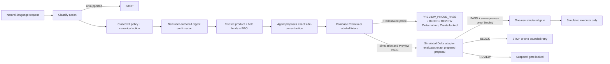

# Delta Coinbase Guard v1.3

> Natural-language Coinbase intent becomes a closed, explicitly authorized
> spot action. The exact proposal and trusted evidence are evaluated before a
> deterministic controller can release anything.

[](https://github.com/mylesoneil-repyhlabs/coinbase-preview-harness/actions/workflows/ci.yml)

[**Download the installable skill**](https://github.com/mylesoneil-repyhlabs/coinbase-preview-harness/releases/latest/download/delta-coinbase-guard-v1.zip)
· [SHA-256](https://github.com/mylesoneil-repyhlabs/coinbase-preview-harness/releases/latest/download/delta-coinbase-guard-v1.zip.sha256)
· [Recording kit](docs/COINBASE-CODEX-RECORDING-KIT.md)
· [Claim ledger](docs/COINBASE-DEMO-ASSURANCE.md)
· [Engineering handoff](docs/ENGINEERING-HANDOFF.md)

This is an independent Delta prototype, not a Coinbase product, integration,
or endorsement.

## The precise capability change

Yes: v1.2 was functionally limited to one `ETH-USDC` BUY path. Its compiler
could parse other pairs and SELL language, but the fixed safety profile,
proposer, Coinbase payload builder, evidence adapter, and reconciliation path
could not carry those actions end to end.

v1.3 implements the missing generic action model rather than broadening the
claim:

- BUY or SELL an exact amount on a dynamically verified Coinbase Advanced
  `SPOT` pair.
- BUY is quote-funded and emits only `quote_size`; SELL is base-funded and
  emits only `base_size`.
- The required funding asset must already be held as an available Coinbase
  balance. The guard never silently substitutes USD for USDC, converts another
  asset, or adds a funding action.
- Product status, assets, increments, size bounds, best bid/ask, account
  balance, and Preview evidence are normalized and bound at runtime.
- A canonical action descriptor carries the pair, side, sizing, funding
  source, price reference, fee/settlement constraints, expiry, and one-use
  limit.
- The application contract surfaces `PASS`, `BLOCK`, or `REVIEW` and emits a
  digest-bound, tamper-evident receipt for simulated Delta decisions. Only
  verified `PASS` for the exact evaluated payload can reach the one-use
  in-memory execution branch.

No static pair count is claimed. The account-specific Coinbase product
response is authoritative.

## What is real, simulated, and locked

| Surface | v1.3 status |
| --- | --- |
| Natural-language classification and closed policy | Implemented locally |
| Explicit policy-digest authorization pause | Implemented; host must attribute the user message |
| Generic SPOT BUY/SELL planning | Implemented |
| Held-funds, product, market, and Preview normalization | Implemented |
| Credential-free end-to-end flow | Implemented with labeled fixtures |
| Real Coinbase Accounts/Product/BBO/Preview | Implemented but not run in this release; requires the user's separate View-only key |
| Delta policy/evidence adapter | Production-shaped local simulation; not the private Delta implementation |
| `PASS / BLOCK / REVIEW` receipt | Implemented as a simulated contract artifact |
| Coinbase Create Order | Compile-time locked and unreachable |
| Live order or money movement | Not performed |

The built-in simulation deliberately runs a Coinbase-shaped in-memory executor
after a verified simulated `PASS` so the gate can be tested end to end. It
makes no network call, creates no Coinbase order, and moves no money.

## Supported action

| Dimension | Public v1.3 |
| --- | --- |
| Venue | Coinbase Advanced Trade custodial account |
| Product | Runtime-verified online, enabled `SPOT` pair |
| Side | `BUY` or `SELL` |
| BUY size/funds | Exact `quote_size`; held quote asset |
| SELL size/funds | Exact `base_size`; held base asset |
| Order | Price-bounded SOR limit IOC; partial fill allowed |
| BUY price/economics | Fresh best ask, maximum upside slippage, commission cap, maximum quote debit |
| SELL price/economics | Fresh best bid, maximum downside slippage, commission cap, minimum net quote proceeds |
| Use and validity | One execution; 30–600 seconds after confirmation |
| Outcomes | `PASS`, `BLOCK`, `REVIEW` |
| Default | Credential-free, clearly labeled simulation |
| Optional | View-only Coinbase reads + real Preview, then mandatory stop |

Runtime product checks fail closed on the wrong pair/assets, non-SPOT product,
offline or restricted trading state, malformed/crossed market, missing
increments or size bounds, unsupported size, incomplete account pagination,
wrong funding currency, or insufficient available funds.

### Explicitly unsupported

v1.3 recognizes and rejects, rather than coerces:

- transfers, sends, withdrawals, deposits, and portfolio fund movement;
- conversions, including USD/USDC conversion;
- staking and onchain swaps;
- derivatives, futures, perpetuals, leverage, and margin;
- stop, bracket, GTC, TWAP, scaled, recurring, and balance-relative orders;
- unrestricted market orders, edit/cancel, and multi-action strategies.

These are a capability inventory, not implemented actions.

## Install in Codex

Requirements: macOS or Linux, Node.js 22+, and Codex. No Coinbase, Delta, or
OpenAI credential is needed for the default simulation.

### Download

1. Download
   [the release bundle](https://github.com/mylesoneil-repyhlabs/coinbase-preview-harness/releases/latest/download/delta-coinbase-guard-v1.zip)
   and its
   [checksum](https://github.com/mylesoneil-repyhlabs/coinbase-preview-harness/releases/latest/download/delta-coinbase-guard-v1.zip.sha256).
2. Verify and unzip:

```sh
shasum -a 256 -c delta-coinbase-guard-v1.zip.sha256
unzip delta-coinbase-guard-v1.zip
cd delta-coinbase-guard-v1.3.0
./install
```

If the executable bit was removed during download, use `bash install`.

The installer verifies Node.js, runs the local doctor, and links the skill into
`${CODEX_HOME}/skills` when set or the normal user-local `~/.agents/skills`.
It never reads credentials or contacts Coinbase. Keep the extracted folder in
place because the installed skill links to its matching harness.

To upgrade an older extracted release:

```sh
./install --upgrade
```

The installer retargets only a verified `delta-coinbase-guard` symlink. Restart
Codex and open a fresh chat if the new skill is not detected immediately.

### Clone instead

```sh
git clone https://github.com/mylesoneil-repyhlabs/coinbase-preview-harness.git \
  "$HOME/.local/share/delta-coinbase-guard"
"$HOME/.local/share/delta-coinbase-guard/install"
```

## Use it in Codex

Invoke `$delta-coinbase-guard` and give one complete action. The skill keeps
the policy, authorization instructions, canonical action, proposed payload,
funding evidence, Preview, `PASS / BLOCK / REVIEW`, receipt, proof status,
controller decision, and no-live-order status in chat.

Example BUY:

```text
Use $delta-coinbase-guard to plan and safely simulate:

Using my isolated Coinbase Advanced portfolio, use exactly 250 USDC to buy SOL
on SOL-USDC once now with a price-bounded IOC limit order. Partial fill is
acceptable. Do not pay more than 40 bps above Coinbase's fresh best ask, more
than 1.25 USDC in commission, or more than 251.25 USDC total. This
authorization expires 3 minutes after I confirm it.
```

Example SELL:

```text
Use $delta-coinbase-guard to plan and safely simulate:

Using my isolated Coinbase Advanced portfolio, sell exactly 0.05000000 BTC on
BTC-USD once now with a price-bounded IOC limit order. Partial fill is
acceptable. Do not accept more than 35 bps below Coinbase's fresh best bid, do
not pay more than 4 USD in commission, and receive at least 3400 USD after
commission. This authorization expires 3 minutes after I confirm it.
```

The first response is a draft. Review the displayed policy and canonical
action. Only a new user-authored message naming the complete displayed policy
digest authorizes the next step. The harness compares digests; the calling
host, not this CLI, must authenticate who sent that message.

Terminal equivalents use the checked-in examples:

```sh
./run doctor
./run plan --intent-file examples/generic-buy-intent.txt
./run plan --intent-file examples/generic-sell-intent.txt
```

After the user separately authorizes the emitted policy digest:

```sh
./run simulate \
  --plan /absolute/path/from-plan.json \
  --confirm-policy <exact-user-authorized-policy-digest>
```

The simulation prints every important transition directly and also writes a
sanitized JSON/HTML report under the ignored local `runtime/` directory. The
chat result must state `SIMULATION_ONLY`, `COINBASE_CONTACTED=false`,
`COINBASE_CREATE_INVOKED=false`, `PRODUCTION_DELTA_INVOKED=false`, and
`MONEY_MOVED=false`.

## Optional real Coinbase Preview

Coinbase documents Advanced Trade Accounts, Products, best bid/ask, and
Preview as `View` operations; Create Order requires `Trade`. A standard
normal-user CDP API key is the public credential path—no private Coinbase
developer access or Coinbase account password is required.

Create a separate Advanced portfolio and a separate ECDSA/ES256 key for this
probe:

- View enabled;
- Trade and Transfer disabled;
- narrowest available portfolio and IP restrictions;
- downloaded JSON stored outside this repository with file mode `0600`.

Coinbase's documented key-permissions response exposes `can_view`,
`can_trade`, `can_transfer`, and `portfolio_uuid`. It does not currently
document a separate `can_receive`; the guard rejects that field if an extended
response explicitly grants it.

Never paste the key or key path into a public artifact. Supply only its
absolute local path at command time:

```sh
./run configure-preview-credentials \
  --key-file /absolute/path/outside/repository/view_key.json

./run bind-execution \
  --plan /absolute/path/from-plan.json \
  --confirm-policy <exact-user-authorized-policy-digest> \
  --credential-role preview \
  --key-file /absolute/path/outside/repository/view_key.json
```

The bind command emits a credential/portfolio-scoped execution digest. Pause
again for a new user-authored confirmation, then:

```sh
./run confirm-execution \
  --bound-execution /absolute/path/from-bind.json \
  --confirm-execution <exact-user-authorized-execution-digest> \
  --key-file /absolute/path/outside/repository/view_key.json

./run probe-execution \
  --bound-execution /absolute/path/from-bind.json \
  --confirmation-receipt /absolute/path/from-confirm.json \
  --key-file /absolute/path/outside/repository/view_key.json
```

The probe re-verifies the key, reads complete account evidence, validates the
exact runtime product and BBO, prepares a side-correct candidate, calls
Preview, prints the result in chat, and stops. Preview warnings are `REVIEW`;
errors or constraint failures are `BLOCK`.

`PREVIEW_PROBE_PASS` means the Coinbase Preview and local checks passed. It is
not a Delta PASS and cannot release an order.

### Coinbase MCP boundary

Coinbase also documents a local CLI/MCP for Codex. Its standard namespace
contains useful reads and `orders_preview`, but also advertises mutating tools
such as `orders_create`, transfers, and conversions. Do not give a planning
agent that unrestricted namespace with a Trade key.

Use a host allowlist exposing only product, balance, market, and Preview tools,
or use this harness's direct View-only REST adapter. The future View+Trade
executor key belongs behind the external deterministic controller, outside the
model and MCP context.

## Decision and evidence model



The evidence and receipt bind:

- source intent, policy, and authorization instance;
- canonical action descriptor;
- exact product, side, size field/value, and funding asset;
- account/portfolio and credential fingerprints;
- runtime product, market, and Preview evidence;
- `preview_id` and Preview request digest; the full simulation additionally
  binds the prospective Create payload digest;
- decision, complete failures, proof digest, and receipt digest.

Changing the pair, side, amount, size field, source asset, portfolio, Preview,
or Create bytes changes a bound digest and fails closed.

For production, only `PASS` plus independent proof verification may reach a
real execution gate. The public simulation uses same-process placeholder proof
material and checks its presence and exact artifact bindings before the
in-memory gate. `BLOCK` may be classified for a bounded retry only when the
controller recognizes a structured constraint failure and attempts remain.
`REVIEW`, expiry, missing proof, or any binding mismatch stops. The generic
simulator currently evaluates one candidate; the fixed conditional showcase
separately exercises one bounded retry with labeled fixtures.

## Conditional-mandate partner showcase

`coinbase-demo` remains a separate presentation fixture:

```sh
./run coinbase-demo --no-artifacts
```

It shows a meaningful simulated mandate: allocate up to 3,000 USDC to ETH only
within price, fee, slippage, exposure, expiry, and one-use constraints. The
first proposal violates six constraints and receives a bound `BLOCK` receipt.
The external controller permits one retry; a revised exact proposal receives
`PASS`; only that digest becomes eligible once in the simulated trace.

This fixed scenario is not the generic compiler, live market data, a Coinbase
conditional order, or production Delta. It uses no credential, contacts no
service, writes no artifact in `--no-artifacts` mode, invokes no external
executor, and moves no money. Follow the
[authentic Codex recording kit](docs/COINBASE-CODEX-RECORDING-KIT.md); do not
fabricate a standalone product UI.

The separate 5-USDC `ETH-USDC BUY` profile is only a future first-live-test
safety ceiling. It does not constrain generic planning, simulation, or
View-only Preview and is not the product story.

## Security and production boundary

Public v1.3 deliberately cannot place an order. Coinbase Create is protected
by independent compile-time and capability checks:

1. the public REST adapter exposes no Create method;
2. the separate Create transport requires a module-private capability;
3. LIVE requires a reviewed Delta adapter and verified proof;
4. a durable grant store must atomically consume one authorization before
   submission;
5. the exact serialized body is re-hashed immediately before transport;
6. ambiguous submission is reconciled by `client_order_id`; it is never
   blindly retried.

The checked-in adapter and receipt prove that the public contract is internally
bound and tamper-evident. They do not prove production Delta identity or
independently authenticate Coinbase as the source of simulated fixtures. The
private Delta implementation was not available for this release and must be
validated against the narrow adapter contract before Create can be enabled.

The user pre-approval for a future isolated 5-USDC, one-order test authorizes
credential setup and validation once the key is separately supplied. It does
not authorize creating a key on the user's behalf or placing the first live
order.

See:

- [Credential setup](docs/COINBASE-CREDENTIAL-SETUP.md)
- [Evidence contract](docs/COINBASE-EVIDENCE-CONTRACT.md)
- [Delta adapter contract](docs/MANDATE-ADAPTER-CONTRACT.md)
- [Engineering handoff](docs/ENGINEERING-HANDOFF.md)
- [Security policy](SECURITY.md)

## v1.2 migration

v1.2 plans and confirmations are intentionally not accepted by v1.3. The
schema, action descriptor, funding evidence, and side-specific economics
changed materially.

1. Install v1.3 with `./install --upgrade`.
2. Re-run `plan` from the original natural-language request.
3. Review and explicitly authorize the new v2 policy digest.
4. If using a credentialed Preview, bind and authorize a new execution digest.

Do not copy an old digest, confirmation receipt, or plan into v1.3.

## Develop and verify

```sh
./run doctor
pnpm test
pnpm run check:skill
pnpm run check:links
```

The suite covers multiple BUY and SELL pairs, USD/USDC non-substitution,
eight-decimal base sizes, product restrictions, increments and bounds,
insufficient/wrong funds, incomplete pagination, Preview warnings,
adversarial descriptor/payload/evidence tampering, exact PASS gating,
one-use behavior, locked Create, reconciliation, fresh install, and upgrade.

## Repository map

```text
install                                  user-local Codex skill installer
skills/delta-coinbase-guard/             chat-first guard workflow
config/coinbase-spot-policy.v2.schema.json
config/preview-capability-profile.json   generic plan/simulate/Preview scope
config/execution-safety-profile.json     separate future 5-USDC live ceiling
src/intent-compiler.js                   closed natural-language compiler
src/spot-action.js                       canonical action descriptor
src/funding.js                           held-asset funding evidence
src/coinbase-rest.js                     Accounts/Product/BBO/Preview adapter
src/execution-pipeline.js                deterministic exact-PASS controller
src/mandate/                             simulated Delta contract and receipts
src/integration/production-composition.js
                                           compile-time locked production seam
test/                                    unit, adversarial, and install tests
output/coinbase-demo-panels/             authentic-chat companion panels
runtime/                                 ignored local plans and reports
```

## Official Coinbase references

- [Coinbase for Agents (CLI/MCP)](https://docs.cdp.coinbase.com/coinbase-for-agents/overview)
- [Advanced Trade endpoint permissions](https://docs.cdp.coinbase.com/coinbase-app/advanced-trade-apis/rest-api)
- [Advanced Trade order guide](https://docs.cdp.coinbase.com/coinbase-app/advanced-trade-apis/guides/orders)
- [List Accounts](https://docs.cdp.coinbase.com/api-reference/advanced-trade-api/rest-api/accounts/list-accounts)
- [Get Product](https://docs.cdp.coinbase.com/api-reference/advanced-trade-api/rest-api/products/get-product)
- [List Products](https://docs.cdp.coinbase.com/api-reference/advanced-trade-api/rest-api/products/list-products)
- [Preview Order](https://docs.cdp.coinbase.com/api-reference/advanced-trade-api/rest-api/orders/preview-orders)
- [Create Order](https://docs.cdp.coinbase.com/api-reference/advanced-trade-api/rest-api/orders/create-order)
- [Get API Key Permissions](https://docs.cdp.coinbase.com/api-reference/advanced-trade-api/rest-api/data-api/get-api-key-permissions)
- [API-key authentication](https://docs.cdp.coinbase.com/coinbase-app/authentication-authorization/api-key-authentication)
