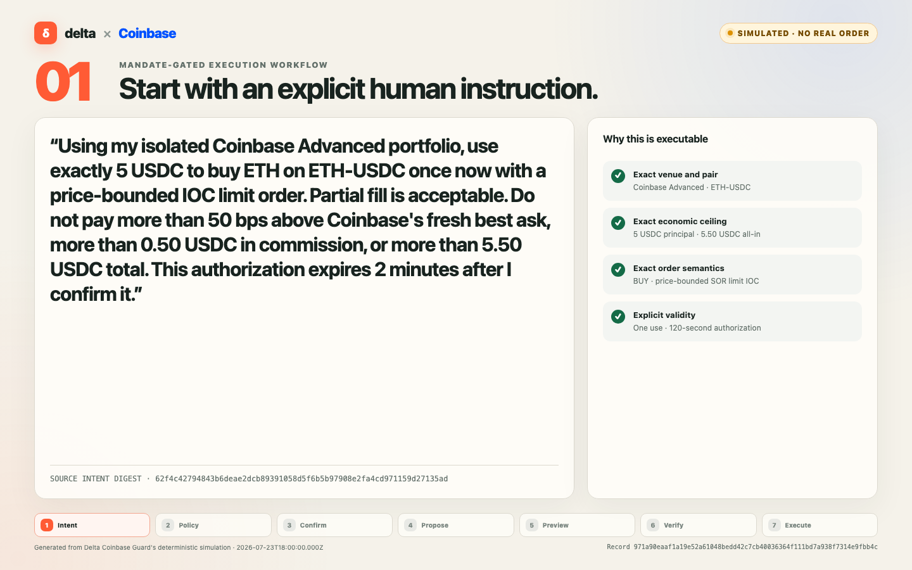
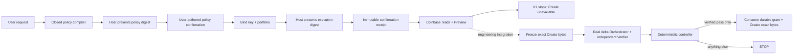

# Delta Coinbase Guard V1

[](output/pdf/delta-coinbase-guard-v1-workflow.pdf)

**[Open the seven-step simulated workflow (PDF) →](output/pdf/delta-coinbase-guard-v1-workflow.pdf)**

Delta Coinbase Guard is an installable agent skill and local harness for
turning a natural-language Coinbase Advanced Trade request into a reviewable
policy, recording explicit digest confirmations, testing the decision flow,
and probing the exact Coinbase Preview boundary.

The checked-in V1 **cannot place an order or move funds**. Coinbase Create is
compile-time disabled until Delta engineering connects the trusted production
composition seam to real delta Mandate services and an isolated, durable
one-time grant store. Credentials or command-line flags cannot enable it.
The public Coinbase adapter exposes reads and Preview only; the separate
Create transport and LIVE pipeline each require the non-exported capability
owned by the reviewed composition module.

This is an independent Delta prototype. It is not a Coinbase product or
endorsement.

## What is usable now

- A controlled natural-language compiler produces a closed
  `digital-asset-spot-order.v1` policy or fails closed with clarification or
  unsupported terms.
- The policy is displayed with a digest for explicit review.
- A credential-free simulation exercises the production-shaped
  Policy → SignedIntent → Proposal → Orchestrator → Verifier → Proof lifecycle.
  Its signatures, evidence, and proof are synthetic and clearly labeled.
- A credentialed probe binds the policy to one Coinbase key and portfolio,
  records one immutable execution-confirmation receipt, fetches fresh product
  and market data, calls Coinbase Preview, runs every local economic and
  binding check available before Create construction, and stops.
- The deterministic controller, exact-byte binding, recovery logic, and Delta
  adapter port are reusable in the engineering integration.

`PREVIEW_PROBE_PASS` means the Preview and local checks passed. It never means
that delta issued a production proof or that Coinbase executed a trade.

## V1 safety envelope

| Dimension | V1 |
| --- | --- |
| Venue | Coinbase Advanced Trade |
| Product | `ETH-USDC` spot |
| Side | `BUY` |
| Principal | Exact user-authorized amount, no more than `5 USDC` |
| Order | Quote-sized SOR limit IOC |
| Slippage | At most `50 bps` above fresh best ask |
| Commission | At most `0.50 USDC` |
| All-in debit | At most `5.50 USDC` |
| Execution confirmation | Fixed 120-second window |
| Use | One candidate and, after engineering integration, one execution |

Transfers, withdrawals, sends, conversions, leverage, margin, derivatives,
recurring orders, percentage sizing, conditional strategies, GTC orders,
unrestricted market orders, and on-chain actions are rejected.

## Trust model



The model may interpret the user's words and propose a candidate. It cannot
authenticate the user, authorize a policy, evaluate its own action, choose
execute versus retry, or possess the Coinbase Trade credential.

The CLI checks that the supplied digest matches the displayed artifact; it
does **not** prove who typed that digest. The chat host or other calling
interface must require a new user-authored confirmation. Production should
replace this procedural boundary with an authenticated Delta-native approval
or signer session.

## Install: checkout plus skill

The skill calls the repository harness, so install both parts.

### 1. Prepare the checkout

```sh
git clone https://github.com/mylesoneil-repyhlabs/coinbase-preview-harness.git
cd coinbase-preview-harness
corepack enable
pnpm install --frozen-lockfile --ignore-scripts
export DELTA_COINBASE_GUARD_ROOT="$PWD"
./run doctor
```

Set `DELTA_COINBASE_GUARD_ROOT` to this checkout in every session that uses the
skill. Do not point it at a different repository.

### 2. Install the skill folder

Use your Codex skill installer on
[`skills/delta-coinbase-guard`](skills/delta-coinbase-guard/SKILL.md), or
symlink that folder into your Codex skills directory:

```sh
export DELTA_CODEX_SKILLS_DIR="${CODEX_HOME:-$HOME/.codex}/skills"
mkdir -p "$DELTA_CODEX_SKILLS_DIR"
ln -s "$DELTA_COINBASE_GUARD_ROOT/skills/delta-coinbase-guard" \
  "$DELTA_CODEX_SKILLS_DIR/delta-coinbase-guard"
```

Then start a fresh Codex session and ask:

```text
Use $delta-coinbase-guard to plan and safely simulate:
Using my isolated Coinbase Advanced portfolio, use exactly 3 USDC to buy ETH
on ETH-USDC once now with a price-bounded IOC limit order. Partial fill is
acceptable. Do not pay more than 50 bps above Coinbase's fresh best ask, more
than 0.50 USDC in commission, or more than 3.50 USDC total. This authorization
expires 2 minutes after I confirm it.
```

## Credential-free workflow

Run the verification suite first:

```sh
cd "$DELTA_COINBASE_GUARD_ROOT"
pnpm test
./run doctor
```

Create a plan from the user's words:

```sh
./run plan \
  --intent-file "$DELTA_COINBASE_GUARD_ROOT/examples/first-live-intent.txt" \
  --compiler deterministic
```

`plan` writes a mode-`0600` artifact under `runtime/plans/`, displays every
material field, and prints its policy digest. The host must pause until a new
user-authored message confirms that exact digest.

After that confirmation, simulate:

```sh
./run simulate \
  --plan /absolute/path/to/plan.json \
  --confirm-policy <authorized-policy-digest>
```

Simulation does not contact Coinbase or production delta and never makes
Create reachable.

An optional Structured Outputs compiler is available with `--compiler openai`.
It requires `OPENAI_API_KEY`, uses the same closed schema and local validator,
and still produces only a draft for review.

## Credentialed Preview probe

Use a newly created ECDSA/ES256 key for an isolated Coinbase Advanced
portfolio:

1. Enable View and Trade.
2. Disable Transfer and Receive.
3. Apply the narrowest available portfolio and IP restrictions.
4. Store the downloaded JSON outside this repository with mode `0600`.
5. Pass only its absolute local path. Never paste key material into chat.

The harness rejects a relative path, symlink, wrong owner, permissive mode, key
inside this repository, unexpected fields, oversized file, or non-P-256 key.

Verify the permission boundary:

```sh
cd "$DELTA_COINBASE_GUARD_ROOT"
./run configure-execution \
  --key-file /absolute/path/outside-this-repo/cdp-key.json
```

Bind the reviewed policy to the verified key and portfolio:

```sh
./run bind-execution \
  --plan /absolute/path/to/plan.json \
  --confirm-policy <authorized-policy-digest> \
  --key-file /absolute/path/outside-this-repo/cdp-key.json
```

`bind-execution` displays the portfolio fingerprint and a new execution
digest. Pause again. Only after the host receives a new user-authored message
confirming that exact execution digest should it create the immutable receipt:

```sh
./run confirm-execution \
  --bound-execution /absolute/path/to/bound-execution.json \
  --confirm-execution <authorized-execution-digest> \
  --key-file /absolute/path/outside-this-repo/cdp-key.json
```

The receipt fixes both `confirmed_at` and `expires_at`. It cannot be
re-timestamped, and rerunning `probe-execution` cannot restart its 120-second
window. If it expires, discard that bound execution and begin a new binding and
confirmation.

Use the same receipt for the non-executing probe:

```sh
./run probe-execution \
  --bound-execution /absolute/path/to/bound-execution.json \
  --confirmation-receipt /absolute/path/to/execution-confirmation.json \
  --key-file /absolute/path/outside-this-repo/cdp-key.json
```

The probe can call Coinbase reads and Preview. It returns before production
delta composition or Coinbase Create can be invoked.

## Engineering integration

Start with
[`docs/ENGINEERING-HANDOFF.md`](docs/ENGINEERING-HANDOFF.md). The handoff maps
the current delta Mandate lifecycle and exact source paths, then separates the
code that should be retained from the production components engineering must
supply.

The intended change is deliberately narrow:

1. implement `CoinbaseSpotHooks` and deterministic Coinbase evidence extraction
   against an authenticated, immutable action registry;
2. connect an authenticated Delta-native signer, the real Orchestrator, and an
   operationally independent Verifier behind the existing seven-operation
   adapter port;
3. replace the compile-time-disabled
   `src/integration/production-composition.js` seam with those internal
   components and return that module's private execution capability—never with
   an arbitrary runtime-loaded module or public capability mint;
4. supply an isolated transactional grant store through the seam—the public V1
   ships no production grant store—and enforce one use across processes/hosts;
5. pass the shadow, tamper, replay, concurrency, uncertainty, and recovery
   acceptance suite before enabling one tiny internal live profile.

Engineering should not rebuild the compiler, reviewed-plan format, Coinbase
order construction, exact-byte binding, deterministic controller,
reconciliation, or recovery paths.

The exact contracts are:

- [`docs/MANDATE-ADAPTER-CONTRACT.md`](docs/MANDATE-ADAPTER-CONTRACT.md)
- [`docs/COINBASE-EVIDENCE-CONTRACT.md`](docs/COINBASE-EVIDENCE-CONTRACT.md)

The public V1 has no environment variable, plugin module, or command-line flag
that enables real Create. `execute` remains a fail-closed integration stub
until engineering changes the trusted composition in source and ships a
reviewed internal build.

## Deterministic decision rule

```text
verified delta success + matching independent proof -> EXECUTE
constraint failure + supported retry semantics       -> RETRY
anything else                                        -> STOP
```

Current delta main treats a constraint failure as terminal for that
`SignedIntent`. The checked-in V1 therefore evaluates one candidate and does
not claim “retry until pass” under one authorization. Engineering must choose
local preflight plus one authoritative proposal, a new signed intent per
candidate, or a bounded attempt-history change in delta core.

## Fail-closed properties

- Natural-language output is a draft, never authorization.
- Unknown, missing, or ungrounded material fields fail closed.
- The safety profile can narrow but cannot broaden the policy.
- The confirmation receipt binds one execution digest, credential fingerprint,
  portfolio fingerprint, and non-renewable deadline.
- Coinbase Preview precedes any future Create.
- After engineering integration, the exact prospective UTF-8 Create body is
  frozen and hashed before Delta evaluation.
- Production evidence must come from trusted Coinbase data and the immutable
  action registry, not agent-authored claims.
- Orchestrator success alone is insufficient; the independent Verifier outcome
  and matching Proof are required.
- The evaluated body and transport-reported submitted body digest must match.
- Any post-submit ambiguity becomes `SUBMISSION_UNCERTAIN`, followed by
  read-only reconciliation by `client_order_id`; Create is never blindly
  retried.
- The model-facing Coinbase MCP must be View-only. Any mutating tool makes the
  guard bypassable and stops the workflow.

## Repository map

```text
skills/delta-coinbase-guard/          installable agent workflow
config/                               closed policy schema and safety ceiling
docs/ENGINEERING-HANDOFF.md           integration start-here
docs/MANDATE-ADAPTER-CONTRACT.md      replaceable Delta application port
docs/COINBASE-EVIDENCE-CONTRACT.md    policy, solution, and proof bindings
src/intent-compiler.js                deterministic + optional model compiler
src/execution-binding.js              policy/key/portfolio binding
src/execution-confirmation.js         immutable fixed-expiry receipt
src/execution-pipeline.js             deterministic fail-closed controller
src/coinbase-rest.js                  public reads/Preview plus capability-gated Create
src/mandate/                          policy, adapter port, controller, simulator
src/reconciliation.js                 order/fill binding and recovery checks
test/                                 unit, adversarial, replay, and bypass tests
output/                               workflow screenshots and PDF
runtime/                              ignored plans, bindings, receipts, private reports
```

## Official Coinbase references

- [Coinbase for Agents skill](https://docs.cdp.coinbase.com/coinbase-for-agents/skill.md)
- [Advanced Trade authentication](https://docs.cdp.coinbase.com/api-reference/authentication)
- [API key permissions](https://docs.cdp.coinbase.com/api-reference/advanced-trade-api/rest-api/accounts/get-api-key-permissions)
- [Get product](https://docs.cdp.coinbase.com/api-reference/advanced-trade-api/rest-api/products/get-product)
- [Get best bid/ask](https://docs.cdp.coinbase.com/api-reference/advanced-trade-api/rest-api/products/get-best-bid-ask)
- [Preview Order](https://docs.cdp.coinbase.com/api-reference/advanced-trade-api/rest-api/orders/preview-orders)
- [Create Order](https://docs.cdp.coinbase.com/api-reference/advanced-trade-api/rest-api/orders/create-order)
- [Get Order](https://docs.cdp.coinbase.com/api-reference/advanced-trade-api/rest-api/orders/get-order)
- [List Orders](https://docs.cdp.coinbase.com/api-reference/advanced-trade-api/rest-api/orders/list-orders)
- [List Fills](https://docs.cdp.coinbase.com/api-reference/advanced-trade-api/rest-api/orders/list-fills)
