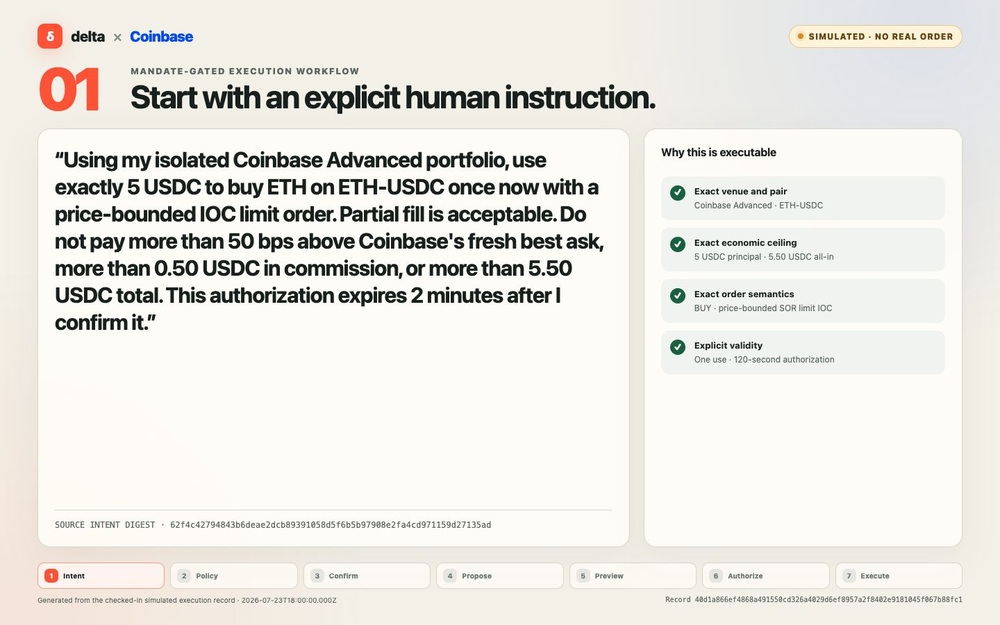
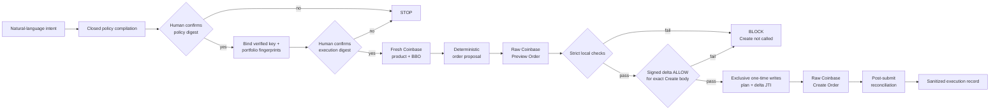

# A delta-gated Coinbase execution harness

[](output/pdf/coinbase-mandate-gated-workflow.pdf)

**[Open the seven-step mandate-gated execution workflow (PDF) →](output/pdf/coinbase-mandate-gated-workflow.pdf)**

The walkthrough follows one fresh simulated run from natural-language intent
through policy compilation, human confirmation, deterministic proposal,
Coinbase-style preview, signed delta authorization, and post-submit
reconciliation. Every page is explicitly labeled as a simulation; no Coinbase
credential was read, no production delta evaluator was contacted, and no funds
moved.

This repository turns a natural-language trading instruction into one tightly
bounded Coinbase Advanced Trade action, then makes Coinbase order creation
conditional on a signed delta `ALLOW` for the exact payload.

It is a concrete integration preview for two audiences:

- **delta and Coinbase engineers** can inspect the enforcement seam, schemas,
  bindings, replay controls, and failure behavior.
- **A prospective customer or partner** can see the full user journey—from
  intent to a reviewable policy and execution record—without granting partner
  access or changing an existing codebase.

> **Current status:** the closed policy compiler, deterministic proposer,
> Coinbase product/BBO and Preview adapters, local checks, signed-decision
> verifier, one-time authorization store, and Create Order adapter are
> implemented and tested locally. The checked-in artifact is a simulation. No
> real Coinbase order has been placed, and the proposed delta bridge has not
> been connected to a production delta endpoint. Treat the first credentialed
> run as integration testing, not a production-ready release.

## The enforcement path



The language model or deterministic parser may interpret intent, but neither
can authorize execution. Authorization comes from two explicit human digest
confirmations and a fresh signed delta decision. The component that can call
Coinbase Create Order receives only the already-verified, exact payload.

## First real-test envelope

The initial live profile is deliberately much narrower than Coinbase Advanced
Trade:

| Dimension | V1 live boundary |
| --- | --- |
| Venue | Coinbase Advanced Trade, production |
| Product | `ETH-USDC` spot only |
| Side | `BUY` only |
| Principal | Exact amount authorized by the policy; local maximum `5.00 USDC` |
| Order | Quote-sized SOR limit IOC |
| Partial fill | Allowed |
| Price | Limit derived from a fresh best ask; at most `50 bps` above it |
| Commission | At most `0.50 USDC` |
| All-in debit | At most `5.50 USDC` |
| Authorization life | At most `120 seconds` |
| Market evidence age | At most `5 seconds` |
| Preview evidence age at submit | At most `10 seconds` |
| Use | Exactly one execution |

`SELL` is represented in the taxonomy so the compiler can identify and
validate a sell instruction, but the live proposer blocks it. Sell sizing,
proceeds, inventory, and post-trade semantics need a separate safety profile
before they should be executable.

V1 also rejects transfers, withdrawals, sends, converts, leverage, margin,
derivatives, recurring orders, percentage-of-balance sizing, conditional
strategies, GTC orders, unrestricted market orders, and on-chain network
instructions. It cannot silently substitute `ETH-USD` for `ETH-USDC` or add
unsupported Coinbase fields.

## Intent taxonomy

The compiler emits `digital-asset-spot-order.v1`. A ready policy closes every
material degree of freedom:

```json
{
  "venue": "COINBASE_ADVANCED",
  "environment": "PRODUCTION",
  "execution_domain": "COINBASE_CUSTODIAL_LEDGER",
  "product_type": "SPOT",
  "product_id": "ETH-USDC",
  "base_asset": "ETH",
  "quote_asset": "USDC",
  "side": "BUY",
  "order_type": "SOR_LIMIT_IOC",
  "size": {
    "denomination": "QUOTE",
    "asset": "USDC",
    "operator": "EXACT",
    "value": "5"
  },
  "partial_fill_policy": "ALLOW",
  "limits": {
    "max_slippage_bps": 50,
    "max_commission": { "asset": "USDC", "value": "0.50" },
    "max_all_in_debit": { "asset": "USDC", "value": "5.50" }
  },
  "validity": {
    "starts": "ON_EXECUTION_CONFIRMATION",
    "ttl_seconds": 120
  },
  "usage": { "max_executions": 1 }
}
```

Every material field must cite text present in the source instruction.
Ambiguous instructions return `NEEDS_CLARIFICATION`; unsupported clauses
return `UNSUPPORTED`; neither produces an executable policy. There are no
silent defaults.

Two compiler modes are available:

- `deterministic` is the narrow, credential-free reference path.
- `openai` uses Structured Outputs with the same closed JSON schema, then runs
  the result through the same local validator. It requires `OPENAI_API_KEY`;
  the request sets `store: false`. Model output remains a draft.

The full schema is in
[`config/coinbase-spot-policy.v1.schema.json`](config/coinbase-spot-policy.v1.schema.json),
and the non-overridable test ceiling is in
[`config/execution-safety-profile.json`](config/execution-safety-profile.json).

## Run everything that does not need credentials

Requirements: Node.js 22+ and pnpm.

```sh
pnpm install --frozen-lockfile --ignore-scripts
pnpm test
./run doctor

./run plan \
  --intent-file "$PWD/examples/first-live-intent.txt" \
  --compiler deterministic
```

The plan command writes an ignored, mode-`0600` JSON file under
`runtime/plans/`, prints the compiled policy, and prints its `policy_digest`.
Read the policy—not just the source sentence—before confirming it.

```sh
./run simulate \
  --plan /absolute/path/from-the-plan-command.json \
  --confirm-policy <printed-policy-digest>
```

Simulation exercises the complete orchestration with deterministic Coinbase
fixtures, a temporary test signing key, a simulated delta `ALLOW`, and a
simulated Create response. It writes:

- [`artifacts/execution-readiness.html`](artifacts/execution-readiness.html)
- [`artifacts/execution-readiness.json`](artifacts/execution-readiness.json)

A `FILLED` status in these checked-in files means the simulated Create, Get
Order, and List Fills adapters returned a complete compliant fill. The
record's `artifact_class` is `SIMULATED`; Coinbase was not contacted and no
funds moved.

For the optional Structured Outputs compiler:

```sh
export OPENAI_API_KEY="<set-in-your-shell-or-secret-manager>"
./run plan \
  --intent-file "$PWD/examples/first-live-intent.txt" \
  --compiler openai
```

## Credential boundary

Use a newly created CDP key for an isolated Coinbase Advanced portfolio:

1. Select **ECDSA / ES256 (P-256)**.
2. Enable **View** and **Trade**.
3. Leave **Transfer** and **Receive** disabled.
4. Apply the narrowest available portfolio and IP restrictions.
5. Keep the downloaded JSON file outside this repository.
6. Make it readable only by your user:

```sh
chmod 600 /absolute/path/outside-this-repo/cdp-key.json
```

The harness rejects a relative path, symlink, non-regular file, wrong owner,
group/world-readable file, oversized file, key inside the repository,
unexpected key fields, or a non-P-256 private key.

The execution path does **not** copy the key, private key, JWT, portfolio UUID,
or delta bearer token into this repository. It reads the key file into memory,
makes a request-bound JWT, and stores only a sanitized permission attestation
and SHA-256 fingerprints in the ignored `runtime/` directory.

The first Coinbase operation is a read-only `GET /key_permissions`. It must
return:

```text
can_view=true
can_trade=true
can_transfer=false
can_receive=false
portfolio_uuid=<present>
```

There is no alternate auth profile or permissive fallback. The harness uses
the named `CDP_URIS_V1` JWT profile and rechecks permissions from the supplied
key before binding and again before execution. Preview precedes Create.

Run the permission preflight:

```sh
./run configure-execution \
  --key-file /absolute/path/outside-this-repo/cdp-key.json
```

This contacts Coinbase only to verify the key's permissions. It does not place
or preview an order.

## Bind the human authorization to the actual portfolio

The policy digest does not identify which Coinbase portfolio would be charged.
The next step combines the confirmed plan with fresh key and portfolio
fingerprints:

```sh
./run bind-execution \
  --plan /absolute/path/to/plan.json \
  --confirm-policy <printed-policy-digest> \
  --key-file /absolute/path/outside-this-repo/cdp-key.json
```

This writes a second ignored, mode-`0600` artifact under
`runtime/bound-executions/` and prints an `execution_digest`. Review the policy
before supplying its digest; a mismatch fails before the key file is read or
Coinbase is contacted. Then review the printed portfolio fingerprint before
confirming the new execution digest. A different key, portfolio, plan, policy,
or safety profile invalidates the binding.

## Run the credentialed Preview-only probe

Before connecting delta or arming Create Order, verify that the exact
quote-sized SOR limit IOC contract works with your key and portfolio:

```sh
./run probe-execution \
  --bound-execution /absolute/path/to/bound-execution.json \
  --confirm-execution <printed-execution-digest> \
  --key-file /absolute/path/outside-this-repo/cdp-key.json
```

This rechecks key permissions and the portfolio binding, fetches the Coinbase
product and fresh BBO, derives the bounded action, calls the raw Preview Order
endpoint, and runs every local preview check. A pass is reported as
`PREVIEW_PROBE_PASS`.

The probe returns before a `client_order_id` is created. It has no delta
adapter, no Create adapter, consumes neither the plan nor a delta JTI, and
cannot place an order. Any API or schema incompatibility blocks here without
silently changing sizing, order type, or authorization semantics.

## Connect the proposed delta gate

The executor currently expects an HTTPS bridge with the contract documented in
[`docs/DELTA-GATE-CONTRACT.md`](docs/DELTA-GATE-CONTRACT.md):

```sh
export DELTA_GATE_URL="https://<delta-gate>/evaluate"
export DELTA_GATE_TOKEN="<set-in-your-shell-or-secret-manager>"
export DELTA_DECISION_PUBLIC_KEY_FILE="/absolute/path/to/delta-public-key.pem"
export DELTA_DECISION_KEY_ID="<optional-pinned-key-id>"
```

The bridge must return an Ed25519-signed, short-lived `ALLOW` bound to the
policy and its exact confirmation/expiry window, deterministic proposal, fresh
market/preview evidence, credential and portfolio fingerprints, Coinbase
`preview_id`, random `client_order_id`, and the SHA-256 digest of the exact
UTF-8 Create Order bytes. The same serialized string is persisted for recovery
and passed unchanged to the fixed Coinbase REST adapter.

**This is a proposed client contract, not a confirmed production delta API.**
It is locally verified and test-covered, but the URL, authentication, signing
key distribution, and request mapping still need to be wired to and tested
against the real delta evaluator.

## Deliberate live execution

Only after reviewing both the policy and credential-scoped execution binding:

```sh
./run execute \
  --bound-execution /absolute/path/to/bound-execution.json \
  --confirm-execution <printed-execution-digest> \
  --key-file /absolute/path/outside-this-repo/cdp-key.json \
  --live-execution \
  --accept-real-money-risk
```

Both real-money flags are required. The command then:

1. Captures the policy TTL start when the command receives this final
   execution confirmation, before any credential or permission check, then
   revalidates the bound plan, execution digest, current key permissions, and
   portfolio fingerprint. Credential-check time consumes the same 120-second
   window; it never extends it.
2. Fetches the exact product and fresh best bid/ask from Coinbase.
3. Deterministically calculates an increment-aligned IOC limit price.
4. Calls raw Coinbase Preview Order and blocks on errors, warnings, missing
   fields, size drift, fee drift, all-in drift, price drift, or stale evidence.
5. Builds the exact Create Order body, including fresh `client_order_id` and
   Coinbase `preview_id`.
6. Sends that complete body and its digest to delta.
7. Verifies a fresh Ed25519 signature and every binding locally.
8. Writes the human-confirmed plan and delta JTI sequentially with exclusive
   file creation before Create, preventing replay. If the second write fails,
   the plan is burned and Create remains blocked.
9. Rechecks every policy, proposal, delta, market, and preview expiry after
   both exclusive writes, then POSTs the unchanged body to Coinbase Create
   Order.
10. Calls Get Order and List Fills, binds the returned records to the submitted
    order, and checks actual principal, commission, all-in debit, average
    price, fill prices, summed fill size/notional, fee totals, pagination, and
    terminal evidence completeness against the confirmed policy.

No delta response, malformed response, `BLOCK`, expired authorization,
signature failure, binding mismatch, failed check, stale evidence, reused plan,
or reused JTI can reach Create Order.

If the Create request has started and the network response is missing or
malformed, the result is `SUBMISSION_UNCERTAIN`, not `BLOCKED`. Do not generate
a new client order ID or submit a replacement order; reconcile the original
`client_order_id` first.

The recovery command is read-only and reusable:

```sh
./run reconcile-execution \
  --bound-execution /absolute/path/to/bound-execution.json \
  --key-file /absolute/path/outside-this-repo/cdp-key.json
```

It loads the original Create payload from the consumed-plan record. If the
Create response never exposed an `order_id`, it scans narrowly filtered
Coinbase List Orders pages for the exact `client_order_id`; once found, it
fetches Get Order and List Fills and reruns the same binding and
actual-economics checks. If the order is absent, still pending, paginated, or
incompletely evidenced, it remains unresolved and never retries Create.

A bound order is reported as `FILLED`, `PARTIAL_FILL`, `NO_FILL`,
`ORDER_PENDING`, or `RECONCILIATION_PENDING`. Returned data that cannot be
bound to the authorized action becomes `RECONCILIATION_FAILED`; actual
economics that exceed the policy become `EXECUTION_POLICY_BREACH`. Only
`FILLED`, `PARTIAL_FILL`, and `NO_FILL` are treated as completed CLI outcomes.
Post-submit breaches cannot undo a trade, so they are recorded as incidents
rather than mislabeled as a pre-execution block.

## Why live execution uses direct REST

The pinned `@coinbase/coinbase-cli@0.0.4` remains useful for the original
credential-free and preview-only demo surfaces, but it is not an acceptable
transport for the execution boundary:

- its live limit-IOC mapper drops `quote_size`;
- its Create path drops `preview_id`; and
- it unwraps or strips raw response fields needed for strict validation,
  including the response envelope and preview diagnostics.

The live path therefore uses a small direct REST adapter with a fixed
`https://api.coinbase.com` origin, fixed Advanced Trade paths, per-request
ES256 JWTs, no redirects, timeouts, response-size limits, and raw Preview and
Create envelopes. There is no generic URL, method, path, or Coinbase command
passthrough.

## Fail-closed properties

- Natural-language compilation creates a draft, never authorization.
- Closed schemas reject unknown fields and ungrounded material constraints.
- The local safety profile can narrow a policy but cannot broaden it.
- A deterministic proposer—not free-form model output—creates the live action.
- Coinbase product flags, increments, BBO, preview values, errors, and warnings
  are checked explicitly.
- The delta signature is verified locally against exact expected bindings.
- Policy confirmation is bound again to the verified key and portfolio.
- The plan and delta grant are consumed with exclusive file creation before
  submission.
- Reports and stored runtime state are sanitized; secrets and live artifacts
  are ignored by Git.
- A failed pre-execution gate never invokes Create Order.
- An ambiguous post-submit result is treated as possibly executed.
- The original consumed plan can be reconciled repeatedly without a second
  delta authorization or any Create call.

## What is not proven yet

- No real Coinbase permission check, Preview Order, Create Order, or fill has
  been run with the owner's credential.
- The proposed delta bridge has not been mapped to a production delta endpoint
  or tested with delta's real signing key.
- Coinbase does not enforce the delta receipt itself; this client-side executor
  is the enforcement owner and must be the only component with access to the
  Trade key.
- The harness is single-process local test software, not a hardened
  multi-tenant executor, HSM-backed credential service, or production ledger.
- SELL, cancellation, replacement, transfer, and conversion workflows are
  outside V1. Recovery is read-only; it never cancels, replaces, or retries.
- Coinbase partnership, endorsement, or privileged access is not implied.

## Repository map

```text
config/
  coinbase-spot-policy.v1.schema.json   closed NL compilation schema
  execution-safety-profile.json        non-overridable first-test ceiling
docs/
  DELTA-GATE-CONTRACT.md                proposed signed evaluation bridge
examples/
  first-live-intent.txt                 fully explicit 5 USDC test intent
src/
  intent-compiler.js                    deterministic + Structured Outputs compilers
  policy-validator.js                   taxonomy and local safety validation
  execution-binding.js                  key/portfolio-scoped human confirmation
  proposer.js                           deterministic live action construction
  coinbase-rest.js                      fixed direct Advanced Trade adapter
  execution-policy.js                   proposal and preview economics checks
  delta-client.js                       bridge client and signature verifier
  authorization-store.js               exclusive one-time consumption
  reconciliation.js                    order/fill binding and actual-economics checks
  recovery.js                           read-only uncertain/pending order recovery
  execution-pipeline.js                 fail-closed orchestration
  execution-report.js                   sanitized JSON + HTML records
test/                                   unit and adversarial path coverage
artifacts/                              checked-in credential-free evidence
runtime/                                ignored local plans, bindings, attestations, grants
```

## Official Coinbase references

- [Coinbase for Agents skill](https://docs.cdp.coinbase.com/coinbase-for-agents/skill.md)
- [Advanced Trade authentication](https://docs.cdp.coinbase.com/api-reference/authentication)
- [Get API key permissions](https://docs.cdp.coinbase.com/api-reference/advanced-trade-api/rest-api/accounts/get-api-key-permissions)
- [Get product](https://docs.cdp.coinbase.com/api-reference/advanced-trade-api/rest-api/products/get-product)
- [Get best bid/ask](https://docs.cdp.coinbase.com/api-reference/advanced-trade-api/rest-api/products/get-best-bid-ask)
- [Preview Order](https://docs.cdp.coinbase.com/api-reference/advanced-trade-api/rest-api/orders/preview-orders)
- [Create Order](https://docs.cdp.coinbase.com/api-reference/advanced-trade-api/rest-api/orders/create-order)
- [Get Order](https://docs.cdp.coinbase.com/api-reference/advanced-trade-api/rest-api/orders/get-order)
- [List Orders](https://docs.cdp.coinbase.com/api-reference/advanced-trade-api/rest-api/orders/list-orders)
- [List Fills](https://docs.cdp.coinbase.com/api-reference/advanced-trade-api/rest-api/orders/list-fills)
