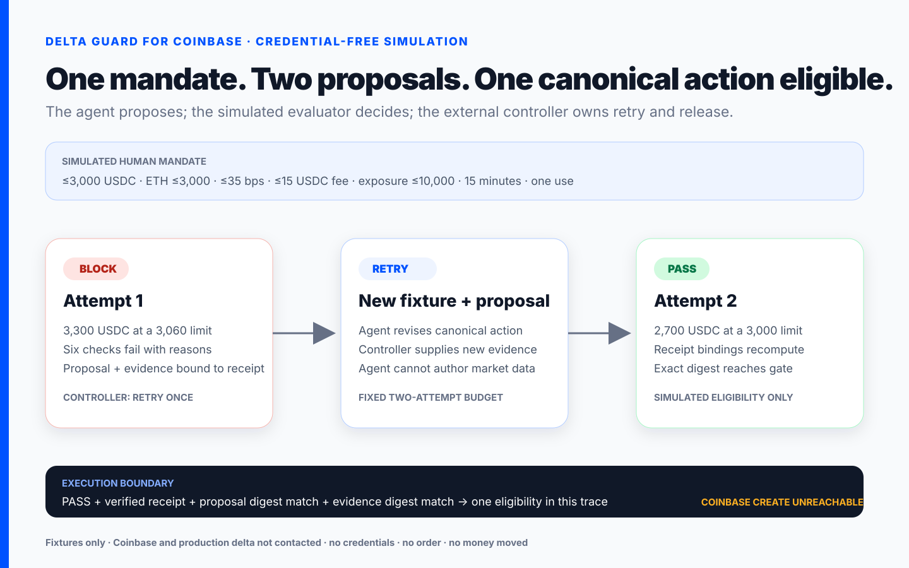
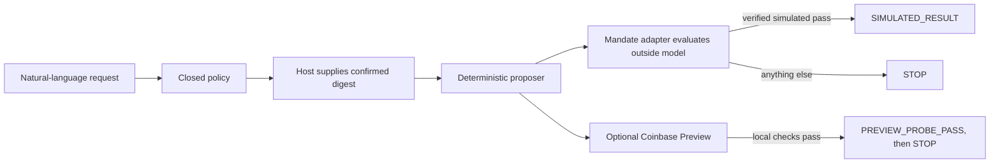

# Delta Coinbase Guard

> Turn a natural-language Coinbase trade request into an explicit policy,
> surface its exact digest for host-mediated authorization, and
> deterministically gate the proposed action before money can move.

[](https://github.com/mylesoneil-repyhlabs/coinbase-preview-harness/actions/workflows/ci.yml)

[**Download Delta Coinbase Guard V1 (.zip)**](https://github.com/mylesoneil-repyhlabs/coinbase-preview-harness/releases/latest/download/delta-coinbase-guard-v1.zip)
· [SHA-256](https://github.com/mylesoneil-repyhlabs/coinbase-preview-harness/releases/latest/download/delta-coinbase-guard-v1.zip.sha256)
· [Recording kit](docs/COINBASE-CODEX-RECORDING-KIT.md)
· [Claim ledger](docs/COINBASE-DEMO-ASSURANCE.md)
· [Engineering handoff](docs/ENGINEERING-HANDOFF.md)

[](docs/COINBASE-CODEX-RECORDING-KIT.md)

## What it is

Delta Coinbase Guard is an installable Codex skill and local Coinbase Advanced
Trade harness. It turns a one-off ETH allocation request into a closed,
reviewable policy; records the exact digest supplied by the calling host;
deterministically proposes a policy-compliant order; and makes the
execute-or-stop decision outside model-controlled logic.

The included V1 lets anyone run the complete workflow as a credential-free
simulation. With an isolated Coinbase API key, it can also call Coinbase’s
real read and **Preview** endpoints to validate the exact prospective order.

> **V1 cannot place an order or move funds.** Coinbase Create is compile-time
> locked until Delta engineering connects the production seam to real delta
> Mandate services and a durable one-time grant store. No credential, prompt,
> plugin, environment variable, or CLI flag can unlock it.

This is an independent Delta prototype, not a Coinbase product or endorsement.

## Record the complete Coinbase demo in Codex

Install the skill, start a fresh Codex chat, and use the single prompt in the
[Coinbase Codex recording kit](docs/COINBASE-CODEX-RECORDING-KIT.md). The
direct normal-user download is:

[**Download and install Delta Coinbase Guard V1 (.zip)**](https://github.com/mylesoneil-repyhlabs/coinbase-preview-harness/releases/latest/download/delta-coinbase-guard-v1.zip)

For a terminal-only check from the repository:

```sh
./run credential-readiness
./run coinbase-demo
```

`coinbase-demo` presents a meaningful simulated mandate: allocate up to 3,000
USDC to ETH only at or below a target price, within fee, slippage, portfolio
exposure, expiry, and one-use constraints. The first agent proposal fails six
checks across allocation, market price, limit price, slippage, fee, and
exposure. The simulated Delta evaluator returns a bound `BLOCK`
receipt; the external deterministic controller permits one retry; a revised
exact proposal receives `PASS`; and only the passed payload digest becomes
eligible once in this simulated trace. No durable grant is issued and no
external executor is invoked.

The skill returns the mandate, authorization status, both exact proposals,
constraint failures, `BLOCK → RETRY → PASS`, receipt verification, payload
and evidence digest equality, evidence provenance, and no-live-order status
directly in Codex. A browser or separate product UI is not part of the
recording. Six aligned right-side
[companion panels](output/coinbase-demo-panels/) explain the flow without
pretending to be a live Coinbase or delta interface.

The chat showcase writes no artifact and requires no browser or repository
write access. It uses no credential, contacts neither Coinbase nor production
delta, invokes no Coinbase Create endpoint, and moves no money. The 5-USDC
ceiling belongs only to the separate future live-test safety profile; it is not
the economic story in this simulation.

The [showcase claim ledger](docs/COINBASE-DEMO-ASSURANCE.md) states exactly
what the receipt proves, what remains fixture data, and which production claims
this public build deliberately does not make.

See [Coinbase credential setup](docs/COINBASE-CREDENTIAL-SETUP.md) for the
optional public Advanced Trade API path. A normal user-created CDP ECDSA key can
support permissions validation, authenticated reads, Preview, and—after the
separate delta production controls are installed—Create. No private Coinbase
developer access is required by the documented API surface.

## Install

Requirements:

- macOS or Linux
- [Node.js 22+](https://nodejs.org/)
- Codex
- Git only if you use the clone option

No Coinbase, Delta, or OpenAI credentials are needed for the default
simulation.

### Option A: clone and install

```sh
git clone https://github.com/mylesoneil-repyhlabs/coinbase-preview-harness.git \
  "$HOME/.local/share/delta-coinbase-guard"
"$HOME/.local/share/delta-coinbase-guard/install"
```

### Option B: download the release

1. [Download the V1 bundle](https://github.com/mylesoneil-repyhlabs/coinbase-preview-harness/releases/latest/download/delta-coinbase-guard-v1.zip).
2. Download the matching [SHA-256 file](https://github.com/mylesoneil-repyhlabs/coinbase-preview-harness/releases/latest/download/delta-coinbase-guard-v1.zip.sha256) and verify it:

```sh
shasum -a 256 -c delta-coinbase-guard-v1.zip.sha256
```

3. Unzip it into a permanent folder.
4. In Terminal, enter that folder and run:

```sh
./install
```

If the executable bit was removed during download, run `bash install`.

The installer:

1. verifies Node.js 22+;
2. links the skill into `${CODEX_HOME}/skills` when set, otherwise the
   documented user-local `~/.agents/skills`;
3. runs the local safety doctor; and
4. never reads credentials or contacts Coinbase.

Keep the repository in the same location after installation because the Codex
skill links back to its matching harness.

Codex normally detects the new skill automatically. If it does not, fully quit
and reopen Codex, then start a fresh chat.

To upgrade an older release extracted somewhere else, keep the new release in
its permanent location and run `./install --upgrade`. The installer retargets
only a verified `delta-coinbase-guard` symlink; it refuses directories,
unrelated skills, and ambiguous existing paths.

## Run the narrow Preview-compatible V1 path

This separate path exercises the future live-test safety profile. Its 5-USDC
ceiling is a test control, not the economic logic of the partner showcase.

Paste this into Codex:

```text
Use $delta-coinbase-guard to plan and safely simulate:

Using my isolated Coinbase Advanced portfolio, use exactly 5 USDC to buy ETH
on ETH-USDC once now with a price-bounded IOC limit order. Partial fill is
acceptable. Do not pay more than 50 bps above Coinbase's fresh best ask, more
than 0.50 USDC in commission, or more than 5.50 USDC total. This authorization
expires 2 minutes after I confirm it.
```

The skill will:

1. preserve the source request;
2. compile every material term into a closed policy or fail for clarification;
3. display the complete policy and its digest;
4. pause while the calling host obtains and supplies a new user-authored
   confirmation of that exact digest;
5. deterministically propose and evaluate one candidate through the
   production-shaped Delta lifecycle;
6. return a deterministic pass, fail, or stop result; and
7. report that Coinbase Create was unreachable and uninvoked.

The simulation uses synthetic signatures, evidence, and proof. They are
clearly labeled and must never be described as a production Delta verdict.

## What V1 supports

| Dimension | Public V1 |
| --- | --- |
| Venue | Coinbase Advanced Trade |
| Product | `ETH-USDC` spot |
| Side | `BUY` |
| Principal | Exact amount, no more than `5 USDC` |
| Order | Quote-sized SOR limit IOC |
| Slippage | At most `50 bps` above fresh best ask |
| Commission | At most `0.50 USDC` |
| All-in debit | At most `5.50 USDC` |
| Confirmation artifact | One candidate, one use, fixed 120-second window |
| Default mode | Credential-free simulation |
| Optional mode | Coinbase reads + real Preview, then stop |

Transfers, withdrawals, sends, conversions, leverage, margin, derivatives,
recurring orders, conditional strategies, GTC orders, unrestricted market
orders, and on-chain actions are rejected.

## How the guard works



The default V1 compiler and order proposer are deterministic. An optional model
compiler can draft the policy, but its output still passes the same closed
local validator and remains unconfirmed.

The CLI verifies that a supplied digest equals the displayed artifact. It
cannot prove who supplied that digest. The calling host must authenticate the
human confirmation; production should replace this procedural boundary with a
Delta-native signer or approval session.

Similarly, the skill instructs the model not to read or receive a Coinbase
private key and the harness accepts only an absolute key-file path. Public V1
does not provide OS- or process-level credential isolation from a local Codex
session. Production must keep the Trade credential behind a separate broker or
service boundary.

The public V1 decision rule is:

```text
verified simulated success + matching synthetic proof -> SIMULATED_RESULT
Coinbase Preview and every local check pass            -> PREVIEW_PROBE_PASS, then STOP
anything else                                          -> STOP
```

Public V1 evaluates exactly one candidate. Automatic multi-attempt retry is not
implemented. Engineering can add bounded retry only after defining how each
new candidate receives a fresh authorized intent and attempt history.

## Optional Coinbase Preview probe

The credentialed probe is for integration testing, not trading. Use a new,
isolated Coinbase ECDSA/ES256 key with:

- View and Trade enabled;
- Transfer and Receive disabled;
- the narrowest available portfolio and IP restrictions; and
- the downloaded key JSON stored outside this repository with mode `0600`.

Never paste the key into chat. Pass only its absolute local file path when the
skill asks for it.

The probe binds the reviewed policy to the key and portfolio, requires a
second exact human confirmation, calls Coinbase reads and Preview, runs local
economic and payload checks, and stops before Delta production composition or
Coinbase Create.

`PREVIEW_PROBE_PASS` means only that Preview and local checks passed. It does
not mean Delta issued a production proof or Coinbase executed a trade.

## Engineering handoff

Start with [docs/ENGINEERING-HANDOFF.md](docs/ENGINEERING-HANDOFF.md).

Engineering should retain the compiler, reviewed-plan format, Coinbase order
construction, exact-byte binding, deterministic controller, reconciliation,
and recovery paths. The intended production change is narrow:

1. connect the existing adapter port to an authenticated Delta signer, the real
   Orchestrator, and an operationally independent Verifier;
2. supply trusted Coinbase evidence through an immutable action registry;
3. replace `src/integration/production-composition.js` in source with reviewed
   internal composition and its private execution capability;
4. supply an isolated, transactional, one-time grant store; and
5. pass the tamper, replay, concurrency, uncertainty, and recovery suite before
   enabling one tiny internal live profile.

Exact contracts:

- [Delta adapter contract](docs/MANDATE-ADAPTER-CONTRACT.md)
- [Coinbase evidence contract](docs/COINBASE-EVIDENCE-CONTRACT.md)

## Develop and verify

```sh
./run doctor
pnpm test
pnpm run check:skill
pnpm run check:links
```

The repository includes a comprehensive unit, adversarial, replay, bypass, and
cold-install suite plus the six companion panels used with an authentic Codex
recording.

## Repository map

```text
install                               local Codex skill installer
skills/delta-coinbase-guard/          installable agent workflow
config/                               closed policy schema and safety ceiling
docs/ENGINEERING-HANDOFF.md           production integration start-here
src/intent-compiler.js                deterministic + optional model compiler
src/execution-pipeline.js             deterministic fail-closed controller
src/coinbase-rest.js                  reads/Preview + locked Create transport
src/mandate/                          Delta adapter, controller, and simulator
src/coinbase-demo.js                  one-command complete simulation showcase
src/reconciliation.js                 uncertainty and recovery checks
test/                                 safety and behavior tests
output/coinbase-demo-panels/          recording companion panels and timeline
runtime/                              ignored local plans and private reports
```

## Coinbase references

- [Coinbase for Agents skill](https://docs.cdp.coinbase.com/coinbase-for-agents/skill.md)
- [Advanced Trade authentication](https://docs.cdp.coinbase.com/api-reference/authentication)
- [API key permissions](https://docs.cdp.coinbase.com/api-reference/advanced-trade-api/rest-api/accounts/get-api-key-permissions)
- [Preview Order](https://docs.cdp.coinbase.com/api-reference/advanced-trade-api/rest-api/orders/preview-orders)
- [Create Order](https://docs.cdp.coinbase.com/api-reference/advanced-trade-api/rest-api/orders/create-order)
