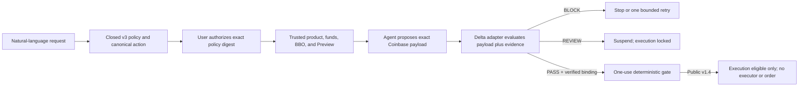

# Delta Coinbase Guard v1.4

> Turn a natural-language Coinbase spot request into a closed mandate, require
> explicit authorization, evaluate the exact prepared order and evidence, and
> keep money movement locked unless the result is `PASS`.

[](https://github.com/mylesoneil-repyhlabs/coinbase-preview-harness/actions/workflows/ci.yml)

[**Download v1.4.0**](https://github.com/mylesoneil-repyhlabs/coinbase-preview-harness/releases/download/v1.4.0/delta-coinbase-guard-v1.4.0.zip)
· [SHA-256](https://github.com/mylesoneil-repyhlabs/coinbase-preview-harness/releases/download/v1.4.0/delta-coinbase-guard-v1.4.0.zip.sha256)
· [Recording kit](docs/COINBASE-CODEX-RECORDING-KIT.md)
· [Claim ledger](docs/COINBASE-DEMO-ASSURANCE.md)
· [Engineering handoff](docs/ENGINEERING-HANDOFF.md)

This is an independent Delta prototype. It is not a Coinbase product,
integration, or endorsement. The default flow is a labeled local simulation:
it uses no credential, contacts no service, creates no order, and moves no
money.

## Why v1.4 is materially better

v1.3 established generic spot BUY/SELL support. v1.4 turns that foundation into
a credible user journey and closes the most important correctness gaps found
in external-user, partner-engineering, and adversarial review:

- **Conditional mandates:** authorize an exact amount or a maximum allocation,
  optionally only when Coinbase's fresh best ask is at or below a BUY threshold
  or its fresh best bid is at or above a SELL threshold.
- **Any supported spot pair:** pair and assets are discovered and verified from
  the account-specific Coinbase product response. There is no static asset
  allowlist or claimed pair count.
- **Truthful completion:** a successful simulation ends at
  `EXECUTION_ELIGIBLE`. It never fabricates `FILLED`, reconciliation, or an
  exchange outcome.
- **Stronger Preview verification:** the guard rejects incoherent quote/base
  arithmetic, crossed or materially divergent Preview books, mismatched
  totals, stale evidence, warnings, errors, and any constraint drift.
- **Complete funding evidence:** account pagination must be explicit and
  complete; duplicate accounts, mixed portfolios, contradictory currencies,
  unsupported platforms, and insufficient held funds fail closed.
- **Explicit proof boundary:** production-shaped adapters must supply a
  cryptographic verifier pinned to a verifier identity and proof program. The
  built-in simulation is plainly labeled as a non-cryptographic binding check.
- **Safer onboarding:** the installer creates a private, versioned, integrity-
  manifested managed copy. The downloaded archive may be deleted afterward.
  On Codex Desktop it can discover the bundled Node 22 runtime even when
  `node` is absent from the user's login `PATH`. The managed Coinbase copy and
  release-facing docs, examples, and panels omit separate Mastra partner
  collateral.
- **Strict CLI:** unknown, duplicate, conflicting, or missing arguments fail
  before a handler runs. Default help shows the safe journey; locked internal
  execution seams require `help --all`.

## Supported action surface

| Dimension | Public v1.4 |
| --- | --- |
| Venue | Coinbase Advanced Trade custodial account |
| Product | Runtime-verified, online, enabled `SPOT` pair |
| Side | `BUY` or `SELL` |
| Size | `EXACT` or `MAX` |
| BUY funds | Held quote asset; Coinbase `quote_size` only |
| SELL funds | Held base asset; Coinbase `base_size` only |
| Order | Price-bounded SOR limit IOC; partial fill allowed |
| Optional condition | BUY best ask `AT_OR_BELOW`; SELL best bid `AT_OR_ABOVE` |
| Economics | Side-correct slippage, commission, and debit/proceeds bound |
| Use and validity | One execution; 30–600 seconds after confirmation |
| Decisions | `PASS`, `BLOCK`, `REVIEW` |
| Default execution | Labeled fixture simulation, ending at eligibility |
| Optional Coinbase path | Real View-only reads and Preview, then mandatory stop |

The guard uses only funds already held in the required source asset. It never
silently substitutes USD for USDC, converts another asset, or adds a funding
action.

### Deliberately unsupported

The classifier recognizes and rejects, rather than coerces:

- transfers, sends, withdrawals, deposits, and portfolio fund movement;
- conversions, staking, and onchain swaps;
- derivatives, futures, perpetuals, leverage, and margin;
- stop, bracket, GTC, TWAP, scaled, recurring, and balance-relative orders;
- edits, cancels, unrestricted market orders, and multi-action strategies.

The optional price condition is checked once against fresh evidence before the
IOC proposal is eligible. This is not a resting order, background market
monitor, or recurring strategy.

## What is real, simulated, and locked

| Surface | Status |
| --- | --- |
| Natural-language classification and closed action-specific policy | Implemented locally |
| Explicit policy-digest authorization pause | Implemented; the host must authenticate the user's message |
| Generic conditional SPOT BUY/SELL planning | Implemented |
| Product, held-funds, BBO, and Preview normalization | Implemented |
| Credential-free end-to-end flow | Implemented with labeled fixtures |
| Real Coinbase Accounts/Product/BBO/Preview | Implemented direct REST path; requires the user's separate View-only key |
| Coinbase MCP | Documented topology only; not the implemented adapter |
| Delta adapter | Narrow production contract plus local simulation; private Delta not integrated |
| Simulation receipt | Hash-bound local evidence, not a signature or real SP1 proof |
| Production proof verification port | Implemented contract; requires the private verifier and pinned identity/program |
| Coinbase Create Order | Compile-time locked and unreachable |
| Live order or money movement | Not performed |

## Install in Codex

Requirements: macOS or Linux and Codex. The installer needs Node.js 22+, but
first checks the shell `PATH` and then Codex Desktop's per-user runtime cache,
so most Codex users do not need to install Node separately. No Coinbase, Delta,
or OpenAI credential is needed for the simulation.

1. Download the pinned
   [v1.4.0 archive](https://github.com/mylesoneil-repyhlabs/coinbase-preview-harness/releases/download/v1.4.0/delta-coinbase-guard-v1.4.0.zip)
   and
   [checksum](https://github.com/mylesoneil-repyhlabs/coinbase-preview-harness/releases/download/v1.4.0/delta-coinbase-guard-v1.4.0.zip.sha256).
2. Verify, unzip, and install:

```sh
shasum -a 256 -c delta-coinbase-guard-v1.4.0.zip.sha256
unzip delta-coinbase-guard-v1.4.0.zip
cd delta-coinbase-guard-v1.4.0
./install
```

If the executable bit was removed, run `bash install`. The installer:

- verifies Node.js and the matching harness version;
- copies an allowlisted payload to
  `${XDG_DATA_HOME:-$HOME/.local/share}/delta/coinbase-guard/versions/v1.4.0`;
- writes and verifies a content manifest with private permissions;
- atomically links the Codex skill from the managed copy; and
- never reads credentials or contacts Coinbase.

The downloaded archive and extracted folder can be deleted after installation.
If neither the shell nor Codex runtime cache contains Node.js 22+, the installer
stops with installation guidance before changing anything.
To move an existing verified Guard symlink to v1.4:

```sh
./install --upgrade
```

Restart Codex and open a fresh chat if the skill is not visible immediately.

To install from a clone instead:

```sh
git clone https://github.com/mylesoneil-repyhlabs/coinbase-preview-harness.git
cd coinbase-preview-harness
./install
```

## Try the complete user journey

In a fresh Codex chat, paste:

```text
Use $delta-coinbase-guard to plan and safely simulate this request:

Using my isolated Coinbase Advanced portfolio, use up to 3000 USDC to buy ETH
on ETH-USDC once now with a price-bounded IOC limit order. Only if Coinbase's
fresh best ask is at or below 3000 USDC. Partial fill is acceptable. Do not pay
more than 35 bps above Coinbase's fresh best ask, more than 15 USDC in
commission, or more than 3015 USDC total. This authorization expires 10
minutes after I confirm it.

Keep the draft policy, authorization instruction, canonical action, proposal,
evidence, BLOCK/REVIEW/PASS decision, proof status, receipt, controller result,
and no-live-order status directly in this chat. Stop for my explicit policy
digest authorization before simulating.
```

The first response is a draft. Review every displayed field. Only a new,
user-authored message naming the entire displayed policy digest authorizes the
next step. The harness compares digests; the calling host—not this CLI—must
authenticate who sent the message.

The skill must return these facts in chat:

- policy, canonical action, funding source, validity, and authorization digest;
- exact prepared payload and trusted-evidence digests;
- proposal and Preview `PASS`, `BLOCK`, or `REVIEW`;
- Delta-contract result, receipt integrity, and proof-verification class;
- controller disposition and one-time gate state; and
- `SIMULATION_ONLY`, `COINBASE_CONTACTED=false`,
  `COINBASE_CREATE_INVOKED=false`, `EXTERNAL_EXECUTOR_INVOKED=false`, and
  `MONEY_MOVED=false`.

### Terminal equivalent

```sh
./run version
./run doctor
./run plan --intent-file examples/conditional-buy-intent.txt
```

After the user separately authorizes the printed policy digest:

```sh
./run simulate \
  --plan /absolute/path/from-plan.json \
  --confirm-policy <exact-user-authorized-policy-digest> \
  --no-artifacts
```

Omit `--no-artifacts` to write a private, sanitized JSON/HTML report under the
ignored `runtime/` directory. Add `--json` for a machine-readable CLI result.

Another supported example is a conditional SELL:

```sh
./run plan --intent-file examples/conditional-sell-intent.txt
```

## Optional real Coinbase Preview

Coinbase documents Accounts, Products, best bid/ask, and Preview as View
operations; Create Order requires Trade. A normal user-created CDP API key is
the public credential path. Do not use a Coinbase account password.

Create a separate Advanced portfolio and ECDSA/ES256 key for the probe:

- View enabled;
- Trade and Transfer disabled;
- narrowest available portfolio and IP restrictions; and
- downloaded key JSON outside this repository with file mode `0600`.

Never paste the key, secret, or local path into a public artifact. Supply its
absolute path only at command time:

```sh
./run configure-preview-credentials \
  --key-file /absolute/path/outside/repository/view_key.json

./run bind-execution \
  --plan /absolute/path/from-plan.json \
  --confirm-policy <authorized-policy-digest> \
  --credential-role preview \
  --key-file /absolute/path/outside/repository/view_key.json
```

The bind step emits a credential/portfolio-scoped execution digest. Require a
new user-authored confirmation before:

```sh
./run confirm-execution \
  --bound-execution /absolute/path/from-bind.json \
  --confirm-execution <authorized-execution-digest> \
  --key-file /absolute/path/outside/repository/view_key.json

./run probe-execution \
  --bound-execution /absolute/path/from-bind.json \
  --confirmation-receipt /absolute/path/from-confirm.json \
  --key-file /absolute/path/outside/repository/view_key.json
```

The probe re-verifies the key, consumes complete account and product
pagination, checks the exact pair and fresh BBO, prepares a side-correct
candidate, calls Preview, validates its economics, prints the result, and
stops.

`PREVIEW_PROBE_PASS` means Coinbase Preview and local checks passed. It is not
a Delta `PASS`, cannot release an order, and does not move money.

### Coinbase MCP boundary

Coinbase also documents local CLI/MCP tooling. Its standard namespace includes
reads and `orders_preview`, but also mutation tools such as `orders_create`,
transfers, and conversions. The checked-in implementation uses direct
View-only REST—not a Coinbase MCP adapter.

Do not give a planning agent the unrestricted MCP namespace with a Trade key.
A future topology should expose only allowlisted reads/Preview to the agent;
the future View+Trade executor key must remain behind the external
deterministic controller.

## Decision and evidence model



The v1.4 evidence contract binds:

- source request, closed policy, canonical action, and authorization instance;
- product, side, size field/operator/value, funding asset, and condition;
- account, portfolio, and credential fingerprints;
- runtime product, BBO, funding, and Preview evidence;
- Preview request, `preview_id`, and prospective Create payload digests;
- decision, complete failures, proof-verification attestation, and receipt.

Changing a bound field changes a digest and fails closed. `BLOCK` is retryable
only for structured constraint failures while attempts remain. `REVIEW`,
expiry, missing proof, verifier mismatch, stale evidence, or any byte mismatch
stops.

The local simulation receipt is tamper-evident within this test contract; it is
not independently signed. A production release must use the private Delta
verifier to produce a cryptographically verified attestation from a pinned
identity/program and must add an external authenticated user-authorization
event.

## Conditional partner showcase

```sh
./run coinbase-demo --no-artifacts
```

This separate fixture shows an authorized maximum 3,000-USDC ETH allocation.
The first proposal violates six price, allocation, fee, slippage, and exposure
constraints and receives a bound `BLOCK`; the external controller permits one
retry; a corrected exact proposal receives `PASS`; only its digest becomes
eligible once.

It is a presentation fixture with simulated market/Preview/portfolio data. It
is not a live conditional order, production Delta, or a claim about Coinbase
market prices. No external executor is invoked.

The separate 5-USDC/one-order profile is only a future first-live-test blast-
radius control. It does not constrain the product story, generic planning,
simulation, or View-only Preview.

## Security and production boundary

Public v1.4 cannot place an order:

1. the public REST adapter exposes no Create method;
2. the separate Create transport requires a module-private capability;
3. production composition requires a real Delta adapter and pinned proof
   verifier;
4. a durable store must atomically consume one external authorization;
5. the exact serialized body is re-hashed immediately before transport; and
6. ambiguous submission must reconcile by `client_order_id`, never blind retry.

Still required before Create can be considered:

- access to and validation against the private Delta implementation;
- an independent user-authentication/signature event with nonce, audience,
  expiry, and durable one-time consumption;
- production receipt signing/verification and key lifecycle;
- isolated View+Trade credentials and a separately authorized first order.

The existing pre-approval permits future credential setup inside the isolated
5-USDC/one-order boundary after the user supplies a key. It does not authorize
creating a key or placing the first live order.

See [credential setup](docs/COINBASE-CREDENTIAL-SETUP.md),
[evidence contract](docs/COINBASE-EVIDENCE-CONTRACT.md),
[Delta adapter contract](docs/MANDATE-ADAPTER-CONTRACT.md),
[engineering handoff](docs/ENGINEERING-HANDOFF.md), and
[security policy](SECURITY.md).

## Upgrade from v1.3

v1.3 plans are intentionally rejected by v1.4. Conditional/MAX semantics and
the action/evidence contracts changed materially.

1. Install with `./install --upgrade`.
2. Re-run `plan` from the original natural-language request.
3. Review and authorize the new v3 policy digest.
4. For credentialed Preview, bind and authorize a new execution digest.

Do not reuse an old policy digest, confirmation, plan, or receipt.

## Develop and verify

```sh
./run doctor
pnpm test
pnpm run check:skill
pnpm run check:links
pnpm run check:release
```

The suite covers BUY and SELL across multiple quote assets, exact and maximum
sizing, side-correct conditions, unsupported actions, source-clause smuggling,
USD/USDC non-substitution, eight-decimal base sizes, pagination, duplicate and
wrong funds, restricted products, crossed/stale/divergent books, incoherent
Preview economics, warnings, proof/verifier misbinding, receipt/payload
tampering, one-use gating, locked Create, recovery, managed install, deletion
of the downloaded source, and upgrades.

## Repository map

```text
install                                  managed user-local installer
skills/delta-coinbase-guard/             chat-first workflow
config/coinbase-spot-policy.v3.schema.json
config/preview-capability-profile.json   planning/simulation/Preview scope
config/execution-safety-profile.json     future 5-USDC live-test ceiling
src/intent-compiler.js                   closed natural-language compiler
src/spot-action.js                       canonical action descriptor v2
src/funding.js                           complete held-asset evidence
src/coinbase-rest.js                     direct Accounts/Product/BBO/Preview
src/execution-policy.js                  proposal and Preview verification
src/execution-pipeline.js                exact-PASS eligibility controller
src/mandate/                             Delta contract, simulation, receipts
src/integration/production-composition.js
                                           compile-time locked Create seam
test/                                    unit, adversarial, and install tests
runtime/                                 ignored local plans and reports
```

## Official Coinbase references

- [Coinbase for Agents](https://docs.cdp.coinbase.com/coinbase-for-agents/overview)
- [Advanced Trade endpoint permissions](https://docs.cdp.coinbase.com/coinbase-app/advanced-trade-apis/rest-api)
- [List Accounts](https://docs.cdp.coinbase.com/api-reference/advanced-trade-api/rest-api/accounts/list-accounts)
- [Get Product](https://docs.cdp.coinbase.com/api-reference/advanced-trade-api/rest-api/products/get-product)
- [List Products](https://docs.cdp.coinbase.com/api-reference/advanced-trade-api/rest-api/products/list-products)
- [Preview Order](https://docs.cdp.coinbase.com/api-reference/advanced-trade-api/rest-api/orders/preview-orders)
- [Create Order](https://docs.cdp.coinbase.com/api-reference/advanced-trade-api/rest-api/orders/create-order)
- [Get API Key Permissions](https://docs.cdp.coinbase.com/api-reference/advanced-trade-api/rest-api/data-api/get-api-key-permissions)
- [API-key authentication](https://docs.cdp.coinbase.com/coinbase-app/authentication-authorization/api-key-authentication)
