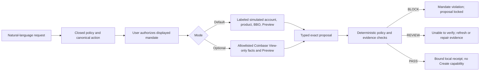

# Delta Coinbase Guard v1.5

> Tell Codex the Coinbase spot trade you want. The Guard turns it into a closed
> mandate, pauses for your authorization, evaluates one exact proposal, and
> keeps Coinbase Create unavailable.

[](https://github.com/mylesoneil-repyhlabs/coinbase-preview-harness/actions/workflows/ci.yml)

[**Download v1.5.3**](https://github.com/mylesoneil-repyhlabs/coinbase-preview-harness/releases/download/v1.5.3/delta-coinbase-guard-v1.5.3.zip)
· [SHA-256](https://github.com/mylesoneil-repyhlabs/coinbase-preview-harness/releases/download/v1.5.3/delta-coinbase-guard-v1.5.3.zip.sha256)
· [Recording kit](docs/COINBASE-CODEX-RECORDING-KIT.md)
· [Claim ledger](docs/COINBASE-DEMO-ASSURANCE.md)
· [Sprint log](docs/SPRINT-LOG.md)

This is an independent Delta prototype. It is not a Coinbase product,
integration, or endorsement. No public command in this release can submit an
order or move money.

## Advisor v1.6 development preview

The active development branch is transforming the same guard into an actual
local-first **protected execution copilot**. The eight-sprint
[roadmap](docs/VIRTUAL-ADVISOR-ROADMAP.md), [design contract](docs/VIRTUAL-ADVISOR-DESIGN-CONTRACT.md),
[threat model](docs/VIRTUAL-ADVISOR-THREAT-MODEL.md), and
[advisor sprint log](docs/ADVISOR-SPRINT-LOG.md) are now checked in.

Sprint 1 now includes an actual dependency-free local frontend and same-origin
loopback service. It is not a screenshot or a fake banking dashboard. A user
can state one spot BUY or SELL, inspect the closed mandate, authorize one dry
run, and see the separate proposal, plain-English `PASS`, `BLOCK`, or `REVIEW`,
impact, checked facts, locally verified receipt, recovery action, and
`NO ORDER SUBMITTED` boundary.

The deliberate fixture story shows an agent proposal outside the mandate,
Delta blocking it, one bounded revision, and the revised exact proposal
passing. The default flow still uses labeled simulation and contacts neither
Coinbase nor production Delta.

### Run the advisor locally

From this development branch:

```sh
./run advisor
```

Open [http://127.0.0.1:4173](http://127.0.0.1:4173). The launcher finds the
Node.js runtime saved by the managed installer, uses `HARNESS_NODE_BINARY` when
explicitly supplied, or falls back to Node.js 22+ on `PATH`. `pnpm advisor`
uses the same launcher.

The first page needs no credential. Leave the composer empty and choose
**Try a protected ETH dry run** to fill a complete, editable example, or write
your own spot request. Nothing is authorized until the exact mandate card is
reviewed and its one-check control is selected.

Current advisor-development capability status comes from
[`config/advisor-capabilities.json`](config/advisor-capabilities.json):

- credential-free protected spot dry run: enabled;
- meaningful simulated `BLOCK → retry → PASS` and unable-to-verify `REVIEW`:
  enabled;
- private session activity and existing redacted Guard history: enabled;
- browser credential storage, Coinbase Create, order submission, production
  Delta, and money movement: unavailable;
- advisor View-only connection, saved conditional plans, research, portfolio
  planning, and post-PASS confirmation readiness: not yet enabled at the
  Sprint 1 milestone.

The public release remains v1.5.3 until all eight advisor sprints, release
archive checks, and CI gates are complete. The existing v1.5 CLI/skill
View-only preflight remains separate and unchanged during this milestone.

## The first experience

After installation, invoke `$delta-coinbase-guard` in Codex. The first message
is intentionally simple:

```text
Coinbase Guard is ready.

Try a protected spot-trade dry run with no credentials, or optionally use a
View-only Coinbase key for real balances, product facts, BBO, and Preview.

This version cannot submit an order.

Tell me the spot BUY or SELL you want in plain English.
```

State intent, not configuration. The skill preserves facts you already gave
and asks once for only the missing economic or authorization limits. It then
shows the complete mandate in plain English:

```text
MANDATE CAPTURED · AWAITING YOUR AUTHORIZATION · NO ORDER CAN BE SENT

Buy: up to 3,000 USDC on ETH-USDC
Condition: fresh best ask at or below 3,000 USDC
Execution: price-bounded IOC; partial fills allowed; no more than 35 bps slippage
Economics: no more than 15 USDC fee; no more than 3,015 USDC all-in
Funding: held USDC only; no conversion
Validity: one use; 10 minutes after authorization

Reply “Authorize this mandate”.
```

The skill retains the exact plan and digest internally. Users do not copy
hashes or paths during the normal flow. Hashes and normalized technical
metadata remain available on request.

## What v1.5 adds

- **Credential-free default:** a complete dry run with labeled local fixtures,
  local Delta simulation, exact-payload checks, receipt, and no network.
- **One optional View-only preflight:** the same authorized mandate can use an
  ephemeral user-supplied key to read only key permissions, held balances, the
  exact product, best bid/ask, and one exact Coinbase Preview.
- **Account-aware proposal:** held-fund availability, portfolio scope, product
  status/increments, fresh BBO, and Preview economics are checked before a
  View-only preflight can pass.
- **Human-readable decisions:** every result shows the mandate, proposal,
  `PASS`, `BLOCK`, or `REVIEW` with one reason, compact economic impact,
  provenance/freshness, recovery action, and an unmistakable no-order boundary.
- **Fail-closed evidence:** missing, stale, malformed, mismatched, rate-limited,
  revoked, partial, or unavailable evidence produces `REVIEW`, not a false
  policy violation or `PASS`.
- **Exact binding:** the receipt binds the policy, proposal, normalized
  evidence, exact Preview request bytes, prospective Create payload,
  preflight fingerprint, decision, mode, nonce, and expiry.
- **Private Guard history:** recent dry runs and View-only preflights are kept
  locally with redacted facts, provenance, age, outcome, and no-order status.
  Credentials, account IDs, raw Coinbase bodies, and headers are not stored.
- **Bounded retry:** an exact nonce retry can return its prior current result.
  A View-only retry rechecks key permissions but does not reread account,
  product, BBO, or Preview facts. Reusing a nonce for different semantics
  blocks; changed evidence supersedes the old result.
- **Locked execution:** Preview is point-in-time evidence, not an execution or
  price guarantee. Coinbase Create remains unavailable.

v1.5.1 also makes every early `BLOCK` or `REVIEW` receipt independently
verifiable by the local receipt checker. Redaction now happens before the
receipt is sealed, so authorization and credential failures keep both their
privacy boundary and their exact integrity binding.

v1.5.2 makes the installer's final handoff fully usable after the downloaded
release is deleted. It now gives one outcome-neutral, copyable Codex prompt,
the separate plain-English authorization message, and the
`PASS`/`BLOCK`/`REVIEW`, receipt, and no-order expectations inline—without
digest ceremony or a source-relative document dependency.

v1.5.3 makes failure and retry provenance match what actually happened.
Permission-check transport, timeout, response-read, shape, size, HTTP, and
scope failures now stop at the View-only credential stage and conservatively
record that the permission request was dispatched. Local key-file/JWT failures
remain local-only. The Guard also stops claiming Coinbase's currently
undocumented `can_receive` field was observed, and the Coinbase release archive
and managed install no longer contain the separate Mastra/Brex partner demo.

## Supported action surface

| Dimension | Public v1.5 |
| --- | --- |
| Venue | Coinbase Advanced Trade custodial account |
| Product | Runtime-verified, online, enabled `SPOT` pair |
| Side | `BUY` or `SELL` |
| Size | `EXACT` or `MAX` |
| BUY funds | Held quote asset; Coinbase `quote_size` |
| SELL funds | Held base asset; Coinbase `base_size` |
| Order | Price-bounded SOR limit IOC; partial fill allowed |
| Optional condition | BUY best ask at/below; SELL best bid at/above |
| Economics | Side-correct slippage, fee, and debit/proceeds bound |
| Use and validity | One use; 30–600 seconds after authorization |
| Decisions | `PASS`, `BLOCK`, `REVIEW` |
| Default mode | `dry_run` with explicitly simulated facts |
| Optional mode | `view_only_preflight` with real read/Preview facts |
| Create/order/money movement | Unavailable |

There is no static asset allowlist or claimed pair count. Availability is
verified from the exact Coinbase product response when View-only credentials
are used. The Guard never silently substitutes USD for USDC, changes a pair,
converts funds, or adds a funding action.

### Deliberately unsupported

- transfers, deposits, withdrawals, sends, and portfolio fund movement;
- conversions, staking, onchain swaps, and network selection;
- derivatives, futures, perpetuals, leverage, and margin;
- stop, bracket, GTC, TWAP, scaled, recurring, and balance-relative orders;
- edits, cancellations, unrestricted market orders, and multi-action plans.

The optional market condition is checked once against fresh evidence. This is
not a resting order, scheduler, price monitor, or recurring strategy.

## What is real, simulated, and locked

| Surface | Status |
| --- | --- |
| Natural-language classification and closed policy | Implemented locally |
| Explicit user-authorization pause | Implemented; the host must authenticate the user message |
| Generic conditional spot BUY/SELL proposal | Implemented |
| Deterministic schema, precision, policy, freshness, and binding checks | Implemented |
| Default end-to-end experience | Labeled local simulation |
| Local Delta evaluation | Simulated contract only; private Delta is not integrated |
| Optional Coinbase facts | Direct REST View-only reads and Preview |
| Coinbase MCP | Documented topology only; not the checked-in adapter |
| Receipt | Locally verifiable SHA-256 integrity evidence |
| Production Delta signature/proof | Not implemented |
| Independent authentication of stored Coinbase facts | Not implemented |
| Coinbase Create or live order | Compile-time locked and unreachable |

A dry-run `PASS` means the exact simulated proposal satisfied the mandate and
local Delta simulation. A `VIEW-ONLY PREFLIGHT PASS` means fresh Coinbase
read/Preview facts and local deterministic rules matched the exact proposal.
It is not production Delta authorization and cannot release an order.

## Install in Codex

Requirements: macOS or Linux and Codex. No Coinbase, Delta, or OpenAI
credential is needed for the default flow. The installer finds Node.js 22+ in
the shell or Codex Desktop runtime cache.

1. Download the pinned
   [v1.5.3 archive](https://github.com/mylesoneil-repyhlabs/coinbase-preview-harness/releases/download/v1.5.3/delta-coinbase-guard-v1.5.3.zip)
   and
   [checksum](https://github.com/mylesoneil-repyhlabs/coinbase-preview-harness/releases/download/v1.5.3/delta-coinbase-guard-v1.5.3.zip.sha256).
2. Verify and install:

```sh
shasum -a 256 -c delta-coinbase-guard-v1.5.3.zip.sha256
unzip delta-coinbase-guard-v1.5.3.zip
cd delta-coinbase-guard-v1.5.3
./install
```

If the executable bit was removed, use `bash install`. The installer:

- validates the matching version and Node runtime;
- copies an allowlisted payload to the private managed version directory;
- creates and verifies an integrity manifest;
- atomically links the Codex skill to the managed copy; and
- never reads a credential or contacts Coinbase.

The archive and extracted directory can be deleted after installation. Upgrade
an existing managed install with:

```sh
./install --upgrade
```

Restart Codex and open a fresh chat if the skill does not appear immediately.
To install from a clone:

```sh
git clone https://github.com/mylesoneil-repyhlabs/coinbase-preview-harness.git
cd coinbase-preview-harness
./install
```

## Try it in Codex

Paste this into a fresh chat:

```text
Use $delta-coinbase-guard for a protected dry run.

Using held USDC, buy up to 3,000 USDC of ETH on ETH-USDC once with a
price-bounded IOC limit order and allow partial fills. Only if
Coinbase's fresh best ask is at or below 3,000 USDC. Do not pay more than
35 bps above Coinbase's fresh best ask, more than 15 USDC in fees, or more
than 3,015 USDC total. The authorization expires 10 minutes after I confirm it.

Keep the mandate, proposal, decision, impact, checked facts, receipt status,
and no-order boundary in this chat. Pause for my authorization.
```

Review the mandate, then reply:

```text
Authorize this mandate
```

The default result stays compact:

```text
DRY RUN · SIMULATED FACTS · NO ORDER SUBMITTED

Mandate captured
[complete enforceable boundary]

Proposal
[one exact IOC proposal]

PASS — [one plain-English reason]
Impact: [debit/receive/fee]
Checked: simulated balance, product, BBO, and Preview at [time]
Boundary: local Delta simulation; no Coinbase contact, Create, order, or money movement.
```

Ask for “technical details” to reveal receipt hashes and normalized metadata.
Use “show Guard history” to see redacted prior runs. The skill must ask for
explicit confirmation before clearing history.

### Terminal equivalent

The chat skill handles paths and hashes internally. Developers can inspect the
same handoff:

```sh
./run version
./run doctor
./run plan --intent-file examples/conditional-buy-intent.txt --details

./run preflight \
  --plan /absolute/private/path/from-plan \
  --confirm-policy <exact-policy-digest> \
  --no-artifacts

./run history
```

Use `--details` for hashes and private artifact paths or `--json` for a
machine-readable result. Omit `--no-artifacts` to write sanitized JSON/HTML
under ignored local runtime storage.

## Optional View-only Coinbase preflight

Coinbase’s official endpoint table documents List Accounts, Get Product, Best
Bid/Ask, and Preview Order as View operations. Create Order requires Trade. A
normal user-created CDP API key is the public credential path; never use a
Coinbase account password.

Create a dedicated ECDSA/ES256 key:

- View enabled;
- Trade, Transfer, and Receive disabled;
- narrowest available portfolio and IP scope; and
- key JSON outside this repository with file mode `0600`.

Never paste a key, private key, JWT, or local key path into chat or a public
artifact. The skill supplies the absolute path directly to one composite
command:

```sh
./run preflight \
  --plan /absolute/private/path/from-plan \
  --confirm-policy <exact-policy-digest> \
  --view-key-file /absolute/path/outside/repository/view_key.json \
  --no-artifacts
```

The key is loaded for that process only. Its secret is not copied, placed in an
environment variable, written to history, or printed. The allowlisted client
can call only:

| Purpose | Method and route |
| --- | --- |
| Verify permissions | `GET /api/v3/brokerage/key_permissions` |
| Read held funds | `GET /api/v3/brokerage/accounts` |
| Read exact product | `GET /api/v3/brokerage/products/{product_id}` |
| Read exact BBO | `GET /api/v3/brokerage/best_bid_ask` |
| Preview exact order | `POST /api/v3/brokerage/orders/preview` |

Redirects are denied, retries do not switch routes, and the View-only adapter
has no Create, transfer, or money-movement method. Permission, account,
product, BBO, or Preview failures return `REVIEW — unable to verify` with a
recovery action.

Coinbase's current documented key-permissions response reports View, Trade,
Transfer, and portfolio scope, but not Receive. Configure Receive disabled.
The Guard rejects an explicit `can_receive: true`, records an omitted value as
unreported, and does not claim the API verified `false`; its allowlisted client
has no Receive route regardless.

View-only setup should take fewer than three minutes after a key exists and
requires no more than two user choices: authorize the mandate, then choose the
optional key. The command emits progress immediately and a safe heartbeat
during a slow provider call.

See [credential setup](docs/COINBASE-CREDENTIAL-SETUP.md).

## Decision, freshness, and receipt model



Deterministic code—not a language model—owns schema validation,
canonicalization, decimal arithmetic, endpoint/method allowlists, evidence
normalization/freshness, policy decisions, nonce/replay, receipts, history,
and mode status. A model may extract, clarify, or explain natural language; it
must pass typed data to the guard.

`BLOCK` means verified facts show the proposal violates the mandate. `REVIEW`
means the Guard cannot safely verify complete, current, matching evidence.
Stale or missing evidence never becomes `PASS`, and the Guard never silently
changes a pair or proposal.

Each receipt is schema-versioned and binds:

- authorized policy and canonical action;
- exact typed proposal;
- allowlisted normalized funding, product, BBO, and Preview facts;
- exact Preview request bytes and transport digest;
- prospective Create payload digest, although Create is unavailable;
- decision code/reason, mode, nonce, source times, fingerprint, and expiry.

Changing an order-relevant field invalidates the prior result. Exact nonce
retries are bounded; a nonce cannot authorize different semantics. History
labels expired and superseded results as historical evidence, never a current
execution grant.

The receipt is an unkeyed local SHA-256 integrity artifact. It is not a
production Delta signature, not proof that Coinbase authored the normalized
facts, and not an execution authorization. Those stronger properties require
the private Delta verifier, authenticated user authorization, trusted key
lifecycle, and durable one-use enforcement.

See [evidence contract](docs/COINBASE-EVIDENCE-CONTRACT.md) and
[Delta adapter contract](docs/MANDATE-ADAPTER-CONTRACT.md).

## Private history and deletion

The Guard keeps at most 100 redacted entries in
`${XDG_STATE_HOME:-$HOME/.local/state}/delta/coinbase-guard/history` with
private directory/file permissions. Entries contain local IDs, hashes,
normalized mandate/proposal summaries, outcome, provenance, evidence age,
expiry/currentness, and the no-order boundary.

They exclude secrets, raw provider bodies and headers, account IDs, key IDs,
private key material, and raw key-file paths. No remote telemetry is enabled.

```sh
./run history --limit 10
./run history --clear
```

`history --clear` permanently removes those local history entries, so the
Codex skill asks for explicit confirmation first. It does not affect Coinbase,
credentials, orders, or release artifacts.

## Security and production boundary

Public v1.5 cannot place an order:

1. the public View-only adapter has an explicit route/method allowlist and no
   Create method;
2. redirects are denied and provider retry behavior cannot introduce a
   mutation endpoint;
3. the separate Create transport is behind a module-private capability;
4. the public production-composition seam throws unless private dependencies
   are supplied; and
5. no checked-in command can issue a durable execution grant.

Still required before any Create path could be reviewed:

- private Delta implementation and pinned cryptographic verifier validation;
- independently authenticated user authorization with audience, nonce,
  expiry, and durable one-use consumption;
- production receipt signing and key lifecycle;
- isolated View+Trade executor credentials; and
- separate explicit authorization for a first live order.

The checked-in 5-USDC/one-order profile is only a future live-test
blast-radius control. It is not product economics and does not authorize a key,
Create call, or trade.

See [security policy](SECURITY.md) and
[engineering handoff](docs/ENGINEERING-HANDOFF.md).

## Upgrade from v1.4

The v3 policy schema remains, but v1.5 adds versioned funding, execution
record, preflight, receipt, and history contracts. Old plans, confirmations,
receipts, and Preview evidence must not be reused.

1. Run `./install --upgrade`.
2. Re-run the original request.
3. Review and authorize the newly displayed mandate.
4. Run a new dry run or View-only preflight.

## Develop and verify

```sh
./run doctor
pnpm test
pnpm run check:skill
pnpm run check:links
pnpm run check:release
```

The release suite covers generic BUY/SELL pairs and quote assets, exact and
maximum sizes, conditions, held-fund mismatches, source-clause smuggling,
USD/USDC non-substitution, decimal precision, product restrictions, stale and
crossed books, incomplete pagination, Preview arithmetic and fingerprint
drift, 401/403/429/outage/partial/malformed responses, wrong side/size,
expired policy, payload mutation, exact-byte mismatch, nonce replay,
supersession, no-secret history/log output, locked Create, managed install,
restricted `PATH`, source deletion, upgrades, truthful permission-failure
provenance, View-only retry contact, and Coinbase-only release contents.

See [the sprint log](docs/SPRINT-LOG.md) for the PM requirement, engineering
decision, QA/persona finding, shipped fix, validation, and user impact for each
release.

## Repository map

```text
install                                  managed user-local installer
skills/delta-coinbase-guard/             chat-native workflow
config/coinbase-spot-policy.v3.schema.json
config/preview-capability-profile.json   dry-run/View-only capability
config/execution-safety-profile.json     future 5-USDC live-test ceiling
src/intent-compiler.js                   closed natural-language compiler
src/preflight.js                         single dry-run/View-only orchestrator
src/coinbase-rest.js                     allowlisted View-only client
src/funding.js                           held-fund and portfolio checks
src/execution-policy.js                  proposal and Preview checks
src/execution-pipeline.js                exact proposal/evidence controller
src/guard-receipt.js                     local binding and verification
src/dry-run-history.js                   redacted local history/replay
src/integration/production-composition.js
                                           compile-time locked Create seam
test/                                    unit, adversarial, UX, install tests
runtime/                                 ignored local plans and reports
```

## Official Coinbase references

- [Advanced Trade endpoint permissions](https://docs.cdp.coinbase.com/coinbase-app/advanced-trade-apis/rest-api)
- [Advanced Trade orders guide](https://docs.cdp.coinbase.com/coinbase-app/advanced-trade-apis/guides/orders)
- [List Accounts](https://docs.cdp.coinbase.com/api-reference/advanced-trade-api/rest-api/accounts/list-accounts)
- [Get Product](https://docs.cdp.coinbase.com/api-reference/advanced-trade-api/rest-api/products/get-product)
- [Best Bid/Ask](https://docs.cdp.coinbase.com/api-reference/advanced-trade-api/rest-api/products/get-best-bid-ask)
- [Preview Order](https://docs.cdp.coinbase.com/api-reference/advanced-trade-api/rest-api/orders/preview-orders)
- [Create Order](https://docs.cdp.coinbase.com/api-reference/advanced-trade-api/rest-api/orders/create-order)
- [Get API Key Permissions](https://docs.cdp.coinbase.com/api-reference/advanced-trade-api/rest-api/data-api/get-api-key-permissions)
- [API-key authentication](https://docs.cdp.coinbase.com/coinbase-app/authentication-authorization/api-key-authentication)
