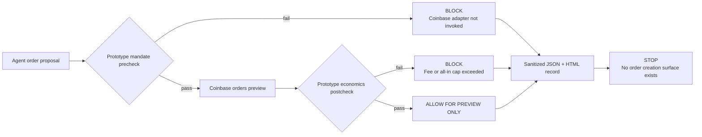

# A delta-gated Coinbase Advanced Trade preview

**What this repository is.** A proposal-grade, preview-only integration harness for the Coinbase Advanced Trade seam
that matters to delta: an agent proposes an order; a prototype mandate gate checks it; Coinbase returns the estimated
economics; the gate checks those economics; the system emits a reviewable verification record and stops.

This is deliberately more concrete than a product mock and safer than an execution demo. It runs real code against the
official Coinbase CLI and Preview Order contract, but contains **no order-creation adapter, no generic Coinbase command
proxy, and no path that can move funds**.

> **Current status:** credential-ready · 19 tests passing · 6 policy fixtures passing · live preview pending a dedicated
> view-only key.

---

## 1. Background in ten lines each

**Coinbase for Agents** gives an agent a structured path into Coinbase capabilities. At the Advanced Trade layer, an
agent can describe an order using fields such as product, side, type, and size. Coinbase's API key permissions answer
whether a key may view, trade, transfer, or receive. Preview Order estimates the fill, fees, and total before an order is
created; it does not create or reserve an order. Those controls are necessary, but they do not answer the
transaction-specific question:
*does this exact order satisfy the mandate the human authorized?*

**delta Mandate** is a buyer-side policy enforcement and evidence layer for agentic finance. Before an action of
consequence is released, delta evaluates the agent's exact proposal against the user's authorized constraints. A failed
proposal is blocked; a successful proposal produces a traceable decision record. In production, that record becomes the
proof that binds the user's mandate, the proposed action, the evidence used to evaluate it, and the resulting liability.

**The thesis.** Coinbase should not have to trust that an agent interpreted a user's instruction correctly. The
execution boundary should require a machine-verifiable answer to:

> Is this exact `ETH-USDC` market buy, for this amount, in this portfolio, still within the mandate after fees?

This repository proves a client-side preflight contract that can sit before a trusted executor without requiring
partner access or an order to be placed. It does not yet bind Preview Order to Create Order, and it does not constrain
an agent that has another execution path.

## 2. The enforcement flow



The Preview Order response is evidence, not authorization. Coinbase supplies the economics; the mandate decides whether
those economics are acceptable.

## 3. Design principles

1. **Evaluate before any future mutation.** In this client-side prototype, a disallowed proposal is rejected before
   Coinbase Preview. A production execution service would sit after the same gate and make bypass impossible.
2. **Use Coinbase's native preview seam.** The integration relies on `orders preview` for fee and fill estimates instead
   of recreating Coinbase's pricing logic.
3. **Fail closed twice.** The proposal is checked before preview; the returned all-in debit and commission are checked
   again after preview. Missing, malformed, timed-out, or ambiguous responses block.
4. **Make the order schema smaller than Coinbase's.** The agent cannot reach arbitrary CLI commands or smuggle
   unsupported fields through the adapter.
5. **Use least privilege.** The demo refuses any credential with Trade, Transfer, or Receive capability. View permission
   is sufficient for Preview Order; the repository cannot execute an order.
6. **Keep secrets out of evidence.** The configuration command reads the downloaded key into memory once, from outside
   the repository, to verify permissions and import it into Coinbase's CLI/keychain. Reports contain sanitized business
   evidence and unsigned SHA-256 digests, never credentials or JWTs.
7. **Say exactly what is real.** The adapter, policy behavior, tests, and report generation are implemented. The current
   evaluator is a deterministic integration prototype—not the production delta verifier and not a production receipt.

## 4. What is real, mocked, and absent

| Component | Status | What it proves |
| --- | --- | --- |
| Closed-schema pre/post evaluator | **Real runnable code** | Prototype policy semantics; not a signed human mandate |
| Official Coinbase CLI adapter | **Real, pinned CLI** | Dry-run proves exact `orders preview` request construction without contacting Coinbase |
| Coinbase static sandbox | **Real endpoint, mocked values** | Production-shaped success and insufficient-funds responses are parsed fail closed |
| View-only permission attestation | **Implemented, not live-tested** | Configuration rejects overscoped keys and binds the attestation to one key and portfolio |
| Authenticated Preview Order | **Credential boundary** | Implemented but not yet exercised with a live credential |
| Sanitized verification record | **Real, unsigned output** | JSON and HTML show inputs, checks, selected evidence, and an SHA-256 digest |
| Production delta verifier or receipt | **Absent** | This build does not invoke the production delta stack |
| Coinbase-side delta enforcement | **Absent** | Coinbase does not verify a delta proof in this prototype |
| Order creation or funds movement | **Absent by design** | This repository cannot place, cancel, convert, transfer, or close anything |

## 5. The demo mandate

The first mandate is intentionally narrow:

```json
{
  "allowed_products": ["ETH-USDC"],
  "allowed_sides": ["BUY"],
  "allowed_order_types": ["market"],
  "max_quote_size": "20.00",
  "max_order_total": "21.00",
  "max_commission_total": "1.00",
  "slippage_policy": "observe_only_until_units_are_confirmed"
}
```

The allowed proposal is equally narrow:

```json
{
  "product_id": "ETH-USDC",
  "side": "BUY",
  "type": "market",
  "quote_size": "20.00"
}
```

The distinction between `ETH-USDC` and `ETH-USD` is load-bearing, not cosmetic. A financially similar substitute can
still violate the user's authorized pair, funding asset, accounting treatment, or portfolio policy.

## 6. Exact client-side integration contract

**Input.** Exactly four fields: `product_id`, `side`, `type`, and `quote_size`.

**Precheck.** Reject unknown fields; require `ETH-USDC`, `BUY`, `market`, a positive decimal-string `quote_size`, and
principal at or below `20.00 USDC`.

**Coinbase action.**

```text
orders preview product_id=ETH-USDC side=BUY type=market quote_size=20.00
```

**Postcheck.** Require a valid response with `order_total`, `commission_total`, and `quote_size`; reject Coinbase errors
or malformed decimals; require positive `order_total` and `quote_size`; bind the returned size to the proposal; require
estimated order total at least equal to principal and no more than `21.00 USDC`; require commission no more than
`1.00 USDC`. Slippage remains observe-only pending one live response.

**Output.** A sanitized JSON record and self-contained HTML rendering with an unsigned digest. The digest is a
correlation/integrity aid—not a signature, delta receipt, or independently verifiable proof.

## 7. Run the credential-free proof

Requirements: Node.js 22+ and pnpm.

```sh
pnpm install --frozen-lockfile --ignore-scripts
pnpm test
./run doctor
./run fixtures
./run dry-run --fixture allowed
./run sandbox
```

`./run fixtures` evaluates six proposals:

| Fixture | Expected verdict | Coinbase adapter calls |
| --- | ---: | ---: |
| Exact allowed proposal | `ALLOW` | `1` dry-run |
| Wrong trading pair | `BLOCK` | `0` |
| Oversized principal | `BLOCK` | `0` |
| Unauthorized sell | `BLOCK` | `0` |
| Unsupported limit order | `BLOCK` | `0` |
| Unknown injected field | `BLOCK` | `0` |

The official CLI dry-run validates the exact request assembly without contacting Coinbase. The static sandbox validates
response parsing against mocked Coinbase responses. Neither is presented as a live customer proof.

## 8. Run one live preview

Create one dedicated key in Coinbase Developer Platform:

1. Scope it to an isolated Coinbase Advanced portfolio.
2. Select **ECDSA / ES256**.
3. Enable **View only**.
4. Leave **Trade**, **Transfer**, and **Receive** disabled.
5. Configure an IP allowlist—or explicitly opt out for this isolated preview key.
6. Keep the downloaded JSON file outside this repository.

The harness reads the downloaded key into memory during configuration, calls `/key_permissions`, and rejects an unsafe
permission set before importing the key into Coinbase's CLI/keychain. It stores only key and portfolio fingerprints in
the ignored `runtime/` directory and invalidates the attestation if the configured key changes. Before each preview it
checks the stored attestation and key fingerprint; it does not re-query Coinbase permissions on every run.

```sh
./run configure --key-file /absolute/path/to/downloaded-key.json
./run preview --live-preview --fixture allowed
```

The live command is fixed to:

```text
orders preview product_id=ETH-USDC side=BUY type=market quote_size=20.00
```

The isolated portfolio should contain enough USDC for the preview; an empty portfolio can return
`PREVIEW_INSUFFICIENT_FUND`.

## 9. The artifact an engineer or partner can inspect

The harness writes:

- [`artifacts/credential-readiness.html`](artifacts/credential-readiness.html) — screen-shareable decision record
- [`artifacts/credential-readiness.json`](artifacts/credential-readiness.json) — machine-readable record
- [`artifacts/coinbase-static-sandbox.json`](artifacts/coinbase-static-sandbox.json) — success-shape contract fixture
- [`artifacts/coinbase-static-sandbox-previeworder-insufficient-fund.json`](artifacts/coinbase-static-sandbox-previeworder-insufficient-fund.json) — documented failure shape

Every report states whether Coinbase was contacted and whether the artifact is a fixture or live result. Every report
also states:

```text
NO ORDER CREATED
```

## 10. What the demo shows

1. **Compromised-agent run.** The agent proposes `ETH-USD` or a principal above `20.00`. The gate blocks it locally and
   the record proves the Coinbase adapter was never invoked.
2. **Allowed preview run.** The exact authorized proposal reaches Coinbase Preview once. Coinbase returns estimated
   economics; the prototype gate rechecks the returned order total and commission.
3. **Fee-drift run.** The proposal is valid before preview, but Coinbase's estimated all-in amount breaches the mandate.
   The post-preview gate blocks it.
4. **Evidence view.** The HTML shows the authorized mandate, exact proposal, each check, Coinbase's sanitized evidence,
   the final verdict, and a deterministic record digest.

The result is a real candidate for *where delta sits* in a Coinbase agent flow—not a dashboard that merely describes
one. It demonstrates preview-time policy evaluation, not execution control.

## 11. Production integration shape

The current repository stops at preview. A production integration should preserve that separation and choose an actual
enforcement owner:

1. **Agent plane:** can propose actions and request previews, but has no trading credential.
2. **delta enforcement plane:** evaluates a signed mandate against the proposal and fresh Coinbase preview evidence.
3. **Execution plane:** holds a separately scoped Trade credential and accepts only a valid, unexpired delta
   authorization bound to the policy, proposal digest, portfolio, and maximum all-in debit.
4. **Record plane:** binds the Coinbase order identifier and final execution outcome back to the delta receipt.

The trusted executor can be delta-operated or customer-operated, holding the Trade credential where the agent cannot
reach it. The stronger alternative is Coinbase verifying a delta proof inside Create Order, which requires Coinbase
coordination. In both models, Preview and Create are non-atomic today, so the verified proposal and economics must be
bound to the exact create payload and protected against replay and price drift.

The minimum engineering progression is:

- replace `config/mandate.example.json` and the deterministic evaluator with the production delta policy and verifier
  client;
- define the signed authorization envelope and replay/expiry semantics;
- keep the Trade credential in a separate service that is unreachable from the agent;
- re-preview or otherwise bound price drift immediately before order creation;
- add one execution adapter only after the verifier contract and failure behavior are reviewed.

The important architectural rule is stable: **the component that can create the order must not be able to bypass the
mandate decision.**

## 12. Known limitations

1. The current evaluator is a deterministic prototype, not the production delta orchestrator/verifier.
2. The checked-in readiness report is pre-credential; it does not claim a live Coinbase response.
3. Slippage is recorded but not enforced until Coinbase's live response units are confirmed.
4. Preview economics are estimates and must be rebound or refreshed at execution.
5. The harness is intentionally single-product and single-action; generalization should follow a proven end-to-end seam.
6. No Coinbase partnership, endorsement, privileged access, or production readiness is implied.

## 13. Repository map

```text
config/       demo mandate
fixtures/     allowed and adversarial order proposals
src/
  policy.js       closed-schema precheck and preview economics checks
  coinbase-cli.js fixed, shell-free official CLI adapter
  permissions.js  view-only key verification and attestation
  pipeline.js     fail-closed orchestration
  evidence.js     deterministic verification record
  report.js       self-contained HTML renderer
test/         policy, adapter, permission, pipeline, report, and sandbox-contract tests
artifacts/    sanitized readiness report and Coinbase contract fixtures
```

## 14. Safety properties

- Pinned official CLI version; no PATH lookup for the Coinbase package.
- `execFile(process.execPath, ...)`, fixed arguments, `shell:false`.
- No generic CLI command passthrough.
- Closed proposal schema and strict decimal-string validation.
- Ambient Coinbase credentials and API URL overrides are removed from the child environment.
- Isolated Coinbase CLI environment and ignored runtime directory.
- CLI history and update checks disabled.
- Timeouts, output limits, JSON validation, and sanitized errors.
- Static HTML has no external assets, analytics, fonts, or network calls.
- Credential files, runtime data, live artifacts, PEM/JWK/key containers, and `.env` files are ignored.
- Production source contains no Coinbase order-creation command.

## 15. Official references

- [Coinbase for Agents skill](https://docs.cdp.coinbase.com/coinbase-for-agents/skill.md)
- [Advanced Trade endpoint permissions](https://docs.cdp.coinbase.com/coinbase-app/advanced-trade-apis/rest-api)
- [Preview Orders API](https://docs.cdp.coinbase.com/api-reference/advanced-trade-api/rest-api/orders/preview-orders)
- [Advanced Trade static sandbox](https://docs.cdp.coinbase.com/coinbase-business/advanced-trade-apis/sandbox)
- [CDP API key authentication](https://docs.cdp.coinbase.com/coinbase-app/authentication-authorization/api-key-authentication)
