# Delta Coinbase Guard v1.3 — engineering handoff

This is the start-here contract for replacing the checked-in Coinbase and Delta
simulators with trusted production components without rebuilding the guard.

The public Repyh Labs organization does not expose the private Delta Mandate
implementation needed to validate concrete policy syntax, service paths, proof
types, or deployment topology. This document therefore describes the narrow
application contract implemented by this repository. It does **not** claim that
the private Delta code already implements this Coinbase domain. Engineering
must validate every Delta mapping against the actual private codebase before
enabling Create.

## The invariant

The model may interpret intent, inspect allowlisted Coinbase data, and propose a
candidate. It must never authorize or execute its own proposal.

Coinbase Create Order is eligible only if a trusted deterministic executor has:

1. the user's authenticated authorization of the closed policy and the
   credential-scoped execution binding;
2. one immutable Coinbase action record containing fresh market, funding, and
   Preview evidence;
3. a terminal Delta `PASS` for that exact record and a matching independently
   verified proof;
4. an unexpired one-time grant that binds the exact serialized Create body; and
5. a transactionally successful consumption of that grant immediately before
   submission.

Every other state stops: `BLOCK`, `REVIEW`, missing evidence, Preview warnings,
timeouts, unavailable services, malformed artifacts, stale data, digest
mismatches, or uncertain submission. No prompt or agent tool result can relax
that predicate.

## What v1.3 implements now

The checked-in build supports:

- natural-language compilation into a closed
  `digital-asset-spot-order.v2` policy;
- explicit policy and credential-scoped authorization digests;
- Coinbase Advanced Trade **SPOT BUY and SELL** actions;
- runtime validation of the requested pair, product flags, increments, and
  size bounds rather than an ETH-specific allowlist;
- exact BUY `quote_size` and SELL `base_size`;
- a held-funds check using the quote asset for BUY or base asset for SELL,
  with no silent conversion;
- authenticated View-only List Accounts, Get Product, Best Bid/Ask, and
  Preview through the REST adapter;
- deterministic proposal and Preview checks with `PASS`, `BLOCK`, and
  `REVIEW`;
- an action descriptor, funding evidence, payload digests, decision receipt,
  and bounded retry controller;
- a production-shaped seven-operation Delta adapter port; and
- a compile-time Create lock.

The current implementation does not support transfers, Convert, recurring
orders, percentages of balance, unrestricted market orders, GTC orders,
staking, leverage, margin, derivatives, on-chain execution, or multi-action
strategies. Product availability is resolved from fresh Coinbase product data;
do not hardcode a public pair count.

The v1.2 plan format is not accepted. Recompile the original natural-language
intent under v1.3 so BUY/SELL denomination, settlement semantics, funding, and
the canonical action descriptor are bound explicitly.

## Public Coinbase basis

The required exchange surfaces are documented as normal Advanced Trade v3
endpoints:

- [endpoint and permission matrix](https://docs.cdp.coinbase.com/coinbase-app/advanced-trade-apis/rest-api);
- [List Accounts](https://docs.cdp.coinbase.com/api-reference/advanced-trade-api/rest-api/accounts/list-accounts);
- [Get Product](https://docs.cdp.coinbase.com/api-reference/advanced-trade-api/rest-api/products/get-product);
- [Preview Order](https://docs.cdp.coinbase.com/api-reference/advanced-trade-api/rest-api/orders/preview-orders);
- [Create Order](https://docs.cdp.coinbase.com/api-reference/advanced-trade-api/rest-api/orders/create-order); and
- [CDP API-key authentication](https://docs.cdp.coinbase.com/coinbase-app/authentication-authorization/api-key-authentication).

Coinbase documents List Accounts, product/market reads, and Preview as View
operations; Create requires Trade. The public
[Coinbase CLI/MCP](https://docs.cdp.coinbase.com/coinbase-for-agents/overview)
also exposes both `orders_preview` and mutating `orders_create`. A production
agent topology must put an allowlisted read/Preview proxy in front of the
agent-facing MCP or use this repository's pinned REST adapter. Merely asking
the model not to call a mutating MCP tool is not an execution boundary.

No key, live Coinbase response, Coinbase MCP session, private Delta service, or
real order was used to validate this public build.

## System map

```mermaid
flowchart LR
  U["User request"] --> C["Closed policy compiler"]
  C --> A["Authenticated user authorization"]
  A --> D["Canonical action descriptor"]

  M["Agent with allowlisted Coinbase reads"] --> P["Candidate proposer"]
  P --> X["Trusted controller"]
  D --> X
  X --> F["Accounts / held-funds evidence"]
  X --> B["Product + best bid/ask"]
  X --> V["Coinbase Preview"]

  F --> R["Frozen action record"]
  B --> R
  V --> R
  R --> T["Delta policy + evidence evaluation"]
  T --> Q["Independent proof verification"]
  Q --> G["Deterministic one-time gate"]

  G -->|"PASS + exact binding only"| E["Isolated Coinbase executor"]
  G -->|"BLOCK / REVIEW / mismatch"| S["Stop or bounded retry"]
  E --> O["Coinbase Create Order"]
  O --> Y["Reconcile by client_order_id"]
```



The agent does not receive the Trade key, write the action registry, issue a
Delta result, consume a grant, or call Create.

## Canonical v1.3 action

`src/spot-action.js` turns the authorized policy into
`delta.coinbase.spot_action.v1`. Its digest covers:

- venue, execution domain, and exact SPOT pair;
- BUY or SELL;
- SOR limit IOC and partial-fill policy;
- exact side-specific size field, asset, and value;
- funding source, asset, required available amount, and
  `conversion_allowed: false`;
- price reference and direction;
- slippage, commission, and settlement limits; and
- one-use validity.

The side-specific economics are intentional:

| Side | Order size | Held funding | Price reference | Settlement rule |
| --- | --- | --- | --- | --- |
| BUY | Exact `quote_size` | Quote asset | Fresh best ask | Maximum quote debit |
| SELL | Exact `base_size` | Base asset | Fresh best bid | Minimum net quote proceeds |

All monetary values cross the v1.3 Delta seam as canonical decimal strings.
This avoids forcing an eight-decimal base-asset SELL into a universal
six-decimal integer scale.

## Current trust boundaries

| Component | Current public-build status | Production disposition |
| --- | --- | --- |
| `src/intent-compiler.js` | Implemented | Keep upstream of authorization; retain strict grounding and clarification |
| `src/plan.js` and `src/spot-action.js` | Implemented | Keep artifact formats; authenticate user approval |
| `src/execution-binding.js` and `src/execution-confirmation.js` | Implemented, digest-based | Keep exact binding; replace procedural chat attribution with authenticated approval |
| `src/coinbase-rest.js` | Read/Preview implemented | Run with a dedicated View-only key in an allowlisted process |
| `src/funding.js`, `src/market.js`, `src/execution-policy.js` | Deterministic checks implemented | Keep; validate against real response fixtures and fail closed on schema drift |
| `src/mandate/coinbase-policy.js` | Narrow simulated contract | Validate and compile against the private Delta policy engine |
| `src/mandate/coinbase-solution.js` | Strict simulation envelope | Keep only for tests; production uses an authenticated action registry |
| `src/mandate/coinbase-evidence.js` | Deterministic simulator extractor | Replace with independently trusted evidence extraction |
| `src/mandate/simulated-adapter.js` | Test double | Never compose into live execution |
| `src/mandate/orchestrator-adapter.js` | Production-shaped port | Connect only after validation against private Delta APIs and types |
| `src/mandate/controller.js` | Deterministic gate and receipt | Keep; bind actual verified proof semantics |
| `src/execution-pipeline.js` | Full flow; public LIVE capability unavailable | Keep as trusted controller/executor orchestration |
| `src/integration/production-composition.js` | Always fails closed | Replace only in a reviewed internal build |
| Durable execution-grant store | Interface only | Implement transactionally outside agent-writable state |
| Coinbase Create adapter | Implemented behind private capability | Run only in isolated executor after acceptance |

## Delta adapter contract

The application port is:

```text
submitPolicy
authorizeIntent
prepareProposal
submitProposal
getStatus
getVerificationOutcome
getProof
```

`authorizeIntent` must return a signed intent bound to the exact policy ID,
intent ID, and typed parameters. `prepareProposal` must register the frozen
action record in authenticated append-only storage and return a content-addressed
locator. The untrusted agent must not choose or overwrite that locator.

The checked-in HTTP adapter models a policy submission, signed-intent
submission, proposal submission, status, verifier outcome, and proof retrieval.
Those paths and payload shapes are integration hypotheses until checked against
the private Delta implementation. Preserve the application port even if the
private clients or wire vocabulary differ.

The authoritative production result must be derived from actual Delta
evaluation and proof verification. This public repository's
`PASS`/`BLOCK`/`REVIEW` receipt is an application artifact, not evidence that
Delta core currently exposes that exact decision vocabulary.

## Decision and retry semantics

There are three separate decision stages:

1. **Local proposal check.** A schema, pair, side, size, order-type, increment,
   or price-bound mismatch is `BLOCK`.
2. **Coinbase Preview check.** Preview errors or violated economics are
   `BLOCK`; any nonempty Coinbase warning is `REVIEW`; otherwise the Preview
   check is `PASS`.
3. **Delta check.** Only terminal successful evaluation, matching independent
   verification, nonempty proof material, and exact proof bindings produce
   `PASS`. A terminal constraint failure or expiry is `BLOCK`; a bound terminal
   adapter `review` becomes `REVIEW` with no proof or execution eligibility.
   Infrastructure, timeout, proof, or artifact failures stop fail-closed and
   must not be reclassified as authorization.

The terminal `review` state is part of this repository's application adapter
contract. It is not a claim that private Delta already exposes that vocabulary;
engineering must validate or map the actual runtime result explicitly.

The controller can retry only a candidate-level constraint failure and only
within an explicit attempt bound. The helper enforces 1–10 attempts and defaults
to three; the showcase uses a smaller fixed bound. `REVIEW` is always `STOP`.

This repository does not claim that the private Delta runtime reopens one
signed intent for multiple proposals. Production must select and test one:

- refine locally, then submit one final candidate to Delta;
- authorize a fresh signed intent for each retry; or
- implement an authenticated bounded-proposal window in Delta.

Retry must never reuse a successful grant or resubmit after an uncertain Create.

## Action registry and evidence service

The production `prepareProposal` contract expects:

```text
coinbase-order://proposal/v1/{sha256-of-canonical-action-record}
```

The registry must recompute the record digest, write it append-only, and return
both that locator and the same digest. Only the trusted controller can write;
the Delta evidence service receives read-only resolution access.

The frozen `delta.coinbase.evaluation_request.v2` includes:

- plan, policy, authorization, and action-descriptor bindings;
- normalized market and complete account/funding evidence;
- the selected Coinbase Preview evidence;
- the exact Preview request and its digest;
- the exact prospective Create object and serialized UTF-8 bytes;
- the Create-body digest; and
- portfolio and credential fingerprints.

The production extractor must independently validate registry provenance,
strict field sets, freshness, product tradability, funding sufficiency,
Preview/Create consistency, and every digest. It must derive evidence
deterministically without an LLM and must never accept the simulator's embedded
claims as authoritative.

The required proof binding set is exactly:

```text
product_id
action_descriptor_digest
funding_evidence_digest
preview_id
create_payload_digest
preview_request_digest
portfolio_fingerprint
credential_fingerprint
```

The controller also requires a matching intent, policy, typed attributes, and
proposal locator. The isolated executor recomputes the serialized body digest
immediately before submission; the transport must report the digest of bytes it
sent. A missing or mismatched transport digest becomes
`SUBMISSION_UNCERTAIN`, followed by reconciliation—never blind resubmission.

See [the evidence contract](COINBASE-EVIDENCE-CONTRACT.md) for the field-level
mapping.

## Credential and process isolation

Use two independently scoped credentials:

- a **View-only** key for accounts, product/market reads, and Preview; and
- a future **View + Trade** key available only to the trusted executor.

Both must be restricted to the intended portfolio and must lack transfer
authority. The agent never sees the Trade key. The evidence service and Delta
Verifier must not share the executor's write credential.

The checked-in file validator requires an absolute external path, owner-only
mode, ECDSA P-256 material, short-lived request-bound JWTs, and fresh
permission verification. It persists fingerprints and permission booleans, not
secret material or the key path. Verify the live Coinbase key-permissions
response schema in shadow before treating credential setup as accepted.

## Durable one-time execution

The production grant store must implement the existing `consumeGrant`,
`markGrant`, and `readGrant` ports with:

- an authenticated writer available only to the trusted executor;
- a transactional unique key for the plan and successful Delta intent;
- bindings to the confirmation, proposal, proof, Preview, Create-body digest,
  portfolio, credential, and deadlines;
- durable states across restart; and
- a read-only recovery path keyed by `client_order_id`.

Do not use an agent-writable file, in-memory map, Redis command without a
transactional uniqueness guarantee, or a model-supplied “already executed”
flag as the production one-use boundary.

## Acceptance checklist

### Policy and authorization

- [ ] Validate the v1.3 policy parameters and evidence types against the actual
      private Delta compiler.
- [ ] Preserve BUY quote sizing and maximum debit.
- [ ] Preserve SELL base sizing and minimum net proceeds.
- [ ] Preserve exact pair, assets, side, one use, and expiry.
- [ ] Authenticate the human authorization of both policy and
      credential-scoped execution digests.
- [ ] Reject all v1.2 artifacts and all unsupported action taxonomies.

### Coinbase reads and Preview

- [ ] Validate View-only key permissions against a real isolated-account
      response without persisting secrets.
- [ ] Validate account pagination, duplicate cursors, active/ready account
      flags, and held funding in the exact asset.
- [ ] Validate product flags, increments, min/max sizes, and bid/ask freshness
      across several real SPOT pairs.
- [ ] Run BUY and SELL shadow Previews and pin side-specific response semantics.
- [ ] Confirm Preview `errs`, `warning`, `preview_id`, `order_total`,
      `quote_size`, `base_size`, commission, and estimated-fill behavior.
- [ ] Treat every schema change, warning, stale value, or mismatch fail-closed.

### Delta and evidence

- [ ] Implement authenticated, append-only action registration.
- [ ] Implement deterministic evidence extraction from trusted records.
- [ ] Validate real signed-intent, status, verifier, and proof shapes.
- [ ] Verify proof cryptography in an operationally independent component.
- [ ] Cover all eight proof bindings and intentional tamper cases.
- [ ] Define and test bounded retry using the private runtime's actual
      lifecycle.

### Execution and recovery

- [ ] Keep the agent-facing key View-only.
- [ ] Keep the Trade key in an isolated executor with no transfer authority.
- [ ] Implement transactional one-time grant consumption.
- [ ] Preserve byte-for-byte Preview/Create binding.
- [ ] Make `SUBMISSION_UNCERTAIN` reconciliation-only.
- [ ] Confirm `client_order_id` duplicate and recovery behavior in shadow.
- [ ] Keep Create disabled through all prior stages.

### Validation

- [ ] Unit tests cover multiple BUY and SELL pairs, USD and USDC funding,
      eight-decimal base sizes, unsupported actions, missing funds, product
      flags, Preview error/warning, tampering, expiry, and replay.
- [ ] Contract tests cover the actual private Delta adapter and independent
      Verifier.
- [ ] End-to-end shadow tests use View-only credentials and never call Create.
- [ ] Logs, reports, recordings, and failure messages contain no key material.
- [ ] Independent security review signs off on credential isolation, evidence
      authority, proof binding, grant atomicity, and recovery.

## Staged rollout

1. **Public simulation:** no credentials, simulated Coinbase and simulated
   Delta, Create locked.
2. **Credentialed shadow:** isolated View-only key, real reads and Preview,
   deterministic local decision, Create locked.
3. **Private Delta shadow:** real signed intent, evaluation, evidence, Verifier,
   and proof; View-only Coinbase key; Create locked.
4. **Executor rehearsal:** isolated future Trade key, real grant store, exact
   payload and recovery tests against non-money-moving doubles; Create locked.
5. **First live test:** only after a new user decision, use the independent
   hard safety profile—one `ETH-USDC` BUY, `5.00 USDC` principal, `5.50 USDC`
   maximum debit, `0.50 USDC` commission, 50 bps slippage, IOC, one use, 120
   seconds.
6. **Any expansion:** requires a new reviewed safety profile, acceptance
   evidence, and explicit authorization. Generic v1.3 Preview coverage does
   not automatically widen live execution.

Handoff is complete only when the private Delta mapping, trusted evidence
service, credential isolation, proof verification, transactional grant store,
Coinbase shadow results, recovery behavior, and independent security review are
all evidenced. A passing local simulator or Coinbase Preview is not sufficient.
