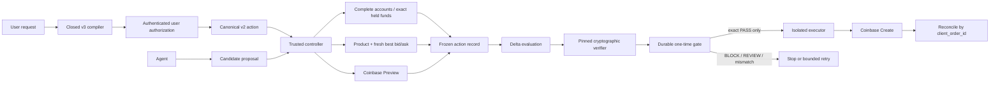

# Delta Coinbase Guard v1.4 — engineering handoff

This is the start-here contract for replacing checked-in Coinbase and Delta
simulation components with trusted production services without rebuilding the
guard.

The public Repyh Labs organization does not expose the private Delta Mandate
implementation. Concrete policy syntax, service paths, signer types, verifier
identity, and proof program must be validated against that codebase before
Coinbase Create can be enabled.

## Non-negotiable invariant

The agent may interpret a request, inspect allowlisted Coinbase data, and
propose a candidate. It must never authorize, evidence, approve, retry, or
execute its own proposal.

Coinbase Create is eligible only when a trusted controller has:

1. authenticated user authorization of the complete closed policy and
   credential-scoped execution binding;
2. one immutable action record containing fresh Coinbase product, BBO,
   funding, and Preview evidence;
3. terminal Delta success for that exact record;
4. an independently verified proof whose digest, verifier identity, proof
   program, and all Coinbase bindings match;
5. an unexpired one-time grant for the exact serialized Create body; and
6. transactional consumption of that grant immediately before submission.

Every other state stops. No prompt, agent output, credential, local simulator,
or self-asserted `ALLOW` may relax that predicate.

## What v1.4 implements

- deterministic natural-language compilation into
  `digital-asset-spot-order.v3`;
- complete draft display and procedural policy/execution digest pauses;
- Coinbase Advanced custodial SPOT BUY and SELL;
- dynamic pair, asset, product-state, increment, and size-bound handling;
- BUY quote sizing/funding and SELL base sizing/funding;
- `EXACT` or positive agent-selected size no greater than `MAX`;
- optional one-shot BUY best-ask-at-or-below or SELL best-bid-at-or-above
  absolute condition;
- SOR limit IOC, partial-fill policy, slippage, commission, settlement,
  expiry, and one use;
- paginated direct REST List Accounts/List Products, Get Product, BBO, and
  Preview through a View-only boundary;
- strict product, funding, proposal, BBO, Preview-coherence, and payload checks;
- `PASS`, `BLOCK`, and `REVIEW`;
- v2 canonical action, v2 frozen evaluation request, v3 decision receipt, and
  bounded controller retry;
- explicit simulation-only versus pinned-production proof-verifier contracts;
- a simulation that stops at `EXECUTION_ELIGIBLE` without invoking an
  executor; and
- a compile-time Create lock.

Unsupported: transfers, Convert, staking, recurring strategies, GTC,
unrestricted market orders, balance percentages, leverage, derivatives,
on-chain execution, multi-action strategies, and generic portfolio exposure
constraints.

The fixed partner showcase has a portfolio-exposure fixture. That is not part
of the generic v1.4 compiler or policy.

v1.2 and v1.3 plans must be recompiled from the original natural language so
the v3 size operator and optional market condition are explicitly bound.

## Public Coinbase basis

The direct adapter targets normal Advanced Trade REST:

- [permission matrix](https://docs.cdp.coinbase.com/coinbase-app/advanced-trade-apis/rest-api);
- [List Accounts](https://docs.cdp.coinbase.com/api-reference/advanced-trade-api/rest-api/accounts/list-accounts);
- [List Products](https://docs.cdp.coinbase.com/api-reference/advanced-trade-api/rest-api/products/list-products);
- [Get Product](https://docs.cdp.coinbase.com/api-reference/advanced-trade-api/rest-api/products/get-product);
- [Preview Order](https://docs.cdp.coinbase.com/api-reference/advanced-trade-api/rest-api/orders/preview-orders);
- [Create Order](https://docs.cdp.coinbase.com/api-reference/advanced-trade-api/rest-api/orders/create-order); and
- [CDP authentication](https://docs.cdp.coinbase.com/coinbase-app/authentication-authorization/api-key-authentication).

Reads and Preview are View operations; Create requires Trade. This repository
documents Coinbase MCP as an alternative topology but does not implement or
claim a live MCP session. An agent-facing MCP must be proxied or allowlisted so
mutating tools are absent. Prompting the model not to call Create is not a
security boundary.

No credential, live Coinbase response, private Delta service, or order was used
to validate the public release.

## System map



The public simulation follows this map only through the gate and ends at
`EXECUTION_ELIGIBLE`. It does not invoke `X`, `O`, or `Y`.

## Canonical v2 action

`delta.coinbase.spot_action.v2` binds:

- exact SPOT pair and Coinbase custodial execution domain;
- BUY/SELL and side-correct `quote_size`/`base_size`;
- `EXACT` or `MAX` authorization;
- held funding asset and no conversion;
- SOR limit IOC and partial-fill policy;
- fresh BBO, slippage, commission, settlement, and optional absolute market
  condition; and
- one-use validity.

| Side | Size/funding | Reference | Condition | Settlement |
| --- | --- | --- | --- | --- |
| BUY | Quote size / held quote | Fresh best ask | Optional ask ≤ threshold | Maximum quote debit |
| SELL | Base size / held base | Fresh best bid | Optional bid ≥ threshold | Minimum net quote proceeds |

All amounts cross the Delta seam as canonical decimal strings.

## Component disposition

| Component | Public status | Production action |
| --- | --- | --- |
| intent compiler, plan, canonical action | Implemented | Retain strict grounding; authenticate approval |
| execution binding and confirmation | Digest-bound procedural UX | Replace chat attribution with authenticated approval |
| Coinbase REST reads/Preview | Implemented | Shadow-test with isolated View-only credential |
| funding, market, execution policy | Implemented deterministic checks | Pin real response semantics and fail closed on drift |
| Coinbase Delta policy/evidence extractor | Narrow simulator contract | Validate/replace against private Delta and trusted evidence |
| simulated adapter | Test double | Never compose into live execution |
| Orchestrator adapter | Production-shaped port | Inject private clients, signer, registry, and pinned proof verifier |
| controller and receipt | Implemented | Preserve exact proof and payload binding |
| execution pipeline | Implemented; live capability unavailable | Keep controller isolation and add durable ports |
| production composition | Always fails closed | Replace only in a reviewed internal build |
| one-time grant store | Interface only | Implement transactionally outside agent-writable state |
| Create transport | Behind non-exported capability | Run only in isolated executor after acceptance |

## Delta and proof seam

The application port is:

```text
submitPolicy
authorizeIntent
prepareProposal
submitProposal
getStatus
getVerificationOutcome
getProof
verifyProofArtifact
```

`authorizeIntent` must bind authenticated user authority to exact typed
parameters. `prepareProposal` must register the frozen action in authenticated
append-only storage. The agent must not choose the locator.

Production `PASS` requires both matching Delta artifacts and a cryptographic
proof-verifier attestation bound to a pinned identity and proof program. A
nonempty proof string is insufficient.

The simulation adapter instead accepts only its explicit local placeholders
and reports `cryptographically_verified: false`. Its receipt proves local
binding integrity, not production authenticity.

Required Coinbase proof bindings:

```text
product_id
action_descriptor_digest
authorized_limit_price
funding_evidence_digest
preview_id
create_payload_digest
preview_request_digest
portfolio_fingerprint
credential_fingerprint
```

## Evidence and Preview invariants

The frozen `delta.coinbase.evaluation_request.v2` binds the policy, action,
proposal, complete funding evidence, trusted BBO, selected Preview, exact
Preview request, prospective Create bytes, and all digests.

Production evidence extraction must be deterministic and must:

- reject incomplete pagination, duplicate accounts/products/cursors, and
  ambiguous portfolios;
- require the exact funding asset without conversion;
- validate SPOT type, trading flags, increments, bounds, and freshness;
- compare Preview BBO with the trusted snapshot;
- recompute quote/base/average-price and order-total coherence;
- derive side-correct slippage and settlement;
- check the optional one-shot market condition in both trusted and Preview
  evidence; and
- freeze one exact prospective Create body.

The external executor must recompute the serialized body digest immediately
before submission. A missing or mismatched transmitted digest becomes
`SUBMISSION_UNCERTAIN` and reconciliation-only.

## Retry and execution

Only explicit candidate-level constraint failure may retry, within a hard
attempt budget. `REVIEW`, timeout, verifier/proof failure, expiry, successful
gate consumption, and uncertain submission never retry.

Private Delta retry lifecycle is not established by this public repository.
Choose and test one: local refinement before one Delta proposal, a new signed
intent per candidate, or an authenticated bounded-proposal primitive.

The production grant store must use transactional uniqueness, durable states
across restart, and read-only recovery by `client_order_id`. An in-memory map,
agent-writable file, or model flag is not sufficient.

## Acceptance checklist

### Authorization and policy

- [ ] Validate v3 policy syntax and types against private Delta.
- [ ] Preserve `EXACT`/`MAX`, optional BBO condition, BUY/SELL economics,
      exact pair/assets, one use, and expiry.
- [ ] Authenticate policy and execution approval.
- [ ] Reject legacy artifacts and unsupported action taxonomies.

### Coinbase shadow

- [ ] Verify live View-only permissions without persisting secrets.
- [ ] Exercise account/product pagination and duplicate-cursor defenses.
- [ ] Validate multiple BUY and SELL pairs, assets, increments, and flags.
- [ ] Pin Preview error, warning, BBO, economics, and Preview ID semantics.
- [ ] Confirm no agent-facing Trade or mutating MCP capability.

### Delta and evidence

- [ ] Implement authenticated append-only action registration.
- [ ] Validate signer, status, outcome, proof, verifier identity, and program.
- [ ] Cryptographically verify exact proof artifacts independently.
- [ ] Tamper-test all nine Coinbase proof bindings.
- [ ] Select and test one bounded-retry lifecycle.

### Execution and recovery

- [ ] Isolate the Trade key from agent, evidence, and verifier processes.
- [ ] Transactionally consume one exact grant.
- [ ] Preserve byte-for-byte Preview/Create binding.
- [ ] Make uncertain submission reconciliation-only.
- [ ] Security-review credential, registry, verifier, grant, and recovery
      boundaries.

## Rollout

1. Public simulation: fixtures, local Delta double, eligibility only, Create
   locked.
2. Credentialed shadow: View-only direct REST reads and Preview, Create locked.
3. Private Delta shadow: real signing/evaluation/proof verification, View-only
   Coinbase, Create locked.
4. Executor rehearsal: isolated future Trade key and durable grant against
   non-money-moving doubles, Create locked.
5. First live test: only after all acceptance evidence, independent review,
   and a new explicit user decision under the separate 5-USDC one-order safety
   profile.
6. Any expansion: new reviewed safety profile and explicit authorization.

A passing simulator or Preview is not sufficient to enable Create.
