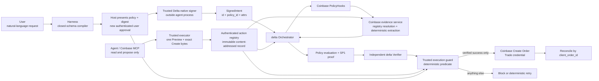

# Delta Coinbase Guard V1 — engineering handoff

This is the start-here document for replacing the local delta simulator with the real delta Mandate runtime without rebuilding the Coinbase harness.

The integration was mapped against `Repyh-Labs/delta-mandate` `main`
(workspace version `0.8.0`) on 2026-07-24, including the current vocabulary
migration introduced in commit
`bd26d3ce529e0e0f71a21b5e7aac468ffe75f017`. Re-check the listed paths before
implementation if `main` has moved.

### The invariant

The model may propose an action. It must never decide whether that action executes.

Coinbase `Create Order` may be called only when a trusted, deterministic executor has:

1. received a terminal `success` from the delta Orchestrator;
2. received `outcome: "success"` and the matching `Proof` from an independently operated delta Verifier;
3. verified that the policy ID, signed intent ID, proposal solution, and exact Coinbase Create payload are the same artifacts that were authorized and evaluated;
4. atomically consumed one execution-grant record binding the plan and
   successful Delta intent; and
5. re-checked expiry, portfolio, credential, preview freshness, and payload digest immediately before submission.

Every other state is fail-closed. No model instruction, tool result, timeout, unavailable verifier, malformed proof, or “likely safe” fallback can bypass this predicate.

### Public V1 boundary

The checked-in V1 supports natural-language planning, structured policy review,
digest confirmation, credential-free simulation, immutable execution
confirmation, and a Coinbase Preview probe. It cannot call Coinbase Create.

`src/integration/production-composition.js` is the only production composition
seam. Its public V1 export always fails with
`ENGINEERING_INTEGRATION_REQUIRED` before an execution command reads Coinbase
credentials. There is no dynamic adapter path or runtime configuration that can
enable execution. The module keeps a non-exported execution capability in its
closure; both the LIVE pipeline and the Coinbase Create transport reject every
caller that does not carry that exact capability.

The CLI confirms that supplied digests match the reviewed artifacts; it does
not authenticate the human who supplied them. The current chat host must
require a new user-authored message for each digest. A production integration
must replace that procedural attribution with an authenticated Delta-native
approval or signer session.

### Minimum integration without a rebuild

Engineering should:

1. keep the compiler, plan/binding formats, fixed Coinbase order builder,
   exact-byte checks, deterministic controller, reconciliation, and recovery;
2. implement `CoinbaseSpotHooks`, the authenticated immutable action registry,
   and deterministic Coinbase evidence extraction;
3. connect the existing seven-operation adapter port to a real signer,
   Orchestrator, and operationally independent Verifier;
4. replace `src/integration/production-composition.js` in source with those
   internal components;
5. inject an isolated transactional execution-grant store whose only writer is
   the trusted executor;
6. return the module-private `LIVE_EXECUTION_CAPABILITY` from that reviewed
   composition without exporting it or adding a runtime minting path; and
7. keep Create disabled through the complete shadow and acceptance suite.

Do not add a runtime-loaded JavaScript adapter. An in-process module label or
file hash cannot prove that the adapter, signer, evidence, or grant store is
independent from the agent.

## 1. Start-here system map



Trust boundaries:

- The user authorizes the `parameters` of a delta `Policy` through an
  authenticated host/signer boundary; the resulting `Intent` is submitted as a
  `SignedIntent`.
- The agent supplies only a `Proposal { solution: String }`. It does not supply authoritative evidence or an execution decision.
- `PolicyHooks` declares the Coinbase evidence schema and builds the `ExtractionRequest`.
- The evidence service resolves the proposal and derives evidence from trusted Coinbase data.
- `policy_engine::evaluate_policy` is the authoritative constraint check.
- The Verifier independently verifies the `Proof`.
- The trusted executor owns the Coinbase write credential and is the only component allowed to call `Create Order`.

## 2. Real delta lifecycle the adapter must preserve

The production adapter must map to the current delta lifecycle as-is:

| Step | Current delta operation | Required binding |
|---|---|---|
| Compile/register policy | `POST /policies` with `Content-Type: text/plain` | Response is the content-addressed `PolicyId` |
| Authorize | Construct and sign `Intent { id, policy_id, attrs }` | Submit the resulting `SignedIntent` to `POST /intents` |
| Propose | `POST /intents/{id}/proposal` with exactly `{ "solution": "…" }` | Solution identifies the frozen Coinbase action |
| Observe | `GET /intents/{id}/status` | `open`, `processing`, `success`, `failure`, or `expired` |
| Verify outcome | Verifier `GET /intents/{id}` | Must return the matching successful intent and proposal |
| Retrieve proof | Verifier `GET /proofs/{id}` | `Proof { sp1_proof, evidence, signed_intent, proposal }` |
| Execute | Local trusted executor | Only after all bindings and one-time controls pass |

Current delta vocabulary is important:

- Policy source declares `parameters { ... }`; expressions reference `parameters.foo`.
- The compiled type is `Policy`.
- The domain extension seam is `PolicyHooks`.
- Runtime domain selection is `PolicyKind`.
- User authorization remains an `Intent` submitted as a `SignedIntent`, with parameter values carried in `attrs`.
- The successful artifact is a `Proof`; delta core does not currently return a separate `ALLOW`, `BLOCK`, “receipt,” or JTI object.

The harness adapter interface in `src/mandate/contract.js` intentionally mirrors this lifecycle:

```text
submitPolicy
authorizeIntent
prepareProposal
submitProposal
getStatus
getVerificationOutcome
getProof
```

`prepareProposal` is the application-level action-registry handoff; it is not a
Delta HTTP endpoint. `src/mandate/orchestrator-adapter.js` is the replacement
seam. Its injected `signer.signIntent(...)` and
`actionRegistry.registerAction(...)` are harness-local ports. Engineering
should implement them with the production signing and registry paths and should
replace the hand-written HTTP calls with the team's generated clients where
available.

## 3. What to reuse and what to replace

| Harness component | Disposition | Why |
|---|---|---|
| `src/intent-compiler.js` and closed input schema | Reuse | Keeps natural-language interpretation upstream of the security boundary |
| `src/plan.js`, policy digest, and confirmation UX | Reuse the artifact format; integrate authenticated approval | Produces a reviewable authorization artifact, but the CLI alone does not authenticate a human |
| `src/execution-confirmation.js` | Reuse the exact binding and fixed-expiry semantics | Prevents restarting the 120-second window; production approval should sign or otherwise authenticate the same binding |
| `src/mandate/coinbase-policy.js` | Reuse as the V1 contract, then compile in real `PolicyHooks` tests | Already uses current `parameters` vocabulary, integer units, and a fixed policy |
| `src/mandate/coinbase-solution.js` | Keep as strict simulation fixture logic | The embedded envelope is deliberately simulation-only; production uses a content-addressed registry locator |
| `src/mandate/controller.js` | Reuse | Keeps execute/retry/stop deterministic and outside the agent |
| `src/execution-pipeline.js` | Reuse | Owns final payload freezing, one-time consumption, Coinbase submission, and recovery; its public LIVE entrypoint requires the private composition capability |
| `src/coinbase-rest.js` | Reuse | Public adapter exposes reads and Preview only; the separate Create adapter requires the same private composition capability |
| `src/mandate/contract.js` | Reuse | Enforces adapter shape and proof/intent/proposal binding |
| `src/mandate/simulated-adapter.js` | Replace at composition root | Test double only; it performs no real signature verification, evidence extraction, or SP1 proving |
| `src/mandate/coinbase-evidence.js` | Keep only as simulator fixture logic | Production evidence must come from an independently trusted service, not proposal claims |
| `src/mandate/orchestrator-adapter.js` | Complete and inject | This is the production delta seam |
| `src/integration/production-composition.js` | Replace in source in the internal engineering build | Public V1 is hard-disabled before credentials; this is the only live composition seam |
| Production execution-grant store | Implement behind the injected `consumeGrant`, `markGrant`, and `readGrant` ports | Public V1 ships no default live store, so execution cannot fall back to agent-writable local state |
| Legacy custom signed `ALLOW` path | Removed | The live pipeline has one production-shaped Mandate path and no alternate decision primitive |

The intended adapter change is small:

```text
createSimulatedMandateAdapter(...)
              ↓
createOrchestratorMandateAdapter({
  orchestratorUrl,
  verifierUrl,
  signer,
  actionRegistry,
  ...
})
```

No policy, proposal, Coinbase order, reconciliation, or recovery code should
need to be rewritten. Wire the real adapter and durable grant-store hooks
inside `src/integration/production-composition.js` at build time. Keep the
public hard-disabled implementation for external builds, return its
module-private `LIVE_EXECUTION_CAPABILITY` only from the reviewed internal
composition, and keep the built-in simulator fixed to in-memory adapters.

## 4. Required delta-main implementation

### 4.1 Add the Coinbase policy domain

In `Repyh-Labs/delta-mandate`:

1. Add `orchestrator/server/src/policy_hooks/coinbase_spot.rs`.
   - Implement the existing `PolicyHooks` trait.
   - Build one fixed, static `EvidenceSchema`.
   - Build the corresponding `ExtractionSchema` from the same field specification.
   - Compile and validate only the intended Coinbase V1 policy shape.
   - Build `ExtractionRequest { solution, attributes }` from the submitted `Proposal`.
   - Return indexed `ConstraintFailure` data through the existing evaluation path; do not create a second decision vocabulary.
2. Export the module from `orchestrator/server/src/policy_hooks.rs`.
3. Add `CoinbaseSpot` to `PolicyKind` in `orchestrator/server/src/config.rs`.
4. Instantiate `CoinbaseSpotHooks` in the `policy_hooks(...)` composition function in `orchestrator/server/src/main.rs`.
5. Configure this Orchestrator instance with the Coinbase evidence extractor URL.

`PolicyKind` and `evidence_extractor_url` are process-level configuration today. Unless engineering first changes that architecture, deploy Coinbase as its own Orchestrator instance rather than attempting to mix Shopify, Kalshi, and Coinbase policies in one process.

Use `orchestrator/server/src/policy_hooks/kalshi_wc26.rs` as the closest implementation precedent: it derives both schema views from one specification, passes `proposal.solution` to extraction, compiles fixed policy examples in unit tests, and preserves indexed failures.

### 4.2 Add tests in the repository's expected layers

Follow `AGENTS.md`:

- Domain schema, policy compilation, extraction request, allowed-values, and failure-explanation tests belong beside `coinbase_spot.rs`.
- Orchestrator business behavior should be exercised through `AppState` in `orchestrator/server/src/state.rs`; test doubles live in `orchestrator/server/src/state/tests/helpers.rs`.
- Add a full lifecycle case under `orchestrator/e2e/`: policy submission, `SignedIntent`, proposal, extraction, evaluation, proof, Verifier success.
- Add golden checks for every constraint index so a policy edit cannot silently change the meaning of a returned failure.

Do not put Coinbase business logic in Axum endpoints. Current convention is conversion at the HTTP boundary and business behavior under state/domain components, with `snafu` error enums mapped to HTTP at the edge.

### 4.3 OpenAPI and generated clients

Adding a `PolicyKind` and `PolicyHooks` implementation does not itself change the public HTTP API. If no endpoint or response shape changes, do not create API churn.

If retry semantics or any wire type changes:

1. update the endpoint/type implementation;
2. regenerate `orchestrator/openapi/orchestrator-openapi.json` using the server's `--openapi` path;
3. regenerate and commit affected clients/specs using the repository's existing generators; and
4. update the e2e and downstream consumer fixtures in the same change.

### 4.4 Preserve repository quality gates

The implementation must pass the repository's formatting, dependency sorting, warnings-as-errors build, Clippy, feature-matrix tests, and no-SP1 real-binary e2e gates. Preserve the workspace prohibitions on unsafe code, unreachable public items, and unused dependencies.

## 5. Production Coinbase evidence service

Create a deterministic Coinbase-specific evidence service adjacent to delta Mandate. This is not present in `delta-mandate` today. Use `Repyh-Labs/evidence-layer-kalshi` as the service-layout precedent, especially:

- `src/extraction.ts`
- `src/types.ts`
- `src/schemas.ts`
- `docs/openapi.yaml`
- `tests/extraction.test.ts`
- `tests/server.test.ts`

Keep the existing delta evidence `/extract` contract unchanged. The Orchestrator's `PolicyHooks` should send the current `ExtractionRequest`; the service should return only the requested, schema-valid evidence attributes.

### Evidence rules

1. Evidence is deterministic. No LLM is in the evidence path.
2. Coinbase amounts are integers in fixed units:
   - quote amounts and fees: microunits;
   - slippage: integer basis points;
   - timestamps: integer epoch milliseconds.
3. V1 evidence fields are flat `bool`, `int`, or `string` values. Do not put objects, arrays, floating-point numbers, or nullable values into the V1 schema.
4. Reject unknown locator versions, missing registry records, mutable or
   overwritten records, unknown/extra fields, digest mismatches, stale evidence,
   and unsupported order configurations.
5. Treat the simulation envelope and every embedded `claimed_evidence` value as
   untrusted input. Production extraction accepts only a registry record
   authenticated as originating from the trusted executor.
6. Use a trusted service clock for `evaluated_at_epoch_ms`.
7. Return a hard extraction error when required Coinbase data cannot be obtained. Do not synthesize “online,” `false`, zero, or other permissive defaults.

### Production solution and action-registry contract

Production uses this content-addressed solution:

```text
coinbase-order://proposal/v1/{sha256-of-canonical-action-record}
```

This is an integration-specific convention carried inside Delta's existing
`Proposal.solution` string; it is not a new Delta API. The digest identifies the
entire `delta.coinbase.evaluation_request.v1` record, which contains the exact
Create object and serialized bytes, Create digest, exact Preview request and
digest, one trusted Preview result, market snapshot, collection timestamps, and
portfolio/credential fingerprints.

The harness port is:

```text
registerAction(actionRecord) -> {
  solution,
  action_record_digest
}
```

The registry must:

1. accept records only from the authenticated trusted executor, never from the
   agent or model-facing Coinbase MCP;
2. validate the exact closed action-record schema and recompute every nested
   digest before storage;
3. compute `action_record_digest` over the same canonical JSON algorithm used by
   `digest(actionRecord)`;
4. store the record append-only under that digest and reject any attempted
   overwrite or digest collision;
5. return exactly
   `coinbase-order://proposal/v1/{action_record_digest}` plus the matching
   `action_record_digest`; and
6. expose authenticated read-by-locator to the evidence service with an
   auditable registration identity and timestamp.

The trusted executor calls Coinbase Preview exactly once, freezes the resulting
Preview ID into the exact Create body, and registers that immutable record.
The evidence service resolves that same record; it must not issue a second
Preview with a potentially different ID or economics. It independently
schema-checks the record, recomputes the Preview request from the Create payload,
recomputes all digests and policy fields with exact decimal arithmetic, verifies
freshness and trusted provenance, and returns only the requested flat evidence.

The simulator intentionally uses an embedded
`coinbase-advanced://order/v1/...?...` envelope so it can run without a registry.
That parser is not a production compatibility path.

### V1 policy parameters

The human-authorized `parameters` should remain:

| Parameter | Meaning |
|---|---|
| `product_id` | Exact Coinbase product, for example `ETH-USDC` |
| `base_asset` / `quote_asset` | Exact asset pair |
| `side` | Exact authorized side |
| `exact_quote_size_microunits` | Exact quote amount, not a model-selected maximum |
| `max_slippage_bps` | Maximum independently calculated slippage |
| `max_commission_microunits` | Maximum Coinbase commission |
| `max_all_in_debit_microunits` | Maximum total debit |
| `portfolio_fingerprint` | Authorized Coinbase portfolio binding |
| `credential_fingerprint` | Authorized execution credential binding |
| `expires_at_epoch_ms` | Hard authorization deadline |

The signer must encode these into delta `attrs` using the policy-engine `ObjectValue` wire representation. The current harness conversion is in `toDeltaWireAttributes(...)`; compare its output byte-for-byte with the production client during contract tests.

Keep V1 narrow. The current order contract is a bounded SOR limit, immediate-or-cancel spot order. Add materially different actions—such as base-denominated sells or a different Coinbase order configuration—as new policy and solution versions, with their own fixtures and human-readable authorization text.

### V1 evidence ownership

| Evidence group | Authoritative source |
|---|---|
| Product, assets, side, order type, time in force, quote size | Parsed exact Create payload |
| Preview ID and Preview/Create consistency | Single trusted Preview frozen in the immutable action record plus exact Create payload |
| Slippage, commission, all-in debit | Frozen trusted Preview and market snapshot; all-in is `max(order_total, quote_size + commission_total)` |
| Market status and disabled flags | Frozen trusted Coinbase product response |
| Create and Preview-request digests | Extractor recomputation over canonical bytes |
| Portfolio binding | Trusted Coinbase read result plus final executor check |
| Credential binding | Non-secret credential identity plus final executor check |
| Evaluation timestamp | Evidence-service clock |

`usage_index == 1` is a simulator convenience unless backed by a trusted attempt ledger. The current `ExtractionRequest` contains `solution` and requested attributes, not an intent ID. Do not ship an extractor that returns a constant `1`. Either:

- remove that evidence constraint and rely on the Orchestrator's proposal state
  plus the executor's single atomic execution-grant record; or
- introduce a trusted proposal/attempt registry that can establish the value independently.

## 6. Signing and credential boundaries

Keep these credentials in separate trust zones:

| Secret/capability | May be visible to agent or Coinbase MCP? | Owner |
|---|---:|---|
| Public market/account read tools | Yes, if scoped read-only | Agent-facing Coinbase MCP |
| Trusted-executor Coinbase read/Preview credential | No | Trusted executor |
| delta signing key or passkey session | No | Trusted signer / explicit authorization UX |
| Coinbase Trade credential | No | Trusted local executor |
| Transfer/withdrawal capability | No and not required | Must not be granted |

### delta signer requirements

The production signer must:

1. authenticate a fresh user approval or a previously authorized signer
   session through the team's approved trust boundary;
2. bind that approval to the exact reviewed policy digest, execution digest,
   key/portfolio binding, and non-renewable expiry represented by the local
   confirmation receipt;
3. generate a fresh caller-assigned `Intent.id`;
4. bind the exact returned `PolicyId`;
5. bind the exact `attrs` produced from the reviewed structured policy;
6. JCS-canonicalize the `Intent` per RFC 8785;
7. produce one of delta's supported real signature forms; and
8. return a `SignedIntent` whose `id`, `policy_id`, and `attrs` are checked again by the adapter before submission.

`primitives::SignedIntent::sign` in `crates/primitives/src/types.rs` is gated for tests/test helpers. Do not build production signing around that helper. Use the team's production signing client/service or the relevant `delta_crypto` production primitives.

The `authorization` object passed into the harness signer port is local context for enforcing UX/session rules. It is not part of the delta Orchestrator wire API unless engineering deliberately includes its values in signed `attrs`.

### Coinbase executor requirements

- The agent-facing process cannot possess or invoke the Trade credential.
- The executor must accept a frozen payload, not free-form order fields.
- Immediately before Create, it must recompute the exact payload digest and match it to verified proof evidence.
- It must re-check the local portfolio and execution-credential fingerprints.
- It must atomically create one execution-grant record keyed by plan ID and
  bound to the successful Delta intent before calling Coinbase.
- Public V1 deliberately provides no default live grant store. Production must
  inject `consumeGrant`, `markGrant`, and `readGrant` through the trusted
  composition seam, backed by an isolated transactional store with a unique
  plan-ID constraint. Only the trusted executor may write it; neither the agent
  process nor the model-facing MCP may create, replace, or delete grants.
- A network error after submission is `SUBMISSION_UNCERTAIN`; reconcile by `client_order_id` and never blind-retry Create.

## 7. Current retry mismatch

The product vision says: one human authorization, agent proposes, delta returns pass/fail, and a failed candidate is retried until one passes.

Current delta core does not support multiple constraint-failing proposals under one `SignedIntent`:

- evidence extraction failure reopens the intent in `orchestrator/server/src/job.rs`;
- a policy-constraint failure is terminal;
- proof-generation failure is terminal; and
- a second proposal against a terminal intent conflicts.

An extraction failure reopening to `open` is infrastructure recovery, not the desired agent constraint-retry behavior.

Engineering must choose one of these explicit V1 semantics:

### Option A — no core change, fastest

Run deterministic local preflight checks while the agent iterates. Submit only the final candidate once to real delta. If real delta still returns a constraint failure, stop and require a new authorization.

- Advantage: no delta storage/state changes.
- Cost: intermediate retries are not authoritative delta evaluations.

### Option B — new signed intent per failed candidate

Each retry creates a fresh intent ID and `SignedIntent`.

- Advantage: works with current core.
- Cost: requires a new user signature or a separately authorized signing capability for every attempt; the audit trail spans multiple intents.

### Option C — add bounded attempt semantics to delta core

Preserve one authorized intent while recording immutable proposal attempts. A constraint failure records the attempt and reopens the intent until a signed maximum-attempt count or expiry is reached.

At minimum this requires coordinated changes to:

- `orchestrator/server/src/state/intents.rs`
- `orchestrator/server/src/state/proposals.rs`
- `orchestrator/server/src/job.rs`
- `orchestrator/server/src/storage.rs`
- `orchestrator/server/src/storage/delta.rs`
- `orchestrator/server/src/storage/sql.rs`
- public status/types and `crates/primitives/src/types.rs` if attempt data is exposed
- `openapi/orchestrator-openapi.json` and generated clients
- state, recovery, concurrency, and e2e tests

Required invariants for Option C:

- exactly one proposal is processing at a time;
- every failed attempt remains immutable and queryable;
- failures cannot be overwritten by later success;
- attempt count and expiry are signed constraints, not agent inputs;
- only the exact successful proposal may execute;
- concurrent submissions cannot both be accepted; and
- recovery after restart preserves the attempt ledger.

Until one option is selected, do not describe “retry until pass under one
authorization” as implemented. The generic controller has a deterministic
retry classifier and attempt-loop helper, but the checked-in simulation and
Preview paths each evaluate one candidate, and public execution is disabled.
Current Delta core determines which multi-attempt semantics can be wired
truthfully.

## 8. SP1 proposal-commitment caveat

The current SP1 guest in `crates/policy_engine_program/src/main.rs` commits:

1. `policy_id`;
2. the hash of signed intent attributes; and
3. the evidence hash.

It does not commit `Proposal.solution` directly. `Proof` contains the proposal, and `verifier/server/src/proof.rs` verifies the three current public values, but the proposal itself is outside those SP1 public values.

For V1 without a guest change, execution is safe only if:

- trusted extraction recomputes evidence from the exact Create bytes identified by the solution;
- evidence includes the exact Create payload digest;
- the policy requires all digest/Preview consistency checks;
- the Verifier-returned proof and outcome contain the same proposal solution; and
- the executor recomputes the exact outgoing Create-body digest and compares it to verified proof evidence before submission.

Do not rely only on equality of the proposal object wrapped beside the proof.

For stronger cryptographic binding, add a proposal/solution hash to SP1 public values. That change must be coordinated across:

- `crates/policy_engine_program/src/main.rs`
- `orchestrator/server/src/proof.rs`
- `verifier/server/src/proof.rs`
- proof fixtures, SP1 artifacts/keys, and full-stack tests

This hardening is separable from the adapter swap, but it should be decided before claiming that the proof itself commits the exact Coinbase action.

## 9. Adapter replacement sequence

Use this order to minimize rework:

1. **Freeze contract fixtures.** Commit one passing and several failing policy/parameter/solution/evidence fixtures from this harness.
2. **Compile the policy in real hooks.** Add `CoinbaseSpotHooks` and prove the harness policy compiles against its evidence schema.
3. **Build the registry and deterministic extraction.** Resolve the exact
   content-addressed action record through real `/extract`; make the same
   fixtures pass/fail without Coinbase Trade access in the evidence service.
4. **Run real delta with mock proving.** Exercise policy → `SignedIntent` → proposal → status → Verifier proof locally.
5. **Implement the authenticated approval and signer port.** Bind and compare
   the reviewed policy digest, execution digest, fixed receipt expiry, policy
   ID, intent ID, and exact `attrs`.
6. **Replace the compile-time composition seam.** Wire
   `OrchestratorMandateAdapter` and an isolated durable grant store inside
   `src/integration/production-composition.js`, and return that module's private
   `LIVE_EXECUTION_CAPABILITY` with the reviewed dependencies. Keep Coinbase
   Create disabled and compare simulator and real-delta results for the golden
   fixtures.
7. **Confirm exact proof-evidence-to-payload verification.** The harness
   already enforces the complete binding set; contract-test it against real
   Verifier responses before any Trade credential is loaded.
8. **Select retry semantics.** Implement and document Option A, B, or C above.
9. **Run shadow Preview tests.** Real Coinbase reads and Preview, real delta evaluation, no Create.
10. **Enable one tiny hard-coded live profile.** Authenticated Delta-native
    approval, fixed short TTL, isolated portfolio, no transfer permission, and
    reconciliation by `client_order_id`.

## 10. Acceptance checklist

### Contract and policy

- [ ] The Coinbase policy compiles through real `CoinbaseSpotHooks`.
- [ ] Every parameter and evidence field has one type, unit, owner, and source.
- [ ] No floating-point monetary value crosses the policy/evidence boundary.
- [ ] Unknown policy fields and unknown solution fields fail closed.
- [ ] Constraint-index golden tests detect policy reordering or semantic drift.
- [ ] The simulator and real policy engine agree on all committed fixtures.

### Signing and authorization

- [ ] The production approval boundary authenticates the human or an explicitly
      authorized signer session; CLI digest equality is not treated as
      authentication.
- [ ] A real `SignedIntent` verifies in the Orchestrator.
- [ ] Mutating intent ID, policy ID, or any `attrs` value after signing is rejected.
- [ ] The signer cannot be invoked by an untrusted agent tool.
- [ ] Expired authorization cannot reach Coinbase Create.
- [ ] Replaying `confirm-execution` or any later command cannot restart the
      receipt's fixed authorization window.
- [ ] The displayed human policy and signed `attrs` have a tested byte-level mapping.

### Evidence and proof

- [ ] Evidence is derived only from an authenticated immutable registry record;
      a simulation envelope or model-supplied claim cannot produce a pass.
- [ ] Registry registration returns the exact content-addressed locator and
      digest, records cannot be overwritten, and extraction never issues a
      second Coinbase Preview for the candidate.
- [ ] Wrong pair, asset, side, amount, order type, time in force, portfolio, or credential fails.
- [ ] Excess slippage, commission, or all-in debit fails.
- [ ] Stale/missing Preview, Preview/Create mismatch, digest mismatch, disabled product, and offline market fail.
- [ ] Verifier unavailable, failure, expired, malformed response, or mismatched proof fails closed.
- [ ] Orchestrator and Verifier use distinct origins, independently scoped
      credentials, and an operational separation reviewed by engineering.
- [ ] Proof policy ID, signed intent ID, typed attributes, proposal solution,
      product ID, Preview ID, Create-body digest, Preview-request digest,
      portfolio fingerprint, and credential fingerprint all match the frozen
      local artifacts.
- [ ] Extraction failure is bounded and observable; it cannot become an infinite poll or an execution pass.

### Execution and recovery

- [ ] A spy Create adapter proves that no failure path invokes Coinbase Create.
- [ ] The exact serialized body evaluated by Delta is the body submitted to
      Coinbase, and the Coinbase transport reports the matching sent-body
      digest.
- [ ] One atomic execution-grant record consumes the plan and binds the
      confirmation receipt, successful Delta intent, proposal, and exact
      Create-body digest.
- [ ] Duplicate/concurrent execution attempts cannot both submit.
- [ ] A multi-host executor uses a transactional shared store with a unique
      plan-ID constraint, accepts writes only from the trusted executor, and
      does not treat local `open(..., "wx")` as distributed atomicity.
- [ ] Trade credential and delta signing secret never appear in model context, logs, receipts, fixtures, or proposal solution.
- [ ] Post-submit timeout becomes `SUBMISSION_UNCERTAIN` and reconciles by `client_order_id`.
- [ ] Restart recovery cannot re-submit an order whose outcome is unknown.

### Repository acceptance

- [ ] Delta formatting, sort, build, lint, feature-matrix, unit, and e2e checks pass.
- [ ] Evidence-service schema/OpenAPI, extraction, and server tests pass.
- [ ] Generated Delta OpenAPI clients are used or the engineering owner records
      why the hand-written transport remains appropriate.
- [ ] Registry/evidence golden fixtures cover a passing action and every
      fail-closed binding mutation.
- [ ] Harness unit, adapter-contract, bypass, and recovery tests pass.
- [ ] Documentation names current core types: `Policy`, `PolicyHooks`, `PolicyKind`, `Intent`, `SignedIntent`, and `Proof`.
- [ ] No documentation claims that the simulator performs real delta verification.
- [ ] A tiny real Coinbase Preview shadow run passes through real hooks,
      registry, extraction, Orchestrator, Verifier, and Proof with Create
      disabled.
- [ ] The public build proves `ENGINEERING_INTEGRATION_REQUIRED` occurs before
      Coinbase credentials are read and that no runtime configuration can
      enable Create.
- [ ] The internal build wires the reviewed real adapter and durable grant
      store only through `src/integration/production-composition.js`; it does
      not expose an arbitrary runtime-loaded adapter.

## 11. Staged rollout

| Stage | delta path | Coinbase path | Exit criterion |
|---|---|---|---|
| 0. Contract lock | Simulator plus real policy compilation | Fixtures only | Simulator and real engine agree |
| 1. Real delta shadow | Real Orchestrator, extraction, mock proof, Verifier | Real reads/Preview; Create disabled | All pass/fail and binding tests green |
| 2. Proof shadow | SP1 proof and independent Verifier | Real reads/Preview; Create disabled | Stable proof latency and no unexplained divergence |
| 3. Internal tiny live | Real delta and selected retry semantics | Hard-coded minimal order profile | Successful submit and reconciliation with complete audit artifact |
| 4. Internal skill | Same trusted services | Team users; isolated credentials | Bypass testing and operational runbook complete |
| 5. External decision | Hosted or local architecture chosen | Customer-scoped credentials | Security, authn/authz, rate limits, tenancy, and support model approved |

Credentials are not needed to complete Stages 0 or the delta half of Stage 1. Coinbase read/Preview credentials are needed for the Coinbase half of Stage 1. The Trade credential should not be introduced until every Stage 1/2 acceptance check passes.

## 12. Exact delta source-path index

| Path in `Repyh-Labs/delta-mandate` | Why engineering will touch or consult it |
|---|---|
| `AGENTS.md` | Repository architecture and testing rules |
| `Cargo.toml` | Workspace version, members, dependencies, and lint policy |
| `crates/primitives/src/types.rs` | `Intent`, `SignedIntent`, `Proposal`, `Proof`, `ConstraintFailure`, and wire semantics |
| `orchestrator/server/src/policy_hooks.rs` | `PolicyHooks` trait and Coinbase module export |
| `orchestrator/server/src/policy_hooks/kalshi_wc26.rs` | Fixed-schema domain implementation and test precedent |
| `orchestrator/server/src/policy_hooks/coinbase_spot.rs` | New Coinbase domain implementation |
| `orchestrator/server/src/config.rs` | Add `PolicyKind::CoinbaseSpot` |
| `orchestrator/server/src/main.rs` | Instantiate Coinbase hooks at the composition root |
| `orchestrator/server/src/endpoints/policies.rs` | Existing plain-text Policy submission boundary |
| `orchestrator/server/src/endpoints/intents.rs` | Existing `SignedIntent`, proposal, and status boundaries |
| `orchestrator/server/src/state.rs` | `AppState` behavior tests |
| `orchestrator/server/src/state/intents.rs` | Intent lifecycle and terminal/reopen semantics |
| `orchestrator/server/src/state/proposals.rs` | Proposal acceptance and duplicate prevention |
| `orchestrator/server/src/state/tests/helpers.rs` | Test doubles used by state tests |
| `orchestrator/server/src/job.rs` | Extraction, deterministic evaluation, proof generation, and failure classification |
| `orchestrator/server/src/proof.rs` | Orchestrator proof backend; relevant only if public commitments change |
| `orchestrator/server/src/storage.rs` | Storage interface; relevant if retry attempts become persisted core state |
| `orchestrator/server/src/storage/delta.rs` | RocksDB-backed implementation |
| `orchestrator/server/src/storage/sql.rs` | SQLite-backed implementation |
| `orchestrator/e2e/src/orchestrator.rs` | Current full-lifecycle test client and fixture pattern |
| `crates/policy_engine_program/src/main.rs` | SP1 guest and current public-value commitments |
| `verifier/server/src/proof.rs` | Independent SP1 public-value verification |
| `orchestrator/openapi/orchestrator-openapi.json` | Regenerate only if public Orchestrator wire behavior changes |
| `verifier/openapi/verifier-openapi.json` | Regenerate only if public Verifier wire behavior changes |

The Coinbase evidence service is a separate deployable component, not an existing directory under `delta-mandate`. Use `Repyh-Labs/evidence-layer-kalshi` as the sibling repository precedent; do not add Coinbase API access directly to Orchestrator endpoints or policy evaluation.

## 13. Definition of handoff complete

Engineering should not need to reinterpret the product flow or rebuild the harness. The integration is complete when:

- `SimulatedMandateAdapter` is selected only in tests and explicit demo mode;
- the public build remains hard-disabled and the reviewed internal
  `src/integration/production-composition.js` injects
  `OrchestratorMandateAdapter`, the authenticated approval/signer boundary, and
  an authenticated content-addressed action registry;
- production composition injects an isolated transactional execution-grant
  store that the agent cannot write and that remains one-use across
  processes, hosts, and restarts;
- real Coinbase `PolicyHooks` and deterministic extraction produce the evidence the fixed policy expects;
- a verifier-confirmed proof is bound to the exact serialized Coinbase Create payload;
- the deterministic controller, not the agent, is the only component that can release execution;
- the chosen retry semantics are accurately represented in product copy and tests; and
- all fail-closed, replay, concurrency, uncertain-submission, and recovery cases above are demonstrated.
