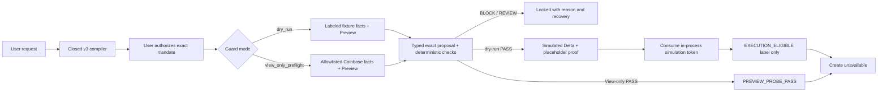

# Delta Coinbase Guard v1.5 — engineering handoff

This is the start-here contract for replacing checked-in Coinbase and Delta
simulation components with trusted production services without rebuilding the
guard.

The public Repyh Labs organization does not expose the private Delta Mandate
implementation. Concrete policy syntax, service paths, signer types, verifier
identity, and proof program must be validated against that codebase before
Coinbase Create can be enabled.

Public v1.5 cannot call Create. Its credential-free `dry_run` uses fixtures and
the simulated Delta adapter; its optional `view_only_preflight` uses real
allowlisted reads/Preview but stops before Delta. Neither result is a
production execution grant.

## Non-negotiable invariant

The agent may interpret a request, inspect allowlisted Coinbase data, and
propose a candidate. It must never authorize, evidence, approve, retry, or
execute its own proposal.

In a future production composition, Coinbase Create may become eligible only
when a trusted controller has:

1. authenticated user authorization of the complete closed policy and
   credential-scoped execution binding;
2. one immutable action record containing fresh Coinbase product, BBO,
   funding, and Preview evidence;
3. terminal Delta success for that exact record;
4. an independently verified proof whose digest, verifier identity, proof
   program, and all Coinbase bindings match;
5. an unexpired one-time grant for the exact serialized Create body; and
6. transactional consumption of that grant immediately before submission.

Every other state stops. No prompt, agent output, credential, local simulator,
or self-asserted `ALLOW` may relax that predicate.

## What v1.5 implements

- closed `digital-asset-spot-order.v3` compilation with deterministic
  validation and grounding;
- a complete plain-English mandate display and procedural new-message
  authorization pause, with digest/path handling internal to the Codex skill;
- Coinbase Advanced custodial SPOT BUY and SELL;
- dynamic pair, asset, product-state, increment, and size-bound handling;
- BUY quote sizing/funding and SELL base sizing/funding;
- `EXACT` or positive agent-selected size no greater than `MAX`;
- optional one-shot BUY best-ask-at-or-below or SELL best-bid-at-or-above
  absolute condition;
- SOR limit IOC, partial-fill policy, slippage, commission, settlement,
  expiry, and one use;
- a single `dry_run` / `view_only_preflight` orchestrator;
- a credential-free default using labeled account/product/BBO/Preview fixtures
  and the local simulated Delta adapter;
- optional session-only View credentials through an explicit permissions,
  List Accounts, Get Product, BBO, and Preview route/method allowlist;
- strict product, funding, proposal, BBO, Preview-coherence, and payload checks;
- `PASS`, `BLOCK`, and `REVIEW`;
- v2 canonical action, a v2 frozen evaluation request and v3 simulated-Delta
  decision receipt in `dry_run`, plus a v1 Guard receipt in both modes;
- atomic nonce claims, exact-result replay, expiry, and local supersession;
- private bounded Guard history containing only redacted allowlisted facts;
- explicit simulation-only versus pinned-production proof-verifier contracts;
- a simulation that stops at `EXECUTION_ELIGIBLE` without invoking an
  executor; and
- a View-only path that stops at `PREVIEW_PROBE_PASS` without invoking Delta
  or granting execution eligibility; and
- a compile-time Create lock.

Unsupported: transfers, Convert, staking, recurring strategies, GTC,
unrestricted market orders, balance percentages, leverage, derivatives,
on-chain execution, multi-action strategies, and generic portfolio exposure
constraints.

The fixed partner showcase has a portfolio-exposure fixture. That is not part
of the generic v1.5 compiler or policy.

Plans, confirmations, Preview evidence, and receipts from older releases must
be regenerated so v1.5 mode, evidence, receipt, and replay bindings are
explicit.

## Public Coinbase basis

The direct adapter targets normal Advanced Trade REST:

- [permission matrix](https://docs.cdp.coinbase.com/coinbase-app/advanced-trade-apis/rest-api);
- [List Accounts](https://docs.cdp.coinbase.com/api-reference/advanced-trade-api/rest-api/accounts/list-accounts);
- [Get Product](https://docs.cdp.coinbase.com/api-reference/advanced-trade-api/rest-api/products/get-product);
- [Best Bid/Ask](https://docs.cdp.coinbase.com/api-reference/advanced-trade-api/rest-api/products/get-best-bid-ask);
- [Preview Order](https://docs.cdp.coinbase.com/api-reference/advanced-trade-api/rest-api/orders/preview-orders);
- [Create Order](https://docs.cdp.coinbase.com/api-reference/advanced-trade-api/rest-api/orders/create-order); and
- [CDP authentication](https://docs.cdp.coinbase.com/coinbase-app/authentication-authorization/api-key-authentication).

The composite preflight first calls the fixed key-permissions route, then
constructs an adapter exposing only List Accounts, exact Get Product, BBO, and
Preview. It denies redirects, enforces the route/method allowlist, and has no
Create method. The general REST module contains additional future integration
methods, but the View-only adapter cannot expose them.

Reads and Preview are View operations; Create requires Trade. This repository
documents Coinbase MCP as an alternative topology but does not implement or
claim a live MCP session. An agent-facing MCP must be proxied or allowlisted so
mutating tools are absent. Prompting the model not to call Create is not a
security boundary.

No credential, live Coinbase response, private Delta service, or order was used
to validate the credential-free public release. The View-only path is tested
with injected response fixtures and remains a real-key shadow-test boundary.

## System map



The future production path described by the non-negotiable invariant starts
after this public boundary: actual Delta evaluation, pinned proof verification,
a durable grant, an isolated executor, Create, and reconciliation remain
unimplemented.

## Canonical v2 action

`delta.coinbase.spot_action.v2` binds:

- exact SPOT pair and Coinbase custodial execution domain;
- BUY/SELL and side-correct `quote_size`/`base_size`;
- `EXACT` or `MAX` authorization;
- held funding asset and no conversion;
- SOR limit IOC and partial-fill policy;
- fresh BBO, slippage, commission, settlement, and optional absolute market
  condition; and
- one-use validity.

| Side | Size/funding | Reference | Condition | Settlement |
| --- | --- | --- | --- | --- |
| BUY | Quote size / held quote | Fresh best ask | Optional ask ≤ threshold | Maximum quote debit |
| SELL | Base size / held base | Fresh best bid | Optional bid ≥ threshold | Minimum net quote proceeds |

All amounts cross the Delta seam as canonical decimal strings.

## Component disposition

| Component | Public status | Production action |
| --- | --- | --- |
| intent compiler, plan, canonical action | Implemented | Retain strict grounding; authenticate approval |
| execution binding and confirmation | Digest-bound procedural UX | Replace chat attribution with authenticated approval |
| Coinbase View-only REST reads/Preview | Implemented and fixture-tested; no real key used for release validation | Shadow-test with an isolated View-only credential |
| funding, market, execution policy | Implemented deterministic checks | Pin real response semantics and fail closed on drift |
| Coinbase Delta policy/evidence extractor | Narrow simulator contract | Validate/replace against private Delta and trusted evidence |
| simulated adapter | Test double | Never compose into live execution |
| Orchestrator adapter | Production-shaped port | Inject private clients, signer, registry, and pinned proof verifier |
| v3 Delta decision receipt | Simulated path only | Preserve exact proof and payload binding |
| v1 Guard receipt | Local digest receipt for both modes | Retain as an operational receipt; do not treat it as a Delta signature |
| redacted history/nonce currentness | Local private files, 100-entry retention | Replace eligibility use with transactional trusted state |
| execution pipeline | Implemented; live capability unavailable | Keep controller isolation and add durable ports |
| production composition | Always fails closed | Replace only in a reviewed internal build |
| one-time grant store | In-process simulation token plus production interface | Implement transactionally outside agent-writable state |
| Create transport | Behind a module-private composition capability | Run only in an isolated executor after acceptance |

## Delta and proof seam

The application port is:

```text
submitPolicy
authorizeIntent
prepareProposal
submitProposal
getStatus
getVerificationOutcome
getProof
verifyProofArtifact
```

`authorizeIntent` must bind authenticated user authority to exact typed
parameters. `prepareProposal` must register the frozen action in authenticated
append-only storage. The agent must not choose the locator.

Production `PASS` requires both matching Delta artifacts and a cryptographic
proof-verifier attestation bound to a pinned identity and proof program. A
nonempty proof string is insufficient.

The simulation adapter instead accepts only its explicit local placeholders
and reports `cryptographically_verified: false`. Its receipt proves local
binding integrity, not production authenticity.

`view_only_preflight` does not call this port. Its `PASS` is a deterministic
local policy/evidence result over authenticated-in-session Coinbase reads, not
a Delta outcome.

Required Coinbase proof bindings:

```text
product_id
action_descriptor_digest
authorized_limit_price
funding_evidence_digest
preview_id
create_payload_digest
preview_request_digest
portfolio_fingerprint
credential_fingerprint
```

## Evidence, freshness, and Preview invariants

In `dry_run`, the frozen `delta.coinbase.evaluation_request.v2` binds the
policy, action, proposal, complete funding evidence, trusted BBO, selected
Preview, exact Preview request, prospective Create bytes, and all digests
before the simulated Delta call.

In both modes, `delta.coinbase.preflight_binding.v1` binds mode, nonce, policy,
action descriptor, proposal, exact serialized Preview-request bytes and
transport digest, selected-Preview fingerprint, normalized evidence digest,
prospective-Create digest, and source times.

Production evidence extraction must be deterministic and must:

- reject incomplete account pagination, duplicate accounts/cursors, and
  ambiguous portfolios;
- require the exact funding asset without conversion;
- validate SPOT type, trading flags, increments, bounds, and freshness;
- compare Preview BBO with the trusted snapshot;
- recompute quote/base/average-price and order-total coherence;
- derive side-correct slippage and settlement;
- check the optional one-shot market condition in both trusted and Preview
  evidence; and
- freeze one exact prospective Create body.

The current capability profile enforces the Coinbase pricebook observation
time for BBO and the local receipt time for Preview. Product and account
records bind local request/receipt times; the API responses used here do not
supply a provider observation time that this harness independently verifies.
Production must pin a freshness rule for every relied-on endpoint rather than
turning a recent local receipt into a provider-age claim.

Verified policy violations, such as wrong side/size, insufficient held funds,
an unavailable product, or price/fee/settlement outside the mandate, become
`BLOCK`. Missing, stale, malformed, mismatched, partial, rate-limited, or
unavailable evidence becomes `REVIEW`. A provider Preview error or incoherent
Preview is unable-to-verify, not a verified policy violation.

The external executor must recompute the serialized body digest immediately
before submission. A missing or mismatched transmitted digest becomes
`SUBMISSION_UNCERTAIN` and reconciliation-only.

## Guard receipt, history, and currentness

`delta.coinbase.guard_receipt.v1` is created for both modes and typed failure
paths. It binds the authorization, policy, proposal, normalized evidence,
exact Preview request bytes, prospective Create payload, preflight fingerprint,
decision, nonce digest, source provenance, expiry, and no-order boundary.
Failed early paths use deterministic unavailable-field digests and are marked
partial rather than claiming missing evidence.

`verifyGuardReceipt` recomputes those bindings from underlying record content,
the selected Preview fingerprint, decision, receipt digest, and record digest.
It proves local integrity only. It neither independently authenticates stored
Coinbase data nor proves that the result is current.

The separate local history check establishes currentness: the exact receipt
must be present, unexpired, nonce-matching, and not superseded. History is
user-owned `0700` storage with immutable `0600` entries, a 100-entry retention
cap, explicit deletion, and no raw credentials, account IDs, headers, or
provider bodies. This remains local trust-building evidence, not a durable
production grant.

## Retry and execution

The public preflight generates one deterministic candidate; it does not
automatically refine or submit alternate candidates. Its retry primitive is
nonce-based:

- same nonce and identical bound semantics may return the prior current result;
- same nonce with different authorization, mode, plan, or credential scope
  blocks;
- concurrent identical nonce runs serialize to one result or return `REVIEW`
  after a five-second bounded wait; and
- expired or superseded prior results return `REVIEW`.

The repository also contains a bounded-controller helper, but the v1.5
preflight does not compose it into an autonomous proposal-retry loop.
`REVIEW`, timeout, proof failure, expiry, or consumed eligibility must never be
treated as permission to change a proposal and continue.

Private Delta retry lifecycle is not established by this public repository.
Choose and test one: local refinement before one Delta proposal, a new signed
intent per candidate, or an authenticated bounded-proposal primitive.

The production grant store must use transactional uniqueness, durable states
across restart, and read-only recovery by `client_order_id`. An in-memory map,
agent-writable file, or model flag is not sufficient.

## Acceptance checklist

### Authorization and policy

- [ ] Validate v3 policy syntax and types against private Delta.
- [ ] Preserve `EXACT`/`MAX`, optional BBO condition, BUY/SELL economics,
      exact pair/assets, one use, and expiry.
- [ ] Authenticate policy and execution approval.
- [ ] Reject legacy artifacts and unsupported action taxonomies.

### Coinbase shadow

- [ ] Verify live View-only permissions without persisting secrets.
- [ ] Exercise account pagination and duplicate-cursor defenses.
- [ ] Validate multiple BUY and SELL pairs, assets, increments, and flags.
- [ ] Pin endpoint-specific provider versus local receipt-time freshness.
- [ ] Pin Preview error, warning, BBO, economics, and Preview ID semantics.
- [ ] Confirm no agent-facing Trade or mutating MCP capability.

### Delta and evidence

- [ ] Implement authenticated append-only action registration.
- [ ] Validate signer, status, outcome, proof, verifier identity, and program.
- [ ] Cryptographically verify exact proof artifacts independently.
- [ ] Tamper-test all nine Coinbase proof bindings.
- [ ] Select and test one bounded-retry lifecycle.
- [ ] Keep Guard receipt integrity separate from production proof authenticity.

### Execution and recovery

- [ ] Isolate the Trade key from agent, evidence, and verifier processes.
- [ ] Transactionally consume one exact grant.
- [ ] Preserve byte-for-byte Preview/Create binding.
- [ ] Make uncertain submission reconciliation-only.
- [ ] Security-review credential, registry, verifier, grant, and recovery
      boundaries.

## Rollout

1. Public simulation: fixtures, local Delta double, eligibility only, Create
   locked.
2. Credentialed shadow: View-only direct REST reads and Preview, local Guard
   receipt only, Create locked.
3. Private Delta shadow: real signing/evaluation/proof verification, View-only
   Coinbase, Create locked.
4. Executor rehearsal: isolated future Trade key and durable grant against
   non-money-moving doubles, Create locked.
5. First live test: only after all acceptance evidence, independent review,
   and a new explicit user decision under the separate 5-USDC one-order safety
   profile.
6. Any expansion: new reviewed safety profile and explicit authorization.

A passing simulator or Preview is not sufficient to enable Create.
