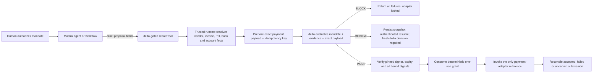

# Mastra × delta — technical integration package

## Purpose

This package tests one proposition:

> A model may propose a money-moving action. It must not decide whether that
> action was authorized or hold an alternate path to the payment executor.

The concrete action is a Brex-style vendor payment. That is commercial framing,
not a claim of a Brex integration. The checked-in reference uses local fixture
evidence, an ephemeral signer, a simulated adapter, and no real credentials or
money.

## Start here

Open
[the browser-ready proof](../output/mastra/mastra-delta-partner-proof.html).
It presents `PASS`, `BLOCK`, and `REVIEW` together.

Then run the two layers:

```sh
# Deterministic local presentation harness
./run mastra-demo

# Actual pinned Mastra createTool + persisted REVIEW workflow
cd examples/mastra
pnpm install --ignore-scripts
pnpm run validate
```

Expected REVIEW output includes:

```json
{
  "initial_delta_decision": "REVIEW",
  "initial_execution_locked": true,
  "workflow_initial_status": "suspended",
  "workflow_resumed_status": "success",
  "review_outcome": {
    "status": "REAUTHORIZE_WITH_DELTA"
  },
  "payment_adapter_invoked": false,
  "money_moved": false
}
```

The overview command uses a handcrafted local trace and labels it that way. The
reference package separately constructs and invokes a Mastra 1.53 `createTool`,
configures a `Mastra` instance with in-memory `LibSQLStore`, starts a real
workflow, persists the suspended state, and resumes it. It does not start a
Mastra server, contact Studio, or use a model.

## The exact workflow



The final submission predicate is:

```text
receipt signature verifies under the controller-pinned key
AND receipt and mandate are active
AND mandate authorization ID matches
AND mandate digest matches
AND proposal digest matches
AND server-owned evidence digest matches
AND prepared execution-payload digest matches
AND decision == PASS
AND grant.max_uses == 1
AND the deterministic grant is consumed transactionally
```

There is no durable “PASS flag” for the model to reuse. The grant is tied to the
tenant, authorization instance, and exact execution-payload digest.

## Implemented reference

| Component | Checked-in behavior | Production replacement |
| --- | --- | --- |
| Mastra proposal | strict `.strict()` Zod schema; model supplies business fields only | reviewed joint schema |
| Controller fields | proposal ID, authorization instance, runtime identity and idempotency key are assigned inside the boundary | authenticated host/controller |
| Evidence | server-owned demo fixtures for vendor status, invoice duplication, PO balance, bank changes and source account | authoritative ERP/vendor/account services |
| Prepared action | exact payment-adapter payload built before evaluation | reviewed Brex adapter payload |
| Decision | deterministic `PASS`, `BLOCK`, or `REVIEW` | production delta Orchestrator and independent Verifier |
| Receipt | Ed25519 receipt binding mandate, proposal, evidence, exact payload, reasons, time window and grant | trusted production delta signer/proof |
| Signer trust | ephemeral key pinned by the controller for one local process | trusted signer registry and rotation |
| Replay control | deterministic in-memory one-use grant; sequential and concurrent replay blocked | durable transactional store |
| Submission failure | timeout/error after adapter call becomes `UNKNOWN_REQUIRES_RECONCILIATION` | rail-specific reconciliation |
| REVIEW | Mastra workflow snapshot persisted in configured in-memory LibSQL; approval requests a fresh delta decision | authenticated reviewer and production store |
| Payment adapter | safe simulated adapter with projected output | credential-isolated reviewed adapter |

Key files:

- [`src/partner-demo.js`](../src/partner-demo.js) — closed objects,
  server-owned fixture evidence, exact payload preparation, mandate decision,
  signer verification, expiry, one-use grant, reconciliation state and
  browser artifact;
- [`src/mastra-partner.js`](../src/mastra-partner.js) — handler-level validation,
  controller-owned context/IDs, Mastra-shaped output and three-outcome bundle;
- [`delta-vendor-payment-tool.ts`](../examples/mastra/delta-vendor-payment-tool.ts)
  — pinned `createTool` factory and explicit nested Zod schemas;
- [`vendor-payment-review-workflow.ts`](../examples/mastra/vendor-payment-review-workflow.ts)
  — actual `createStep`/`createWorkflow`, `suspendSchema`, `resumeSchema`, zero
  retries and fresh-decision requirement;
- [`run-reference-demo.ts`](../examples/mastra/run-reference-demo.ts) — local
  Mastra + LibSQL start/suspend/resume proof; and
- [`test/mastra-partner.test.js`](../test/mastra-partner.test.js) — hostile
  boundary coverage.

## Why these Mastra interfaces

This mapping was checked against current official Mastra documentation and the
stable `@mastra/core@1.53.0` package on 2026-07-27.

### `createTool`

Use a `createTool` deployed in the trusted Mastra app/server runtime as the
only route to the payment adapter. Mastra also supports client tools, so
`createTool` is not inherently a server-side security boundary. Deployment and
capability ownership matter.

The agent receives the delta-gated tool. It must never receive a second raw
payment tool.

The reference uses:

- `inputSchema` plus `.strict()` and `strict: true`;
- handler-level closed-schema validation as a second boundary;
- `outputSchema` with explicit receipt, verification and execution types;
- `requestContextSchema`;
- `inputExamples`; and
- `execute(input, context)`, the current Mastra 1.x signature.

`strict: true` improves tool-argument generation only for providers that support
it. It does not replace boundary validation.

### Request context

Mastra `requestContextSchema` provides runtime validation and type safety. It
does not authenticate a user or authorize a payment.

Production must derive or overwrite tenant and principal values in
authenticated middleware and bind them to the mandate. Payment credentials do
not belong in request context, prompts, tool arguments, traces, or receipts.
Where available, use runtime-owned workflow/tool-call identifiers rather than
model-authored IDs.

### `outputSchema`

Mastra validates tool output at runtime when an `outputSchema` is present. The
reference also explicitly parses its result before returning. There are no
open `z.record(...unknown())` receipt or execution fields.

Raw adapter output is projected to allowlisted `execution_id` and `status`
fields so credentials, provider payloads and debug data cannot reach the model
or trace.

### Workflow suspend/resume

`REVIEW` is not an error and is not a hidden `PASS`. The reference workflow:

1. receives the signed `REVIEW` result;
2. calls `suspend()` with the proposal digest, receipt digest and expiry;
3. persists the snapshot because a storage provider is configured;
4. resumes only with a server-authenticated reviewer shape and the exact
   suspended digests;
5. returns `DECLINED` or `REAUTHORIZE_WITH_DELTA`; and
6. never invokes the adapter or edits the old receipt.

An approval must produce a fresh delta decision bound to the authenticated
review. The reference stops at that boundary instead of inventing production
authorization semantics.

### Retries

The irreversible workflow step is configured with zero retries. Semantic
proposal revision after `BLOCK` and infrastructure retries are different
things.

An adapter may retry only when it has proven idempotency and reconciliation.
After a timeout that could have happened after submission, the reference
consumes the grant and reports `UNKNOWN_REQUIRES_RECONCILIATION`; another tool
call cannot resubmit.

### Hooks and approvals

Tool hooks are useful for audit, redaction and coarse denial, but hook errors
do not necessarily stop execution and hooks do not own the authoritative
evidence/payment boundary. Keep final evaluation and submission in the gated
tool.

Mastra tool approval occurs before tool execution. That can be useful for a
different workflow, but it is not a substitute for delta `REVIEW`, which is
known only after evidence and mandate evaluation. Workflow suspend/resume is
the cleaner post-evaluation path.

## Failure behavior

| Event | Required result |
| --- | --- |
| Unknown input field, negative amount, wrong currency | fail before evidence or adapter |
| Agent tries to override tenant, authorization or execution target | fail closed |
| Vendor inactive/unapproved | `BLOCK`; receipt; no grant |
| Duplicate invoice | `BLOCK`; receipt; no grant |
| PO mismatch or insufficient balance | `BLOCK`; receipt; no grant |
| Bank details changed | `BLOCK`; receipt; no grant |
| Inside hard mandate but above review threshold | `REVIEW`; persist snapshot; no grant |
| Receipt signed by an unpinned key | adapter locked |
| Receipt expired | audit integrity remains verifiable; adapter locked |
| Prepared payload differs after decision | adapter locked |
| Identical concurrent `PASS` calls | one adapter call; replay blocked |
| Adapter timeout after possible submission | no retry; reconcile |
| Raw adapter response contains secret fields | secret fields omitted from output |

## Delta and Brex boundaries

The public Repyh Labs organization does not expose the private delta Mandate
implementation. This package therefore keeps the existing narrow adapter seam
instead of guessing internal APIs:

```text
submitPolicy → authorizeIntent → prepareProposal → submitProposal
→ getStatus → getVerificationOutcome → getProof
```

When the private implementation is available, validate that seam against the
real policy, evidence, Orchestrator, Verifier, signer and proof types.

Likewise, this package does not invent Brex endpoints or claim product access.
A Brex owner must validate the eventual sandbox action, credential scope,
idempotency, status model, webhooks, reconciliation and vendor/invoice evidence
available to the integration.

## Validation

The local suite must prove:

- strict input and trusted-context ownership;
- server-owned fixture evidence;
- exact execution-payload binding;
- signed receipt tamper rejection and pinned-signer requirement;
- authorization and receipt expiry;
- PASS-only adapter reachability;
- sequential and concurrent replay blocking;
- ambiguous submission reconciliation state;
- REVIEW suspension and authenticated resume shape; and
- no raw adapter secret leakage.

Run:

```sh
node --test test/partner-demo.test.js test/mastra-partner.test.js
./run mastra-demo

cd examples/mastra
pnpm run typecheck
pnpm run demo:review
```

The root repository's complete test suite also covers the independent Coinbase
Guard architecture this work reuses.

## Proposed 30-minute Mastra review

1. **Five minutes:** agree the invariant and inspect the PASS/BLOCK/REVIEW
   browser proof.
2. **Ten minutes:** review the `createTool` factory, trusted context ownership,
   exact payload binding and one-use grant.
3. **Ten minutes:** run the persisted REVIEW workflow and discuss where
   authenticated review belongs in a Mastra example.
4. **Five minutes:** decide whether the next artifact should be a reusable
   tool, workflow step, or both.

The useful output is a cloneable Mastra example and an evidence checklist. A
Brex sandbox conversation comes after that technical boundary is accepted.

## Official Mastra sources

- [Using tools with agents](https://mastra.ai/docs/agents/using-tools)
- [`createTool` reference](https://mastra.ai/reference/tools/create-tool)
- [Request context](https://mastra.ai/docs/server/request-context)
- [Mastra 1.0 tool signature, output validation and Node requirement](https://mastra.ai/blog/changelog-2026-01-20)
- [`requestContextSchema`](https://mastra.ai/blog/changelog-2026-01-30)
- [`inputExamples`](https://mastra.ai/blog/changelog-2026-03-05)
- [Suspend and resume](https://mastra.ai/docs/workflows/suspend-and-resume)
- [Human-in-the-loop workflows](https://mastra.ai/docs/workflows/human-in-the-loop)
- [Workflow snapshots](https://mastra.ai/docs/workflows/snapshots)
- [Workflow retries](https://mastra.ai/docs/workflows/error-handling)
- [Tool hooks](https://mastra.ai/blog/introducing-tool-hooks)
