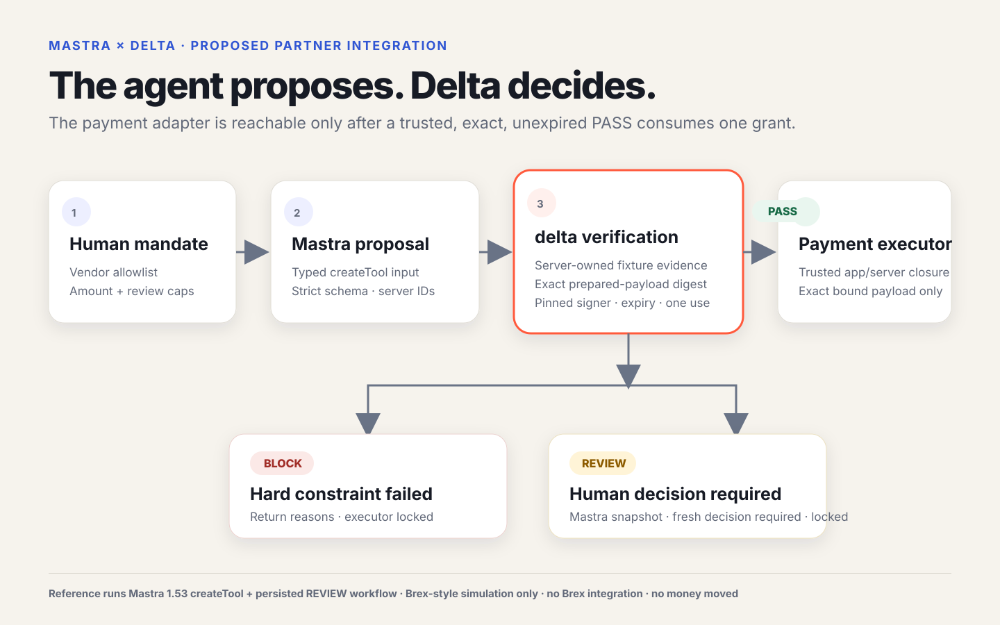

# Mastra × delta: make agent-initiated payments enforceable

Mastra can give an agent a typed payment tool. A schema-valid request still
does not answer the authorization question: did this exact vendor, invoice,
amount, account, bank destination and timing match what the business approved?

The proposed delta tool makes that check inside the trusted app runtime, before
the payment adapter:

```text
agent proposal
  → server-owned evidence
  → exact prepared-payment payload
  → delta PASS / BLOCK / REVIEW + receipt
  → one-use payment submission only on a trusted, unexpired PASS
```



## What we built

This repository contains a working local reference, pinned to
`@mastra/core@1.53.0`:

- a strict Mastra `createTool` factory with closed input and output schemas;
- controller-owned proposal and idempotency IDs;
- a Brex-style vendor-payment example with vendor, invoice, PO, bank-detail
  and funding-account fixtures resolved outside the agent;
- `PASS`, `BLOCK`, and `REVIEW` receipts binding mandate, proposal, evidence
  and exact execution-payload digests;
- a controller-pinned ephemeral demo signer, expiry checks, and an in-memory
  single-use execution grant;
- replay, concurrent retry, malformed input, forged evidence, payload tamper
  and ambiguous-submission tests; and
- a real Mastra workflow using configured LibSQL storage: `REVIEW` persists a
  snapshot, resumes with an authenticated-review shape, and requires a fresh
  delta decision. It never mutates `REVIEW` into `PASS`.

Open the checked-in
[three-outcome visual](../output/mastra/mastra-delta-partner-proof.html), or
run:

```sh
node scripts/run-mastra-partner-demo.mjs

cd examples/mastra
pnpm install --ignore-scripts
pnpm run validate
```

The first command creates one browser-friendly PASS/BLOCK/REVIEW bundle. The
second type-checks the reference against the pinned Mastra packages and runs
the persisted REVIEW suspend/resume path.

## The boundary

The model can propose. It cannot supply the authorization instance, evidence,
prepared payment payload, receipt decision, signing key, execution grant, or
payment credential.

The payment adapter is kept only in the gated tool closure. Immediately before
submission, the controller checks:

```text
trusted signer
+ intact receipt
+ active authorization and receipt window
+ exact mandate digest
+ exact proposal digest
+ exact server-owned evidence digest
+ exact prepared-payment payload digest
+ decision == PASS
+ one-use grant consumed transactionally
```

`BLOCK` returns every failed hard constraint. `REVIEW` remains locked and
routes into Mastra suspend/resume. A duplicate or concurrent `PASS` call sees
the same deterministic grant and cannot submit twice. A timeout after the
adapter is called becomes `UNKNOWN_REQUIRES_RECONCILIATION`; it is not retried.

## Honest scope

This is not a live Brex integration and no Brex system was contacted. The
example runs Mastra core and LibSQL locally, but it has not been added to a
Mastra application, Studio, or the Mastra repository. The evaluator, evidence
sources, signer and payment adapter are explicit simulations; no production
delta service was invoked and no money moved.

Production needs authenticated server middleware, authoritative enterprise
evidence, a trusted delta signer/verifier, a durable transactional grant store,
a reviewed payment adapter, and reconciliation. Mastra
`requestContextSchema` validates shape and types; it is not proof of identity.
The host must derive tenant and principal values from its authenticated
boundary.

## Why this fits Mastra

- `createTool` gives the agent a typed proposal surface while the trusted app
  runtime owns the action of consequence.
- `requestContextSchema` carries runtime-scoped values; authenticated
  middleware must supply them.
- `outputSchema` makes PASS/BLOCK/REVIEW and receipt state inspectable.
- workflow suspend/resume and configured storage give `REVIEW` a native,
  durable human-in-the-loop route.
- tool hooks can add audit and coarse denial, while the gated tool remains the
  final money-moving boundary.

## The ask

Would you be open to a 30-minute code review with the person who owns Mastra
tools and workflows? We will bring the runnable reference and three questions:

1. Should this ship first as a reusable tool, a workflow step, or both?
2. What authenticated request context and Studio trace fields should the joint
   example expose?
3. What is the smallest cloneable Mastra example worth building together?

If the boundary holds, the output is a reusable Mastra example and a concrete
evidence checklist for a later Brex sandbox conversation.
